# Followup 3.0 — Funzionalita complete + Interfaccia AI per Jira

**Versione:** 1.0  
**Data:** 2026-04-15  
**Scopo:** pagina unica che elenca tutte le funzionalita di Followup 3.0 (perimetro canonico), con roadmap prioritaria e disegno operativo per:

- generare Epic/Story/Task/Spike/Sub-task da interfaccia AI collegata a Jira;
- mostrare in interfaccia quando una componente/funzione e stata completata su Jira (`Done` / `Closed`).

---

## 1) Perimetro canonico (cosa e dentro)

Il perimetro ufficiale Followup 3.0 e quello definito in [CANONICAL_SCOPE.md](./CANONICAL_SCOPE.md):

- `followup-3.0/be-followup-v3`
- `followup-3.0/fe-followup-v3`
- `followup-3.0/mcp-followup` (supporto)

Per priorita e stato ufficiale restano fonti master:

- [PIANO_GLOBALE_FOLLOWUP_3.md](./PIANO_GLOBALE_FOLLOWUP_3.md)
- [IMPLEMENTATION_TRACKER.md](../tasks/IMPLEMENTATION_TRACKER.md)
- [JIRA_TRACEABILITY_FOLLOWUP_3.md](./JIRA_TRACEABILITY_FOLLOWUP_3.md)

**Product Blueprint (MVP implementato):** in Followup 3.0, dalla UI **Tecma Admin**, route **`/tecma/product-blueprint`** (menu *Product Blueprint (Jira)*) si apre il catalogo server-side, la pubblicazione su Jira Cloud e la sincronizzazione stato. Le credenziali Jira restano solo sul backend; variabili: `JIRA_HOST`, `JIRA_EMAIL`, `JIRA_API_TOKEN`, `JIRA_PROJECT_KEY`, opzionali `JIRA_ISSUE_TYPE_STORY`, `JIRA_ISSUE_TYPE_SUBTASK`. Dettaglio deploy: [RENDER_FOLLOWUP_ENV.md](./RENDER_FOLLOWUP_ENV.md); runbook: [JIRA_PRD_PAGE_RUNBOOK.md](./JIRA_PRD_PAGE_RUNBOOK.md).

---

## 2) Catalogo completo funzionalita (macro-domini)

### 2.1 Workspace, utenti, ruoli, visibilita

- Multi-workspace con `user.workspaces[]`.
- Assegnazione progetti per utente (`tz_workspace_user_projects`).
- RBAC granulare per modulo/azione/progetto.
- Entity assignments (`tz_entity_assignments`) su clienti/appartamenti.
- Wizard utenti e permission overrides.
- Entitlement commerciali workspace (`tz_workspace_entitlements`) separati da RBAC.

Riferimenti:

- [PIANO_GLOBALE_FOLLOWUP_3.md](./PIANO_GLOBALE_FOLLOWUP_3.md) (§3.1, §4, §5)
- [deliverables/FASE01_USER_ACCESS_RBAC.md](./deliverables/FASE01_USER_ACCESS_RBAC.md)
- [deliverables/FASE02_ENTITLEMENTS_AND_TECMA.md](./deliverables/FASE02_ENTITLEMENTS_AND_TECMA.md)

### 2.2 Clienti, Appartamenti, Customer 360

- Modello runtime clienti su `tz_clients`.
- Modello runtime appartamenti su `tz_apartments`.
- Query/list/detail omogenee, compatibili con filtri workspace/progetto.
- Vista Customer 360 (storico e contesto operativo cliente).

Riferimenti:

- [CLIENT_APARTMENT_MODEL.md](./CLIENT_APARTMENT_MODEL.md)
- [FOLLOWUP_3_MASTER.md](./FOLLOWUP_3_MASTER.md) (Wave 3)
- [PIANO_GLOBALE_FOLLOWUP_3.md](./PIANO_GLOBALE_FOLLOWUP_3.md) (§15)

### 2.3 Trattative / Requests (rent + sell)

- Entita unificata `tz_requests`.
- Stati e transizioni per flusso trattativa.
- Lista paginata, dettaglio, creazione, cambio stato.
- Collegamenti con cliente e appartamento.

Riferimenti:

- [REQUESTS_MODEL.md](./REQUESTS_MODEL.md)
- [FOLLOWUP_3_MASTER.md](./FOLLOWUP_3_MASTER.md) (Wave 4)

### 2.4 Prezzi e disponibilita

- Stato immobile normalizzato (`AVAILABLE`, `RESERVED`, `SOLD`, `RENTED`).
- Modalita (`RENT` / `SELL`) e prezzo grezzo (`rawPrice`).
- Matrici prezzi/disponibilita protette da permessi in area workspace/settings.

Riferimenti:

- [CLIENT_APARTMENT_MODEL.md](./CLIENT_APARTMENT_MODEL.md)
- [PIANO_GLOBALE_FOLLOWUP_3.md](./PIANO_GLOBALE_FOLLOWUP_3.md) (§4, slice permessi)

### 2.5 Preventivi digitali e documenti

- Trigger da stato trattativa.
- Generazione PDF e magic link pubblico firmato.
- Storage S3 via presigned URL.

Riferimenti:

- [deliverables/FASE2_DIGITAL_QUOTE.md](./deliverables/FASE2_DIGITAL_QUOTE.md)
- [deliverables/FASE3_S3_VERIFICATION.md](./deliverables/FASE3_S3_VERIFICATION.md)

### 2.6 Report, dashboard, KPI

- Definizioni report persistite (`tz_report_definitions`).
- Condivisione snapshot report.
- KPI e telemetria per monitoraggio adozione/valore.

Riferimenti:

- [deliverables/FASE4_REPORTS_DASHBOARDS.md](./deliverables/FASE4_REPORTS_DASHBOARDS.md)
- [telemetry/KPI_AND_DASHBOARDS.md](./telemetry/KPI_AND_DASHBOARDS.md)

### 2.7 Calendario e sincronizzazioni esterne

- Sorgente eventi unificata CRM.
- Integrazione Outlook gia presente.
- Gmail/sync job e lifecycle token in roadmap.

Riferimenti:

- [deliverables/FASE5_CALENDAR_SYNC.md](./deliverables/FASE5_CALENDAR_SYNC.md)

### 2.8 Integrazioni e automazioni

- Hub integrazioni: connettori, regole, webhook, API.
- Twilio, Mailchimp, ActiveCampaign sotto gate entitlement.
- Automazioni e workflow con sicurezza e auditing.

Riferimenti:

- [deliverables/FASE6_CONNECTORS_UX.md](./deliverables/FASE6_CONNECTORS_UX.md)
- [PIANO_GLOBALE_FOLLOWUP_3.md](./PIANO_GLOBALE_FOLLOWUP_3.md) (§11)

### 2.9 Inbox e notifiche operative

- Contratto notifiche (`request_action_due`, `calendar_reminder`, ecc.).
- Preferenze utente e stati vuoti.

Riferimenti:

- [deliverables/FASE7_INBOX_CONTRACT.md](./deliverables/FASE7_INBOX_CONTRACT.md)

### 2.10 AI operativa (cockpit + approvals + agente)

- Suggerimenti aggregati con LLM opzionale.
- Esecuzione con agente tool in-process.
- Flussi approvals/drafts per human-in-the-loop.

Riferimenti:

- [AI_FLOWS.md](./AI_FLOWS.md)
- [PIANO_GLOBALE_FOLLOWUP_3.md](./PIANO_GLOBALE_FOLLOWUP_3.md) (§3.3, §9)

### 2.11 Big Data / Marketing intelligence

- Diagnostica GA4 in pagina Big Data.
- Configurazione OAuth/Property e check configurazione marketing.
- Base per insight marketing collegati al workspace.

Riferimenti:

- [runbooks/GA4_BIG_DATA_DIAGNOSI.md](./runbooks/GA4_BIG_DATA_DIAGNOSI.md)
- [MARKETING_APIS_RUNBOOK.md](./MARKETING_APIS_RUNBOOK.md)

### 2.12 API platform, sicurezza, osservabilita, CI

- API riusabili (listing/client lite) per scenari esterni.
- Hardening auth (JWT + refresh + audit).
- OpenAPI e allineamento TECMA-BSS.
- Quality gates CI, security scan, osservabilita.

Riferimenti:

- [API_RIUSABILI.md](./API_RIUSABILI.md)
- [AUTH_AND_TECMA_BSS_API_REPORT.md](./AUTH_AND_TECMA_BSS_API_REPORT.md)
- [SECURITY_RUNBOOK.md](./SECURITY_RUNBOOK.md)
- [CI_AND_TEST_GATES.md](./CI_AND_TEST_GATES.md)
- [OBSERVABILITY.md](./OBSERVABILITY.md)

---

## 3) Roadmap prioritaria sensata (business-first)

Ordine consigliato (allineato al piano globale):

1. Dati legacy e mapping (`csv-mapping`)
2. Storage/documenti (`s3-verify`)
3. Preventivo digitale (`digital-quote`)
4. Report e dashboard (`reports-dashboards`)
5. Calendar sync (`calendar-sync`)
6. Connettori UX (`connectors-ux`)
7. Inbox contract (`inbox-contract`)
8. Visual parity/mobile (`visual-parity`, `ux-mobile`)

Prerequisiti sempre attivi: workspace + RBAC + entitlement.

Dettaglio stato: [JIRA_TRACEABILITY_FOLLOWUP_3.md](./JIRA_TRACEABILITY_FOLLOWUP_3.md) e [IMPLEMENTATION_TRACKER.md](../tasks/IMPLEMENTATION_TRACKER.md).

---

## 4) Interfaccia AI: creazione Epic/Story/Task su Jira

### 4.1 Obiettivo UX

Dalla pagina funzionalita, l'utente autorizzato deve poter:

1. selezionare una o piu componenti/funzioni;
2. chiedere all'AI di proporre backlog (Epic/Story/Task/Spike/Sub-task);
3. confermare;
4. creare issue su Jira con integrazione API.

### 4.2 Flusso funzionale

```mermaid
flowchart LR
  CatalogPage[CatalogPage]
  SelectItems[SelectItems]
  AiDraft[AiDraftBacklog]
  UserConfirm[UserConfirm]
  JiraCreate[JiraCreateIssues]
  LinkMap[StoreIdTemaIssueKey]
  StatusSync[StatusSyncFromJira]
  UiCheck[UiDoneCheck]
  CatalogPage --> SelectItems
  SelectItems --> AiDraft
  AiDraft --> UserConfirm
  UserConfirm --> JiraCreate
  JiraCreate --> LinkMap
  LinkMap --> StatusSync
  StatusSync --> UiCheck
```



### 4.3 Mapping minimo da usare

- `idTema` -> label Jira (`idTema_<value>`)
- `Area` (`Cross`, `Sell`, `Rent`, `QA`, `iTd`) -> prefisso summary
- `Story template` -> description
- `Dipendenze` -> issue links (`blocks`/`relates`)

Riferimento operativo completo: [JIRA_TRACEABILITY_FOLLOWUP_3.md](./JIRA_TRACEABILITY_FOLLOWUP_3.md) (§9-§13).

---

## 5) Connessione Jira e creazione issue (API)

Endpoint Jira Cloud di riferimento:

- `POST /rest/api/3/search` (search)
- `POST /rest/api/3/issue` (create)
- `PUT /rest/api/3/issue/{issueIdOrKey}` (update)
- `POST /rest/api/3/issueLink` (link)

Strategia consigliata:

1. Search idempotente per label `followup-3.0` + `idTema_*`.
2. Create solo se assente.
3. Update se esistente.
4. Link dipendenze.

---

## 6) Check in interfaccia: funzione completata o no

### 6.1 Regola richiesta

La funzione/componente e **checkata come completata** quando la issue Jira associata e in:

- `Done`, oppure
- `Closed`

Altri stati = non completata.

### 6.2 Regole UI

Per ogni riga del catalogo funzionalita mostrare:

- `jiraKey` (es. `TECMA-1234`)
- `jiraStatus`
- `doneCheck` boolean (`true` se `Done/Closed`)
- timestamp ultimo sync

Esempio visuale (logica):

- `DONE CHECK = true` -> badge verde `Completato su Jira`
- `DONE CHECK = false` -> badge grigio/giallo `Da completare`

### 6.3 Query JQL di controllo

Per idTema:

```jql
project = TECMA
AND labels = "idTema_reports-dashboards"
AND status in (Done, Closed)
```

Per singola issue:

```jql
issue = TECMA-1234
AND status in (Done, Closed)
```

---

## 7) Contratto dati minimo per la pagina UI

```json
{
  "idTema": "reports-dashboards",
  "featureName": "Report e dashboard",
  "area": "Cross",
  "statusLocale": "[~]",
  "jira": {
    "issueKey": "TECMA-1234",
    "issueType": "Story",
    "status": "Done",
    "doneCheck": true,
    "lastSyncAt": "2026-04-15T09:30:00Z"
  }
}
```

---

## 8) Governance operativa

- **PO/PM:** decide ordine di rilascio e approva backlog AI prima del create.
- **Tech Lead:** valida mapping tecnico e dipendenze.
- **Team FE/BE/QA/OPS:** mantiene aggiornati gli stati issue in Jira.
- **Sync tracker locale:** quando Jira e `Done/Closed`, aggiornare la riga corrispondente in [IMPLEMENTATION_TRACKER.md](../tasks/IMPLEMENTATION_TRACKER.md).

---

## 9) Relazione con gli altri documenti

- Questa pagina e la **vista completa funzionalita + AI/Jira UI flow**.
- [JIRA_TRACEABILITY_FOLLOWUP_3.md](./JIRA_TRACEABILITY_FOLLOWUP_3.md) resta il blueprint dettagliato di backlog/Jira API.
- [PIANO_GLOBALE_FOLLOWUP_3.md](./PIANO_GLOBALE_FOLLOWUP_3.md) resta il piano unico ufficiale.

