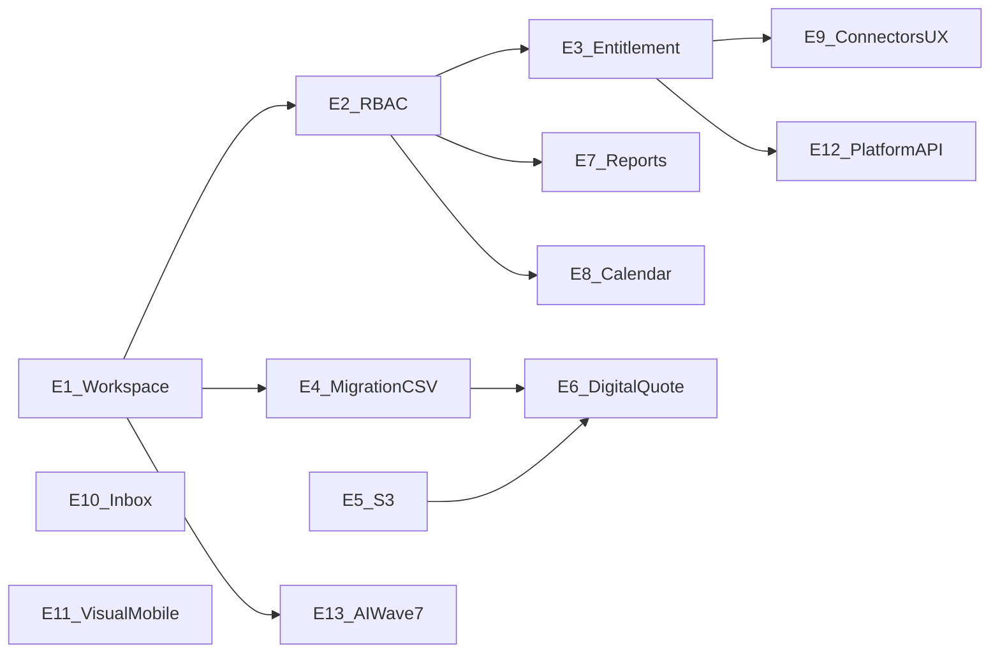

# Followup 3.0 — Tracciabilità funzioni → backlog Jira (TECMA)

**Versione documento:** 1.0  
**Data:** 2026-04-15  
**Scopo:** catalogo funzionale del POC Followup 3.0, prioritizzazione e **blueprint** per tradurre il lavoro in Epiche, Story, Task, Spike e sub-task (FE/BE/QA/OPS) sul progetto **TECMA**, in linea con la struttura software house e il template Jira interno.

**Non sostituisce** il piano operativo unico: [PIANO_GLOBALE_FOLLOWUP_3.md](./PIANO_GLOBALE_FOLLOWUP_3.md). Per priorità e checklist “ufficiali” aggiornare sempre il piano globale e [IMPLEMENTATION_TRACKER.md](../tasks/IMPLEMENTATION_TRACKER.md).

**Fonti incrociate principali:**

| Fonte | Ruolo |
|-------|--------|
| [PIANO_GLOBALE_FOLLOWUP_3.md](./PIANO_GLOBALE_FOLLOWUP_3.md) | Checklist ID tema §2, ordine FASE §2.1, dettaglio §3–§16 |
| [IMPLEMENTATION_TRACKER.md](../tasks/IMPLEMENTATION_TRACKER.md) | Stato `[x]` / `[~]` / `[ ]`, tag A/B/C |
| [FOLLOWUP_3_MASTER.md](./FOLLOWUP_3_MASTER.md) | Wave 1–7 (auth, design system, UX core, requests, API, hardening, AI) |
| [docs/README.md](./README.md) | Indice deliverable migrazione, sicurezza, API |
| [2026-04-08-priorita-abc-followup-design.md](./plans/2026-04-08-priorita-abc-followup-design.md) | Significato tag A, B, C e regole di composizione incrementi |

**Come aggiornare questo file:** a ogni chiusura significativa di tema nel tracker o cambio di perimetro commerciale, allineare le tabelle §4–§5 e le Story candidate; non eliminare righe storiche nelle tabelle stato — usare note “superseded” se serve.

---

## 1. Sommario esecutivo (CTO / PO)

- **North star del prodotto:** CRM verticale real estate (rent + sell), multiprogetto, semplice per utenti non tecnici; dati legacy Mongo in sola lettura o estensioni additive `tz_*`.
- **Gap “POC vs erogabile”:** il codice in `followup-3.0/be-followup-v3` e `fe-followup-v3` dimostra capacità end-to-end; la **erogazione enterprise** richiede backlog esplicito su governance (RBAC + entitlement), dati/migrazione, storage/PDF in ambienti controllati, QA su checklist FASE, allineamento API TECMA-BSS/CI come da [PIANO_GLOBALE §14.1](./PIANO_GLOBALE_FOLLOWUP_3.md).
- **Ordine decisionale business (asse A):** FASE 1 (CSV/mapping) → FASE 3 (storage) → FASE 2 (preventivo digitale) → FASE 4 (report) → FASE 5 (calendar sync) → FASE 6 (connettori) → FASE 7 (inbox) → FASE 8 (visual parity), salvo eccezione concordata ([PIANO_GLOBALE §2.1](./PIANO_GLOBALE_FOLLOWUP_3.md)).
- **Prossimo passo verso Jira:** validare le **Epic candidate** (§6) con Parent/Theme aziendale; poi creare Story/Task/Spike e sub-task un confine per volta (microservizio o componente) come da policy interna.

---

## 2. Legenda ID tema e tracciabilità

Ogni area funzionale è ancorata all’**ID tema** della checklist §2 di [PIANO_GLOBALE_FOLLOWUP_3.md](./PIANO_GLOBALE_FOLLOWUP_3.md), allineato riga-per-riga a [IMPLEMENTATION_TRACKER.md](../tasks/IMPLEMENTATION_TRACKER.md).

| ID tema | Nome breve |
|---------|------------|
| `close-phase0` | Workspace, progetti utente, assignments, cockpit AI aggregato, platform API, matching |
| `user-access-granularity` | RBAC granulare, wizard utenti, permission catalog, audit membership |
| `commercial-entitlements` | Entitlement commerciale vs RBAC; gate connettori/API a pagamento |
| `connectors-showcase-ux` | Vetrina connettori per utenti senza modulo (assorbito in integrazioni/FASE02) |
| `tecma-activation-audit` | Console Tecma + audit attivazioni |
| `csv-mapping` | Migrazione CSV legacy verso dominio operativo + API/UI |
| `s3-verify` | Bucket S3, presigned, diagnostica |
| `digital-quote` | Preventivo digitale, PDF, magic link |
| `reports-dashboards` | Report, definizioni, link condivisi, AI opzionale |
| `calendar-sync` | Calendario unificato + Outlook/Gmail reali |
| `connectors-ux` | Twilio dedicato, cataloghi dummy RE, MCP opzionale |
| `inbox-contract` | Contratto inbox, preferenze, empty state |
| `visual-parity` | Parità UI rispetto al design system ITD |
| `ux-mobile` | UX mobile per pagina |
| `refactor-api-layer` | Refactor client API per dominio (FE) |
| `matching-be` | Endpoint matching candidates (opzionale) |
| `dialog-drawer` | Residui Dialog → Drawer |
| `ux-liste-card-toggle` | Card/toggle liste Clienti e Appartamenti |

**Allineamento catalogo PRD:** la colonna «Nome breve» è mantenuta coerente con i campi `title` in [`feature-catalog.ts`](../be-followup-v3/src/core/jira-prd/feature-catalog.ts) (stessi `idTema`).

**Wave prodotto** (sequenza vincolante concettuale): [FOLLOWUP_3_MASTER.md §4](./FOLLOWUP_3_MASTER.md) — usare come **etichetta di release** o epic figlia, non come sostituto degli ID tema.

---

## 3. Inventario funzioni per area

Ogni voce include: **ID tema**, **stato tracker** (snapshot alla data documento), **funzioni**, **riferimento**.

### 3.1 Foundation / piattaforma

| ID tema | Stato | Funzioni (capability) | Riferimento |
|---------|-------|------------------------|-------------|
| `close-phase0` | [x] | Workspace utenti: route `GET/POST/PATCH/DELETE /workspaces/:id/users`; `tz_workspace_user_projects` (subset progetti per utente); `POST /session/projects-by-email` con `workspaceId` e intersezione accessi; `ProjectAccessPage` / `WorkspacesPage` | [PIANO_GLOBALE §3.1](./PIANO_GLOBALE_FOLLOWUP_3.md) |
| `close-phase0` | [x] | Entity assignments: `tz_entity_assignments`; assign/unassign/list; filtro list/query clienti e appartamenti per viewer non admin | [PIANO_GLOBALE §3.2](./PIANO_GLOBALE_FOLLOWUP_3.md) |
| `close-phase0` | [x] | Cockpit: suggerimenti aggregati Wave 7 (`aggregatedKind`, accordion, cap UI); orchestrator BE + `PrioritySuggestionsList` | [PIANO_GLOBALE §3.3](./PIANO_GLOBALE_FOLLOWUP_3.md) |
| `close-phase0` | [x] | API piattaforma: `POST /v1/platform/clients/lite/query`, scope `platform.clients.read`; listing pubblico; matching `GET /v1/matching/.../candidates` | [PIANO_GLOBALE §3.4–3.5](./PIANO_GLOBALE_FOLLOWUP_3.md) |
| `matching-be` | [x] | Candidati matching per appartamento/cliente | [IMPLEMENTATION_TRACKER](../tasks/IMPLEMENTATION_TRACKER.md) |

### 3.2 Sicurezza e governance

| ID tema | Stato | Funzioni | Riferimento |
|---------|-------|----------|-------------|
| — (Wave 1/6) | [x] | Login `POST /v1/auth/login`, `GET /v1/auth/me`, SSO exchange; refresh/logout; `tz_authSessions`, `tz_authEvents` | [FOLLOWUP_3_MASTER Wave 1, 6](./FOLLOWUP_3_MASTER.md) |
| `user-access-granularity` | [x] | Permessi moduli × azioni; `GET /v1/rbac/permission-catalog`; override su utente; `requirePermission` su route; wizard 4 passi; audit membership workspace / `user_project` | [PIANO_GLOBALE §4](./PIANO_GLOBALE_FOLLOWUP_3.md), [FASE01](./deliverables/FASE01_USER_ACCESS_RBAC.md) |
| `commercial-entitlements` | [x] | `tz_workspace_entitlements`; `GET/PATCH /workspaces/:id/entitlements`; enforcement platform/Twilio/MC/AC; FE Integrazioni + tab API; audit PATCH | [PIANO_GLOBALE §5](./PIANO_GLOBALE_FOLLOWUP_3.md), [FASE02](./deliverables/FASE02_ENTITLEMENTS_AND_TECMA.md) |
| `tecma-activation-audit` | [x] | Pagina `/tecma/entitlements`, evento `workspace.entitlement.updated` | [IMPLEMENTATION_TRACKER](../tasks/IMPLEMENTATION_TRACKER.md) |

### 3.3 Core CRM UX

| ID tema | Stato | Funzioni | Riferimento |
|---------|-------|----------|-------------|
| — (Wave 3–4) | [x] | Cockpit home; liste e schede clienti/appartamenti; calendario UI creazione/modifica evento; requests/trattative lista, kanban, dettaglio `tz_requests` | [FOLLOWUP_3_MASTER Wave 3–4](./FOLLOWUP_3_MASTER.md), [REQUESTS_MODEL.md](./REQUESTS_MODEL.md) |
| `close-phase0` | [x] | Integrazioni hub (connettori, regole, webhook, API) con gate permessi/entitlement | [PIANO_GLOBALE §15](./PIANO_GLOBALE_FOLLOWUP_3.md) |
| — (Millennium) | [~]/[x] | W1 Command Palette, ricerca entità, sidebar persistente; W2 Inbox header + notifiche; W3 Customer 360; W4 Integrazioni tab | [PIANO_GLOBALE §15](./PIANO_GLOBALE_FOLLOWUP_3.md) |

### 3.4 Dati e migrazione

| ID tema | Stato | Funzioni | Riferimento |
|---------|-------|----------|-------------|
| `csv-mapping` | [~] | Mapping CSV → cliente/appartamento/quote verso collezioni dominio; quote `asset.quotes` → `tz_quotes`; `POST /v1/quotes/query`; restano export CSV e matrici dove non coperte da Mongo | [PIANO_GLOBALE §6](./PIANO_GLOBALE_FOLLOWUP_3.md), [FASE1_CSV_MAPPING.md](./deliverables/FASE1_CSV_MAPPING.md) |
| — | — | Inventario legacy, ETL pilota, mapping progetto/workspace, GDPR spike | [docs/README](./README.md) deliverable migrazione |

### 3.5 Documenti e commercio (storage + preventivo)

| ID tema | Stato | Funzioni | Riferimento |
|---------|-------|----------|-------------|
| `s3-verify` | [x] | Servizio presigned `assets-s3.service`; variabili bucket; diagnostica Tecma `GET /tecma/storage/assets-diagnostics`; checklist manuale IAM staging | [PIANO_GLOBALE §8](./PIANO_GLOBALE_FOLLOWUP_3.md), [FASE3_S3_VERIFICATION.md](./deliverables/FASE3_S3_VERIFICATION.md) |
| `digital-quote` | [~] | `createDigitalQuote`, PDF su S3, route pubblica token, aggiornamento trattativa; DoD QA staging in deliverable | [PIANO_GLOBALE §7](./PIANO_GLOBALE_FOLLOWUP_3.md), [FASE2_DIGITAL_QUOTE.md](./deliverables/FASE2_DIGITAL_QUOTE.md) |

### 3.6 Insight (report e condivisione)

| ID tema | Stato | Funzioni | Riferimento |
|---------|-------|----------|-------------|
| `reports-dashboards` | [~] | `tz_report_definitions`, CRUD `/v1/report-definitions`, preferiti UI, `POST /v1/reports/share-definition`, audit snapshot; restano AI opt-in centralizzato e rifiniture UI | [PIANO_GLOBALE §9](./PIANO_GLOBALE_FOLLOWUP_3.md), [FASE4_REPORTS_DASHBOARDS.md](./deliverables/FASE4_REPORTS_DASHBOARDS.md) |

### 3.7 Calendario esteso

| ID tema | Stato | Funzioni | Riferimento |
|---------|-------|----------|-------------|
| `calendar-sync` | [~] | Outlook OAuth, Graph events in UI; restano Gmail, job sync incrementale, lifecycle refresh token, unificazione scrittura | [PIANO_GLOBALE §10](./PIANO_GLOBALE_FOLLOWUP_3.md), [FASE5_CALENDAR_SYNC.md](./deliverables/FASE5_CALENDAR_SYNC.md) |

### 3.8 Connettori e comunicazioni

| ID tema | Stato | Funzioni | Riferimento |
|---------|-------|----------|-------------|
| `connectors-ux` | [ ] | Twilio card dedicata; catalogo dummy RE; Mailchimp/AC; MCP opzionale | [PIANO_GLOBALE §11](./PIANO_GLOBALE_FOLLOWUP_3.md), [FASE6_CONNECTORS_UX.md](./deliverables/FASE6_CONNECTORS_UX.md) |

### 3.9 Inbox e notifiche

| ID tema | Stato | Funzioni | Riferimento |
|---------|-------|----------|-------------|
| `inbox-contract` | [ ] | Tipi notifica, persistenza notifiche in-app, empty state, preferenze/mute | [PIANO_GLOBALE §12](./PIANO_GLOBALE_FOLLOWUP_3.md), [FASE7_INBOX_CONTRACT.md](./deliverables/FASE7_INBOX_CONTRACT.md) |

### 3.10 Qualità prodotto e UX

| ID tema | Stato | Funzioni | Riferimento |
|---------|-------|----------|-------------|
| `visual-parity` | [ ] | Allineamento UI al design system ITD (riferimento implementativo: repo `fe-tecma-itd`) | [FASE8_VISUAL_PARITY.md](./deliverables/FASE8_VISUAL_PARITY.md) |
| `ux-mobile` | [ ] | Checklist mobile per pagina | [PIANO_GLOBALE §2](./PIANO_GLOBALE_FOLLOWUP_3.md) |
| `refactor-api-layer` | [ ] | Client HTTP per dominio in `fe-followup-v3/src/api/` (ex-monolite `followupApi`) | [IMPLEMENTATION_TRACKER](../tasks/IMPLEMENTATION_TRACKER.md) |
| `dialog-drawer` | [ ] | Pattern Drawer vs Dialog residui | [IMPLEMENTATION_TRACKER](../tasks/IMPLEMENTATION_TRACKER.md) |
| `ux-liste-card-toggle` | [ ] | Card/toggle liste Clienti/Appartamenti | [IMPLEMENTATION_TRACKER](../tasks/IMPLEMENTATION_TRACKER.md) |

### 3.11 Cross-cutting engineering (abilitanti)

| Ambito | Funzioni | Riferimento |
|--------|----------|-------------|
| OpenAPI / BSS | Contratto `openapi.v1.yaml`, esposizione TECMA-BSS, merge spec | [PIANO_GLOBALE §14.1](./PIANO_GLOBALE_FOLLOWUP_3.md), [AUTH_AND_TECMA_BSS_API_REPORT.md](./AUTH_AND_TECMA_BSS_API_REPORT.md) |
| CI/CD e qualità | Workflow `followup-3.0-ci-cd`, security, gate test | [DOCS_CI_CD.md](./DOCS_CI_CD.md), [CI_AND_TEST_GATES.md](./CI_AND_TEST_GATES.md) |
| DevSecOps | Semgrep, Trivy, SBOM, runbook | [SECURITY_RUNBOOK.md](./SECURITY_RUNBOOK.md), [plans/2026-03-24-devsecops-enterprise-roadmap.md](./plans/2026-03-24-devsecops-enterprise-roadmap.md) |
| Osservabilità | Log strutturato, trace, alert | [OBSERVABILITY.md](./OBSERVABILITY.md), [OBSERVABILITY_ALERTS_FOLLOWUP.md](./OBSERVABILITY_ALERTS_FOLLOWUP.md) |
| Wave 7 (aperto) | Human-in-the-loop su azioni draft ad alto impatto | [FOLLOWUP_3_MASTER Wave 7](./FOLLOWUP_3_MASTER.md), [PIANO_GLOBALE §3.3](./PIANO_GLOBALE_FOLLOWUP_3.md) |

---

## 4. Matrice di priorità (due assi + stato POC)

### 4.1 Asse A — Sequenza business (FASE)

Ordine da [PIANO_GLOBALE §2.1](./PIANO_GLOBALE_FOLLOWUP_3.md):

| Priorità | FASE | Focus | ID tema principali |
|----------|------|--------|---------------------|
| 1 | FASE 1 | CSV/mapping legacy | `csv-mapping` |
| 2 | FASE 3 | Storage / S3 | `s3-verify` |
| 3 | FASE 2 | Preventivo digitale | `digital-quote` |
| 4 | FASE 4 | Report/dashboard | `reports-dashboards` |
| 5 | FASE 5 | Calendar sync | `calendar-sync` |
| 6 | FASE 6 | Connettori UX | `connectors-ux` |
| 7 | FASE 7 | Inbox | `inbox-contract` |
| 8 | FASE 8 | Visual parity | `visual-parity` |

**Fondamenta fuori dalla numerazione FASE 1–8 ma prerequisito:** Fase 0 / 0.1 / 0.2 (`close-phase0`, `user-access-granularity`, `commercial-entitlements`, ecc.).

### 4.2 Asse B — Tag tracker A / B / C

Da [IMPLEMENTATION_TRACKER](../tasks/IMPLEMENTATION_TRACKER.md) e [2026-04-08-priorita-abc](./plans/2026-04-08-priorita-abc-followup-design.md):

| Tag | Significato |
|-----|-------------|
| **A** | Allineamento a fasi e checklist piano + deliverable FASE |
| **B** | Parità legacy nel perimetro di migrazione concordato |
| **C** | Valore rapido (2–4 settimane), riduzione attrito, demo |

### 4.3 Tabella sintetica: ID tema × FASE × Tag × Stato

| ID tema | FASE (se applicabile) | Tag tipici | Stato tracker |
|---------|------------------------|------------|---------------|
| `close-phase0` | 0 | A, C | [x] |
| `user-access-granularity` | 0.1 | A, B | [x] |
| `commercial-entitlements` | 0.2 | A, B, C | [x] |
| `connectors-showcase-ux` | 0.2 | A, C | [x] |
| `tecma-activation-audit` | 0.2 | A | [x] |
| `csv-mapping` | 1 | A, B | [~] |
| `s3-verify` | 3 | A, B | [x] |
| `digital-quote` | 2 | A, B | [~] |
| `reports-dashboards` | 4 | A, C | [~] |
| `calendar-sync` | 5 | A, B | [~] |
| `connectors-ux` | 6 | A, C | [ ] |
| `inbox-contract` | 7 | A, C | [ ] |
| `visual-parity` | 8 | A, B | [ ] |
| `ux-mobile` | — | A, C | [ ] |
| `refactor-api-layer` | — | A, C | [ ] |
| `matching-be` | opz. | A, C | [x] |
| `dialog-drawer` | — | C | [ ] |
| `ux-liste-card-toggle` | — | C | [ ] |

---

## 5. Blueprint Jira TECMA (Epic → Story / Spike / Task)

**Convenzione titoli:** prefisso area tra parentesi quadre all’inizio, es. `[Cross]`, `[Rent]`, `[Sell]`, `[QA]`, `[iTd]` — come da linee guida progetto TECMA.

**Gerarchia:** Parent (Theme/Category se usati nel backlog) → **Epic** → **Story** (o **Task** se non user-oriented) → **FE/BE/QA/OPS-SubTask** (un solo microservizio o confine per sub-task).

**Nota:** Questa sezione è un **blueprint**: non crea issue in Jira. Prima di creazione massiva, presentare l’albero a PO/CTO per allineamento Parent/Epic Link.

### Epic candidate (macro-iniziative)

| # | Titolo Epic (esempio TECMA) | ID tema coperti | Dipendenze note |
|---|-----------------------------|-----------------|-----------------|
| E1 | `[Cross] Followup 3.0 — Workspace, progetti e segregazione dati` | `close-phase0` | — |
| E2 | `[Cross] Followup 3.0 — RBAC granulare e audit utenze` | `user-access-granularity` | E1 |
| E3 | `[Cross] Followup 3.0 — Entitlement commerciale e integrazioni a pagamento` | `commercial-entitlements`, `connectors-showcase-ux`, `tecma-activation-audit` | E2 |
| E4 | `[Cross] Followup 3.0 — Migrazione dati legacy e mapping CSV` | `csv-mapping` | E1 |
| E5 | `[Cross] Followup 3.0 — Storage S3 e documenti` | `s3-verify` | Env AWS, policy |
| E6 | `[Sell] Followup 3.0 — Preventivo digitale e magic link` | `digital-quote` | E4, E5 |
| E7 | `[Cross] Followup 3.0 — Report, definizioni e condivisione` | `reports-dashboards` | E2 |
| E8 | `[Cross] Followup 3.0 — Calendario e sincronizzazione esterna` | `calendar-sync` | E2 |
| E9 | `[Cross] Followup 3.0 — Connettori e comunicazioni (UX)` | `connectors-ux` | E3 |
| E10 | `[Cross] Followup 3.0 — Inbox e notifiche` | `inbox-contract` | — |
| E11 | `[iTd] Followup 3.0 — Parità visiva e UX mobile` | `visual-parity`, `ux-mobile`, `dialog-drawer`, `ux-liste-card-toggle` | Design system |
| E12 | `[Cross] Followup 3.0 — Piattaforma API enterprise (OpenAPI, BSS, CI)` | cross-cutting §3.11 | E2, E3 |
| E13 | `[Cross] Followup 3.0 — AI cockpit e automazioni (Wave 7)` | `close-phase0` (Wave 7), gap human-in-the-loop | E1 |

**Opzionale:** Epic dedicata a `matching-be` solo se il prodotto la promuove da “opzionale” a roadmap cliente.

**E14 — Discovery e strumenti interni:** Epic aggiuntiva per mappare nel catalogo PRD le capability di *product discovery*, assessment gap (es. COIMA), overview executive, hub sperimentale e console Product Blueprint — vedi tabella §5.1.

### Mappatura catalogo PRD (single source) e Epic E14

Il catalogo operativo in `be-followup-v3/src/core/jira-prd/` assegna a ogni voce pubblicabile:

| Campo | Contenuto |
|-------|-----------|
| `epicId` / `epicTitle` | E1–E14 con titolo Epic come in tabella sopra (E14 = discovery / assessment / strumenti interni) |
| `workItemKind` | `story` \| `spike` \| `task` \| `technical` (suggerimento tipo issue Jira TECMA) |
| `storyRef` | Opzionale (es. S1.1), allineato ai riferimenti narrative sotto quando esiste |
| `designRefs` | Opzionale: path sotto `docs/` per deliverable UX/FASE (supporto designer) |

**Fonte unica** della mappa `idTema` → Epic + backlog: [`id-tema-epic-map.ts`](../be-followup-v3/src/core/jira-prd/id-tema-epic-map.ts). Ogni nuovo `idTema` va aggiunto lì e verificato con `assertCatalogIntegrity` / test Vitest.

**Copertura “100%”** (checklist prodotto vs inventario codice): metodo e matrice gap in [COVERAGE_MATRIX_FOLLOWUP_3.md](./COVERAGE_MATRIX_FOLLOWUP_3.md).

### Story e Spike suggerite (estratti; da copiare nei campi Jira)

Per ogni Story usare in Markdown le sezioni: **User Story** (Who / What / Why), **Supporting Material**, **Acceptance criteria**, **Technical Description** — come da template interno TECMA.

#### E1 — Workspace e segregazione

- **Story S1.1:** Come **amministratore workspace** voglio **gestire utenti e progetti assegnati** per **limitare la visibilità ai soli progetti autorizzati**.  
  - **AC:** CRUD utenti workspace; `tz_workspace_user_projects` rispettato in query; test integrazione su `POST /session/projects-by-email`.  
  - **Sub-task:** BE-SubTask `be-followup-v3` (routes workspace); QA-SubTask (checklist accessi); OPS-SubTask (env Mongo se applicabile).

- **Story S1.2:** Come **agente** voglio **vedere solo clienti/appartamenti assegnati o non filtrati** così **rispetto le regole di assegnazione**.  
  - **AC:** Filtro `tz_entity_assignments` su query clients/apartments; allineamento tool AI/report a stessi criteri.

#### E2 — RBAC

- **Story S2.1:** Come **admin** voglio **configurare permessi per modulo e azione** per **aderire al principio least privilege**.  
  - **AC:** `permission-catalog` in UI; override su utente; route protette con `requirePermission`; matrice documentata.

#### E3 — Entitlement

- **Story S3.1:** Come **Tecma Admin** voglio **attivare/sospendere capability a pagamento per workspace** con **tracciabilità**.  
  - **AC:** PATCH entitlements; audit evento; 403 su route senza entitlement; FE vetrina se disattivato.

#### E4 — Migrazione / CSV

- **Spike SP4.1:** *Analisi residui mapping CSV cliente/appartamento ed export* — output: lista Story/Task per matrici mancanti e piano ETL. Riferimento: [FASE1_CSV_MAPPING.md](./deliverables/FASE1_CSV_MAPPING.md).

- **Story S4.1:** Come **integrazione dati** voglio **allineare quote legacy a `tz_quotes`** per **parità sui totali e trattative**.  
  - **AC:** coerenza con `POST /v1/quotes/query` e migrazione pilota documentata.

#### E5 — Storage

- **Story S5.1:** Come **operatore** voglio **caricare/scaricare asset via URL presigned** così **i documenti sono in bucket sicuro**.  
  - **AC:** checklist [FASE3_S3_VERIFICATION.md](./deliverables/FASE3_S3_VERIFICATION.md) completata in staging.

#### E6 — Preventivo digitale

- **Story S6.1:** Come **venditore** voglio **generare un preventivo digitale con PDF e link per il cliente** per **chiudere più velocemente le trattative**.  
  - **AC:** [FASE2_DIGITAL_QUOTE.md](./deliverables/FASE2_DIGITAL_QUOTE.md) DoD + checklist QA staging.

#### E7 — Report

- **Story S7.1:** Come **manager** voglio **salvare definizioni report e condividere snapshot** per **allineare il team sui KPI**.  
  - **AC:** CRUD definizioni; link pubblico con audit lettura dove previsto; [FASE4](./deliverables/FASE4_REPORTS_DASHBOARDS.md).

#### E8 — Calendario

- **Story S8.1:** Come **utente** voglio **vedere eventi Outlook nel calendario CRM** per **evitare doppio inserimento**.  
  - **AC:** merge eventi in UI; stato OAuth; resto backlog Gmail/job in Story successive.

- **Spike SP8.1:** *Gmail e sync incrementale + token lifecycle* — output: design tecnico e stima.

#### E9 — Connettori UX

- **Story S9.1:** Come **marketing** voglio **vedere una vetrina chiara dei connettori** con **CTA e limitazioni entitlement**.  
  - **AC:** [FASE6](./deliverables/FASE6_CONNECTORS_UX.md).

#### E10 — Inbox

- **Story S10.1:** Come **utente** voglio **inbox con tipi notifica e preferenze** così **non perdo task**.  
  - **AC:** [FASE7](./deliverables/FASE7_INBOX_CONTRACT.md).

#### E11 — Parità visiva / mobile

- **Task T11.1 (non-Story):** Refactor incrementale parity UI vs design system ITD — [FASE8](./deliverables/FASE8_VISUAL_PARITY.md).

- **Task T11.2:** Checklist `ux-mobile` per pagina critica.

#### E12 — Piattaforma API

- **Story S12.1:** Come **architect** voglio **allineare OpenAPI e gateway TECMA-BSS** per **erogazione controllata delle API**.  
  - **AC:** merge spec; test governance; documentazione in [AUTH_AND_TECMA_BSS_API_REPORT.md](./AUTH_AND_TECMA_BSS_API_REPORT.md).

#### E13 — AI / Wave 7

- **Spike SP13.1:** *Human-in-the-loop e audit per azioni draft ad alto impatto* — output: flussi approvazione + eventi audit.

### Task trasversali (fuori Epic utente-centriche)

| Task | ID tema | Sub-task tipo |
|------|---------|---------------|
| Refactor client API (per dominio) | `refactor-api-layer` | FE-SubTask `fe-followup-v3`; QA-SubTask regression E2E |
| Dialog → Drawer | `dialog-drawer` | FE-SubTask |
| Card/toggle liste | `ux-liste-card-toggle` | FE-SubTask |

---

## 6. Diagramma dipendenze (Epic candidate)



---

## 7. Riferimenti incrociati rapidi

| Argomento | File |
|-----------|------|
| Piano unico checklist | [PIANO_GLOBALE_FOLLOWUP_3.md](./PIANO_GLOBALE_FOLLOWUP_3.md) |
| Stato implementazione repo | [IMPLEMENTATION_TRACKER.md](../tasks/IMPLEMENTATION_TRACKER.md) |
| Wave prodotto | [FOLLOWUP_3_MASTER.md](./FOLLOWUP_3_MASTER.md) |
| Roadmap cicli | [MULTI_CYCLE_ROADMAP.md](../tasks/MULTI_CYCLE_ROADMAP.md) |
| Deliverable FASE1–8 | [deliverables/](./deliverables/) |
| API riusabili | [API_RIUSABILI.md](./API_RIUSABILI.md) |
| Executive / migrazione | [executive/README.md](./executive/README.md) |

---

## 8. Checklist pre-creazione issue su Jira (PO / CTO)

Questo documento è **pronto per la traduzione** in issue ma **non** sostituisce la revisione umana.

- [ ] Allineare **Parent** (Theme/Category) con il backlog TECMA esistente.
- [ ] Verificare **Epic Link** e dipendenze tra E1–E13.
- [ ] Per ogni Story, incollare sezioni Markdown standard (Who/What/Why, AC, Technical Description).
- [ ] Suddividere in **FE/BE/QA/OPS** con un confine chiaro per sub-task.
- [ ] Spikes solo dove serve scoperta; dopo Spike, creare Story/Task concrete.
- [ ] Tracciare **ID tema** nel campo descrizione o label Jira per coerenza con questo documento e il tracker.

---

## 9. Roadmap operativa API Jira (priorita + esecuzione)

Questa roadmap traduce il blueprint (§5) in operativita Jira progressiva, mantenendo l'ordine priorita prodotto gia definito in §4.

| Step | Obiettivo | Input | Output |
|------|-----------|-------|--------|
| 0 | Validare albero backlog con PO/CTO | §5 Epic candidate + §4 priorita | Albero approvato (Epic -> Story/Task/Spike) |
| 1 | Creare Epiche (`E1`...`E13`) | Tabella Epic §5 + Parent backlog TECMA | Epic Jira con chiavi (`TECMA-xxx`) |
| 2 | Creare Story/Task/Spike per ogni Epic | Story candidate §5 + template Story TECMA | Issue figlie create e linkate all'Epic |
| 3 | Creare FE/BE/QA/OPS-SubTask | Microservizi/componenti coinvolti | Sub-task con un solo confine tecnico |
| 4 | Riconciliare chiavi Jira con catalogo locale | `ID tema`, label e issue key | Matrice tracciabilita locale aggiornata |

**Regola di priorita operativa:** partire dagli item in stato `[~]` o `[ ]` con priorita FASE alta (§4.1), mantenendo prerequisiti E1/E2/E3 prima dei domini dipendenti.

---

## 10. Mappatura dati sorgente -> payload Jira API

### 10.1 Mapping canonico

| Sorgente Followup | Campo Jira | Note |
|-------------------|------------|------|
| `ID tema` (es. `csv-mapping`) | `labels` (`idTema_csv-mapping`) | Chiave tecnica per ricerca/check sincronizzazione |
| Area (`Cross`, `Sell`, `iTd`, `QA`) | Prefisso `summary` | Convenzione titolo TECMA |
| Titolo Epic candidata | `summary` | Copiato da tabella §5 |
| Story template (Who/What/Why + AC + Technical Description) | `description` | Markdown Jira |
| Dipendenze Epic (diagramma §6) | issue link `blocks` / `relates to` | Gestione ordine implementativo |
| Tag priorita A/B/C | `labels` (`prio_A`, `prio_B`, `prio_C`) | Lens di prioritizzazione non sostitutiva |
| Tipo FE/BE/QA/OPS | issue type sub-task dedicato | `FE-SubTask`, `BE-SubTask`, `QA-SubTask`, `OPS-SubTask` |

### 10.2 Payload di riferimento (Jira Cloud REST v3)

Esempio Epic:

```json
{
  "fields": {
    "project": { "key": "TECMA" },
    "issuetype": { "name": "Epic" },
    "summary": "[Cross] Followup 3.0 - Migrazione dati legacy e mapping CSV",
    "description": "Epic generata da JIRA_TRACEABILITY_FOLLOWUP_3.md (§5 E4).",
    "labels": ["followup-3.0", "idTema_csv-mapping", "prio_A", "prio_B"]
  }
}
```

Esempio Story:

```json
{
  "fields": {
    "project": { "key": "TECMA" },
    "issuetype": { "name": "Story" },
    "summary": "[Cross] CSV mapping - Completa matrice cliente/appartamento",
    "description": "## User Story:\n### Who:\nData migration owner\n### What:\nCompletare mapping CSV clienti/appartamenti\n### Why:\nRidurre gap di parita dati nel cutover\n\n## Acceptance criteria:\n- Matrice FASE1 aggiornata\n- Validazione su dataset pilota\n\n## Technical Description:\nAllineare mapping verso collezioni dominio e query API correlate.",
    "labels": ["followup-3.0", "idTema_csv-mapping", "prio_A", "prio_B"]
  }
}
```

Esempio Task:

```json
{
  "fields": {
    "project": { "key": "TECMA" },
    "issuetype": { "name": "Task" },
    "summary": "[iTd] Refactor API layer FE - client HTTP per dominio",
    "description": "Task tecnico trasversale collegato a idTema_refactor-api-layer.",
    "labels": ["followup-3.0", "idTema_refactor-api-layer", "prio_A", "prio_C"]
  }
}
```

Esempio Spike:

```json
{
  "fields": {
    "project": { "key": "TECMA" },
    "issuetype": { "name": "Spike" },
    "summary": "[Cross] Wave 7 - Human in the loop e audit azioni draft",
    "description": "## Obiettivo dell'analisi\nDefinire flusso approvazione + audit.\n\n## Risultato atteso\nLista Story/Task/Sub-task post-spike.",
    "labels": ["followup-3.0", "idTema_close-phase0", "wave7"]
  }
}
```

Esempio Sub-task (FE/BE/QA/OPS):

```json
{
  "fields": {
    "project": { "key": "TECMA" },
    "issuetype": { "name": "FE-SubTask" },
    "parent": { "key": "TECMA-1234" },
    "summary": "[Cross] Report preferiti - integrazione lista FE",
    "description": "Micro-confine: fe-followup-v3/src/pages/ReportsPage",
    "labels": ["followup-3.0", "idTema_reports-dashboards", "subtask_fe"]
  }
}
```

---

## 11. Flusso API Jira (create/update/search/link) con approccio idempotente

### 11.1 Endpoint REST Jira Cloud (riferimento)

- Ricerca issue: `POST /rest/api/3/search`
- Creazione issue: `POST /rest/api/3/issue`
- Aggiornamento issue: `PUT /rest/api/3/issue/{issueIdOrKey}`
- Link issue: `POST /rest/api/3/issueLink`
- Transizioni issue: `GET /rest/api/3/issue/{issueIdOrKey}/transitions`

### 11.2 Algoritmo consigliato

1. **Search** issue esistenti con label `followup-3.0` + `idTema_*`.
2. Se non esistono, **create** Epic/Story/Task/Spike/Sub-task secondo ordine roadmap §9.
3. Se esistono, **update** campi descrizione/priorita/link senza duplicare issue.
4. **Link** dipendenze (`blocks`/`relates`) seguendo tabella §5 e diagramma §6.
5. Salvare una tabella locale (nel documento o in file operativo separato) con `idTema -> issueKey`.

Esempio JQL per bootstrap idempotente:

```jql
project = TECMA
AND labels = "followup-3.0"
AND labels in ("idTema_csv-mapping", "idTema_digital-quote", "idTema_reports-dashboards")
ORDER BY updated DESC
```

---

## 12. Check completamento componente/funzione (Done/Closed)

### 12.1 Regola ufficiale richiesta

Una componente/funzione e considerata **completata** quando la issue Jira associata (o la sua Story/Task principale) e in stato:

- `Done`, oppure
- `Closed`

Nessun criterio aggiuntivo richiesto in questa versione (AC, test, deploy non bloccano il check di completamento).

### 12.2 Query standard

Per `ID tema`:

```jql
project = TECMA
AND labels = "idTema_csv-mapping"
AND status in (Done, Closed)
```

Per Epic:

```jql
project = TECMA
AND "Epic Link" = TECMA-2001
AND status in (Done, Closed)
```

Per singolo componente/funzione:

```jql
project = TECMA
AND labels = "idTema_reports-dashboards"
AND summary ~ "\"Report preferiti\""
AND status in (Done, Closed)
```

### 12.3 Mini-tabella stato locale

| Stato Jira | Esito locale |
|------------|--------------|
| `To Do`, `Open`, `In Progress`, `In Review` | Non completato |
| `Done`, `Closed` | Completato |

---

## 13. Governance minima di sincronizzazione Jira -> tracker locale

### 13.1 Quando aggiornare il tracker locale

Aggiornare [IMPLEMENTATION_TRACKER.md](../tasks/IMPLEMENTATION_TRACKER.md) quando l'item Jira mappato all'`ID tema` passa a `Done` o `Closed`:

- da `[ ]` a `[~]` se solo una parte del tema e completata in Jira,
- da `[~]` a `[x]` quando il pacchetto concordato del tema risulta completato in Jira.

### 13.2 Ownership minima

| Ruolo | Responsabilita |
|-------|-----------------|
| PO/PM | Gestione workflow Jira, priorita sprint/release, coerenza parent/epic |
| Tech Lead | Mapping `ID tema <-> issue key`, validita tecnica di Story/Task/Sub-task |
| Team delivery (FE/BE/QA/OPS) | Avanzamento issue operative e allineamento stato Jira |

### 13.3 Cadence consigliata

- Sync operativo: 2 volte a settimana.
- Sync rilascio: prima di ogni review CTO/PO.

---

*Fine documento — aggiornare le tabelle §4–§5 e le sezioni §9–§13 quando cambia [IMPLEMENTATION_TRACKER.md](../tasks/IMPLEMENTATION_TRACKER.md) o la configurazione Jira del progetto TECMA.*
