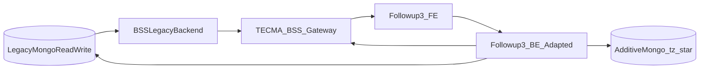

# Followup 3.1 target da POC 3.0 e BSS legacy — contesto, vincoli, baseline

## Allineamento 3.1 (corrente)

Per Followup 3.1 questo pacchetto va letto con il seguente principio guida:

- il percorso conservativo richiesto dal CTO considera il **legacy source of truth in lettura e scrittura** per i domini già esistenti;
- il vincolo “read-only” valeva per il **POC locale** (protezione da side effect), non per il target di produzione;
- il layer `tz_*` resta utilizzabile solo per capability realmente additive/non coperte dal legacy.

## Nota sul POC greenfield

Il POC Followup 3.0 ha rifatto frontend, backend e database per ripulire logiche stratificate nel legacy. Questa scelta spiega molte differenze tecniche del POC, ma **non è il percorso approvato per Followup 3.1**.

Per il lavoro dei team vale un solo target:

- **Percorso approvato — legacy-first**: Followup 3.1 usa legacy/BSS in read/write per clienti, appartamenti, richieste, progetti, utenti e altri domini già esistenti; `tz_*` solo per capability additive/non presenti nel legacy.
- **Fuori scope**: migrazione completa a nuovo database Followup, cutover greenfield e proposta cliente “ripartenza da zero”.

## Scopo del pacchetto

Questo pacchetto descrive **come portare Followup 3.0 POC verso Followup 3.1** in modalità **adattiva** rispetto a:

- **MongoDB legacy come sistema primario read/write** (nessuna migrazione “big bang” dei dati storici).
- **Backend legacy** esposto principalmente via **TECMA-BSS** (API Gateway / contratti OpenAPI).
- **Estensioni additive** su MongoDB (`tz_*`) solo dove il legacy non copre un dominio/capability.

Output atteso: **specifiche operative** (non marketing) per dev/QA/Arch con decisioni, tradeoff, rischi e criteri di accettazione.

## Vincoli CTO / prodotto (non negoziabili)

- **No migrazione dati legacy**: il sistema legacy resta fonte di verità per i domini già coperti da BSS.
- **Compatibilità-first**: dove possibile, riusare **endpoint e modelli legacy**; aggiungere solo ciò che manca.
- **Estensioni additive**: nuove collection `tz_*` e nuovi endpoint “BP/Followup” possono convivere, ma devono avere confini chiari (ownership, retention, backup, permessi).

Nota: questi vincoli sono il perimetro approvato. Eventuali ipotesi greenfield restano fuori scope e richiederebbero una decisione CTO separata.

## Baseline repository e contratti (Gate 0 / 0.1)

### Artefatti di baseline già raccolti (2026-04-23)

Nella stessa cartella (ciascuno inizia con la sezione **«Uso nel pack Followup 3.1»**: ruolo, rigenerazione, riferimenti incrociati):

- `_baseline_git_2026-04-23.md` — branch/commit/origin per repo critici; perché tre repo e come leggerli con `05` / `11`.
- `_openapi_hashes_2026-04-23.md` — hash/size per `tecma-bss-swagger.yaml` e raw gateway; comando `shasum` e policy drift vs `07` §9b.
- `_openapi_recent_history_2026-04-23.md` — ultimi commit che toccano gli OpenAPI rilevanti; limiti rispetto a `git log --follow`.

Indice sintetico anche in `README.md` → **Artefatti di baseline**.

### Nota operativa importante (sync GitLab “API-based”)

Lo script “clone all via GitLab API” **non è stato eseguibile** in questa baseline perché il token disponibile risultava **non valido/scaduto** per l’API (`invalid_token`). Di conseguenza la baseline è stata consolidata con **git fetch/pull mirati** sui repo locali sotto `/Users/s.zanetti/dev/tecma`, con log operativi in `/Users/s.zanetti/dev/tecma/_sync_logs/`.

**Dopo un nuovo sync (PAT valido o pull manuale):** aggiornare i tre file `_*.md` sopra secondo le istruzioni nella loro sezione «Uso nel pack» (commit/branch, hash ricalcolati, history), così Gate 0 resta dimostrabile in review. Fino ad allora, trattare questa baseline come **punto nel tempo** 2026-04-23, non come mirror live del gruppo GitLab.

Implicazione: **i path OpenAPI nel repo sono comunque “post-aggiornamento locale”**, ma non è garantito che *tutti* i repository del gruppo siano allineati all’ultimo remoto.

### Fonti interne già validate (bootstrap)

- `followup-3.0/docs/BSS_INTEGRATION.md`
- `followup-3.0/docs/FOLLOWUP_3_MASTER.md`
- `followup-3.0/docs/PIANO_GLOBALE_FOLLOWUP_3.md`
- `followup-3.0/docs/AUTH_AND_TECMA_BSS_API_REPORT.md` (stato auth BSS vs Followup)
- `followup-3.0/docs/openapi-tecma-bss-additions.yaml` (merge/addizioni gateway)
- OpenAPI BSS:
  - `tecma/architecture/aws-api-gateway/api/TECMA-BSS/public/tecma-bss-swagger.yaml`
  - `tecma/architecture/aws-api-gateway/api/TECMA-BSS/raw/TECMA Digital Platform - Dev-v1-oas30-apigateway.yaml`

## Modello architetturale target (analisi)

## Decisioni “forzate” da anticipare (per evitare rework)

1. **Perimetro approvato**: Followup 3.1 è legacy-first. Dev e QA devono trattare il POC come riferimento funzionale/UX, non come target dati greenfield.

2. **Dove vivono le scritture**: i domini legacy devono scrivere nel legacy tramite percorsi approvati (BSS/servizi legacy). Le scritture `tz_*` sono ammesse solo per domini nuovi non coperti dal legacy.

3. **Doppio sistema di auth**:
   - **BSS**: login “classico” con `project_id` + refresh + `getUserByJWT`.
   - **Followup POC**: login “senza progetto” + `session/projects-by-email` + refresh opaco lato Followup.

   Per produzione “solo gateway” serve una strategia unica (vedi `03` e `05`).

4. **Identità membership workspace (Fase 1)**: oggi `tz_user_workspaces.userId` è **email**; la roadmap naturale è **stabilizzare su id utente** mantenendo compatibilità col modello scelto.

## Come leggere i documenti `01`–`12`

- `01` — dominio workspace (multi-tenant) end-to-end nel POC.
- `02` — matrice gap POC vs legacy (API/dati/permessi).
- `03` — specifica di adattamento backend (non distruttiva).
- `04` — specifica dati (legacy read/write + `tz_*` solo additive + ownership).
- `05` — allineamento contratti gateway (merge path, sicurezza, versioning).
- `06` — roadmap MVP → hardening (sequenza, dipendenze, rischi).
- `07` — pacchetto operativo implementation-ready: owner, runbook, contratti minimi, permessi, KPI, security, rollback, **DoR §8** (8 punti con §9b/§9c/§9d), QA gate, DoD §9a (da usare prima dello sprint e in release).
- `08` — utenti, identità, ciclo di vita account.
- `09` — RBAC, enforcement route, costruzione permessi JWT.
- `10` — inviti, token, email, set-password (inclusi edge case sicurezza).
- `11` — **ponte BSS/legacy per implementazione**: cosa è reuse vs API nuove, spike obbligatori, ordine di lavoro backend; compensa il fatto che `08`–`10` descrivono soprattutto il POC.
- `12` — **progetti ↔ workspace ↔ utenti/permessi**: creazione `tz_projects`, lista via `tz_workspace_projects`, JWT `projectId`, query `workspaceId` obbligatoria, incrocio con RBAC e access middleware.

## Criteri di accettazione del pacchetto (meta)

- Ogni gap in `02` ha **owner** (FE/BE/OPS) e una delle classi: *Mitigabile subito*, *Richiede contratto gateway*, *Richiede estensione dati*, *Bloccante*.
- Le spec `03`–`05` non contraddicono il principio **legacy source of truth read/write**.
- La roadmap `06` ha almeno uno **slice** rilasciabile in staging con test minimi definiti.
- Ogni area ad alto rischio (auth, inviti, membership, progetti/workspace) ha in backlog almeno **tre** test nominati (happy + 2 negativi o edge) allineati a `07` §9 e §9d, con ID tracciabile (Jira/Xray o tabella §9b).
- I gate **DoD** di release workspace/auth (`07` §9a) sono stati letti da Security/Platform: nessun merge in `main` su path proxy gateway senza checklist §9 completata per il dominio toccato.
- La matrice `11` §2 non ha righe **S** (spike) ancora “placeholder” al momento del kickoff implementativo: ogni **S** ha owner legacy e data target output §3 di `11`, oppure lo sprint è considerato a rischio documentato.
