# Workspace Model Blueprint (PO)

## Executive summary

Questa versione documenta in modo operativo **come funziona davvero oggi** la gestione workspace in Followup 3.0 e cosa manca per renderla pronta a un rollout su **legacy source-of-truth read/write + REST-only**.  
Punto chiave: nel POC l’accesso è **workspace-centric**, mentre nel legacy BSS è **project-centric**; quindi non basta “collegare API”, serve un modello di adattamento dati+API.

Decisione guida proposta:

1. mantenere il dominio workspace nel layer additivo (`tz_*`) allineato al legacy,
2. usare BSS legacy per domini core legacy,
3. formalizzare API REST mancanti per inviti/membership/progetti workspace,
4. eliminare ambiguità operative (invito utente vs onboarding workspace).

## Obiettivo del documento

Per **utenti, RBAC, inviti** (dettaglio esteso, edge case, matrici e backlog): usare anche `08-users-identity-accounts-and-lifecycle.md`, `09-rbac-permissions-enforcement-and-jwt.md`, `10-invites-tokens-email-and-set-password.md`.

Per **creazione progetto, elenco progetti del workspace e permessi utente/progetto** (incrocio con JWT e query `workspaceId`): `12-projects-workspace-users-and-permissions.md`.

Produrre un documento pronto per refinement backlog che risponda a:

- come funziona oggi la gestione inviti,
- come si aggiungono utenti al workspace,
- come si associano progetti al workspace e agli utenti,
- quali casi mancano,
- come implementare il modello con **legacy source-of-truth read/write** e layer `tz_*` solo dove additive,
- quali API REST mancano.

## Stakeholder e bisogni

- **PO/Business**: capire il modello reale e i gap di processo.
- **Backend**: blueprint implementativo REST-only e dati.
- **Platform/API Gateway**: contratti coerenti con BSS.
- **Security/Compliance**: inviti, sessioni, audit, least privilege.
- **QA**: casi testabili (happy path + edge case).

## AS-IS Followup 3.0 (reale da codice)

### 1) Flusso inviti: come funziona oggi

Il flusso invito è **user-centric**, non workspace-centric.

1. Admin chiama `POST /users` con `email`, `projectId`, `projectName` (opzionale), `roleLabel` (opzionale).
2. Backend crea utente in `tz_users` con `status: invited` e `project_ids: [projectId]`.
3. Backend genera token in `tz_inviteTokens` (hash, expiry, used flag).
4. Viene inviata email con link di invito.
5. Utente chiama `POST /auth/set-password-from-invite` con token+password.
6. Backend consuma token, imposta password, attiva utente, emette access token + refresh token.

Note importanti:

- invito fallisce se email già presente in qualsiasi collection utente candidate,
- non c’è auto-creazione membership workspace al momento dell’invito,
- si sta invitando un utente al sistema/progetto, non direttamente a uno specifico workspace.

### 2) Aggiunta utenti al workspace: come avviene oggi

La membership workspace è un passo separato:

- `POST /workspaces/:id/users` aggiunge utente al workspace con ruolo (`owner/admin/collaborator/viewer` mappati anche da `vendor/vendor_manager`).
- dati salvati in `tz_user_workspaces`.
- `userId` è ancora email lowercased (Fase 1).
- `access_scope` (`all|assigned`) esiste e viene aggiornato via `PATCH /workspaces/:id/users/:userId`.

Implicazione:

- puoi avere un utente invitato/attivo ma **non membro di nessun workspace**.

### 3) Gestione progetti nel workspace

Ci sono due livelli distinti:

1. **Workspace ↔ Progetto** (`tz_workspace_projects`)
   - `POST /workspaces/projects/associate`
   - `DELETE /workspaces/:workspaceId/projects/:projectId`
   - lista con `GET /workspaces/:id/projects`

2. **Utente nel workspace ↔ Progetto** (`tz_workspace_user_projects`)
   - `POST /workspaces/:id/users/:userId/projects`
   - `DELETE /workspaces/:id/users/:userId/projects/:projectId`
   - `GET /workspaces/:id/users/:userId/projects`

Regola attuale importante:

- se per un utente non esistono righe in `tz_workspace_user_projects`, l’utente vede tutti i progetti del workspace;
- se esistono righe, vede solo quelli specificati.

### 4) Assegnazioni entità e visibilità

- `tz_entity_assignments` gestisce assegnazioni per `client`/`apartment`.
- le liste applicano un filtro “assigned visibility” per utenti non admin.
- oggi c’è gap: `access_scope` non pilota completamente il filtro lato liste in tutti i casi.

### 5) Mappa flussi end-to-end (AS-IS)

```mermaid
flowchart LR
  adminAction[AdminInvitaUtente] --> apiUsers[POST_users]
  apiUsers --> tzUsers[tz_users_status_invited]
  apiUsers --> tzInvite[tz_inviteTokens]
  tzInvite --> mailInvite[EmailInvito]
  mailInvite --> userSetPwd[POST_auth_set_password_from_invite]
  userSetPwd --> authTokens[AccessToken_RefreshToken]
  authTokens --> workspaceMembership[POST_workspaces_id_users]
  workspaceMembership --> wsProjects[POST_workspaces_projects_associate]
  wsProjects --> userProjectScope[POST_workspaces_id_users_userId_projects]
  userProjectScope --> runtimeAccess[canAccess_and_query_filters]
```

## Casi mancanti / edge cases da documentare e coprire

## Tabella gap (AS-IS)

| Gap | Impatto | Rischio | Priorità |
|---|---|---|---|
| Invito non lega automaticamente utente a workspace | onboarding frammentato | utente attivo ma senza accesso operativo | Alta |
| `access_scope` non allineato ai filtri lista in tutti i path | comportamento UX incoerente | bug autorizzativi percepiti | Alta |
| `userId=email` in membership | fragilità identità | rename email, duplicati, merge account | Alta |
| Progetti orfani/non risolvibili in `tz_projects` | dati non visibili o inconsistenti | perdita fiducia su dati | Media |
| Mancano API REST dedicate a “workspace invite” | processo manuale e multi-step | errori operativi | Alta |
| Invito utente già esistente in altri store | blocco onboarding | support burden | Media |
| Revoca/disabilitazione non agganciata esplicitamente a cleanup membership/scope | accessi zombie | security/compliance | Alta |

### Casi da aggiungere in documentazione QA

- utente invitato, attivato, ma non aggiunto al workspace,
- utente aggiunto al workspace senza progetto workspace associato,
- rimozione progetto dal workspace con utenti che lo avevano nel loro scope,
- disabilitazione utente con refresh token ancora attivo,
- duplicazione invite/reinvite e token precedente.

## Confronto Followup vs BSS legacy

| Capability | Followup AS-IS | BSS legacy AS-IS | Nota PO |
|---|---|---|---|
| Login | `/auth/login` + varianti POC | `/login` con `project_id` | modelli diversi, servono adapter/decisione auth |
| Scope principale | workspace + membership | project_id | mismatch strutturale |
| Inviti | tokenized invite su `tz_*` | non equivalente workspace-native | va mantenuto additivo |
| Progetti utente | per workspace + overlay per utente | project-centric | va mappato chiaramente |
| Assignment entità | nativo nel POC | non equivalente standard | additivo necessario |

## Blueprint TO-BE su legacy read/write

### Principio

- **Legacy DB**: read/write sui domini core legacy.
- **Additive DB**: scritture dei domini nuovi/capability non presenti nel legacy.

### Collection additive minime richieste

Obbligatorie per il dominio workspace:

- `tz_workspaces`
- `tz_user_workspaces`
- `tz_workspace_projects`
- `tz_workspace_user_projects`
- `tz_entity_assignments`

Consigliate per robustezza:

- `tz_identity_links` (email ↔ userId stabile ↔ eventuale id legacy)
- `tz_workspace_project_legacy_map` (mappa projectId interno ↔ legacyProjectId)
- `tz_workspace_invites` (stato lifecycle invito workspace-oriented, opzionale ma utile)

Candidate secondo decisione Auth/Security:

- `tz_users` (solo projection/cache governata; non source of truth generale)
- `tz_inviteTokens`
- `tz_authSessions`
- `tz_account_lockout`
- `tz_authEvents` / `tz_security_audit` / `tz_audit_log`

### Database/ownership consigliata

- `legacy_primary_db`: read/write per domini legacy tramite percorsi approvati.
- `followup_identity_db`: utenti/inviti/session/security.
- `followup_workspace_db`: workspace/membership/progetti/assignments.
- opzionale `followup_audit_db`: auditing separato.

Se si vuole restare su un solo DB additivo, mantenere comunque namespace e policy di ownership esplicite.

## API REST-only: cosa manca oggi

Obiettivo: niente GraphQL, solo REST con contratti chiari e versionati.

### API mancanti proposte (MVP)

1. **Inviti workspace-oriented**
   - `POST /workspaces/{workspaceId}/invites`
   - `GET /workspaces/{workspaceId}/invites`
   - `POST /workspaces/{workspaceId}/invites/{inviteId}/resend`
   - `DELETE /workspaces/{workspaceId}/invites/{inviteId}`

2. **Onboarding membership atomico**
   - `POST /workspaces/{workspaceId}/members:onboard`
   - crea/invita utente + membership + project scope iniziale in un unico workflow transazionale applicativo.

3. **Gestione bulk progetti utente nel workspace**
   - `PUT /workspaces/{workspaceId}/users/{userId}/projects`
   - semantica replace totale per evitare drift add/remove multipli.

4. **Revoca e cleanup consistente**
   - `POST /users/{id}/deactivate`
   - opzionale `?revokeSessions=true&removeWorkspaceMemberships=true`.

5. **Read model operativo**
   - `GET /workspaces/{workspaceId}/users?include=projectScope,assignments,status`.

### Standard contrattuale consigliato

- tutte le response wrappate in `data`,
- error model unico (code/message/status/details),
- idempotency key sulle operazioni sensibili (`invites`, `onboard`),
- versioning esplicito (`/v1/...`),
- nessun endpoint GraphQL introdotto.

## Migliorie di modello consigliate

1. Migrare `userId` membership da email a id stabile.
2. Separare chiaramente:
   - invito al sistema/progetto,
   - invito al workspace (nuovo lifecycle).
3. Rendere `access_scope` enforcement-driven in tutte le query soggette a visibilità.
4. Introdurre policy esplicita per progetti orfani/non mappati.

## Backlog PO iniziale (epiche + user stories)

## Epic 1 — Workspace onboarding coerente

**Obiettivo**: ridurre attrito e inconsistenza nell’ingresso utenti.

User Story 1.1  
Come admin voglio invitare un utente direttamente in un workspace con ruolo e scope progetto iniziale, così evito configurazioni manuali post-invito.

Acceptance Criteria:

1. Da una sola API posso creare invito + membership + scope progetti iniziale.
2. Se l’invio email fallisce, il sistema non lascia dati orfani.
3. Posso reinviare invito senza duplicare membership.

User Story 1.2  
Come admin voglio vedere lo stato invito (pending/accepted/expired/revoked) per workspace.

Acceptance Criteria:

1. Lista inviti filtrabile per stato e data.
2. Ogni invito mostra utente, ruolo proposto, workspace e project scope.

## Epic 2 — Governance progetti nel workspace

**Obiettivo**: rendere chiaro e robusto il rapporto workspace-progetto-utente.

User Story 2.1  
Come admin voglio associare/dissociare progetti al workspace in modo controllato.

Acceptance Criteria:

1. Non posso associare lo stesso progetto due volte.
2. Dissociazione blocca o avvisa se utenti hanno scope su quel progetto.

User Story 2.2  
Come admin voglio impostare in bulk i progetti visibili per un utente nel workspace.

Acceptance Criteria:

1. Una chiamata replace aggiorna lo scope completo.
2. Audit log registra before/after.

## Epic 3 — Sicurezza e coerenza accessi

**Obiettivo**: eliminare incoerenze tra modello dichiarato e comportamento runtime.

User Story 3.1  
Come security officer voglio che `access_scope` sia rispettato in tutte le query soggette a visibilità.

Acceptance Criteria:

1. Suite test copre almeno clienti e appartamenti.
2. Documentazione comportamento allineata con codice.

User Story 3.2  
Come admin voglio che disattivare un utente revochi sessioni e accessi workspace secondo policy.

Acceptance Criteria:

1. Flag di revoca sessioni disponibile.
2. Nessun token refresh valido dopo disattivazione con revoca.

## Epic 4 — Legacy read/write readiness

**Obiettivo**: rendere il modello workspace deployabile con legacy source-of-truth in lettura/scrittura.

User Story 4.1  
Come architetto voglio separare chiaramente i domini legacy read/write dai domini additive `tz_*`.

Acceptance Criteria:

1. Le write dei domini legacy passano su legacy/BSS tramite percorsi approvati.
2. Configurazione ambienti documentata e validata in staging.

User Story 4.2  
Come PO voglio un mapping stabile tra progetti legacy e workspace.

Acceptance Criteria:

1. Esiste mapping esplicito e versionato.
2. Casi di progetto orfano sono tracciati e visibili.

## MVP scope (consigliato)

In scope MVP:

- API invite workspace-oriented (create/list/resend/revoke),
- onboarding membership atomico,
- bulk project scope per utente,
- enforcement `access_scope` su clienti/appartamenti,
- separazione governance legacy read/write vs additive write DB.

Out of scope MVP:

- automazioni avanzate di provisioning cross-workspace,
- refactor completo di tutti i moduli non workspace,
- ottimizzazioni analytics non bloccanti.

## Decisioni da validare in steering (CTO + Security + Platform)

1. auth strategy target (`bss-first` vs `hybrid`),
2. identità canonica (`userId` stabile e piano migrazione da email),
3. ownership finale collection e confini DB,
4. priorità rollout API gateway per nuove REST.

## Valutazione readiness (aggiornamento)

No, non ancora sufficiente per partire senza ambiguità.  
È una buona base PO, ma ci sono alcune mancanze importanti.

### Gap principali

1. Manca una tabella "AS-IS vs TO-BE con owner": nel documento c'è priorità, ma non owner (PO/BE/FE/Platform/Security/QA) e non sempre TO-BE esplicito per ogni gap.
2. Flussi operativi non "step-by-step" per casi chiave:
   - invitare utente + agganciarlo al workspace,
   - associare workspace a progetto,
   - assegnare scope progetti all'utente.
   Oggi sono descritti, ma non come runbook operativo con precondizioni/esiti/errori.
3. API mancanti proposte senza contratto minimo: ci sono endpoint candidati, ma non ci sono ancora request/response/error codes per renderli backlog-ready.
4. Legacy read/write ancora ad alto livello: elenca collection, ma manca piano di adozione per fasi (migrazione identita email->id, fallback, rollback, reconciliation).
5. Mancano KPI e criteri di successo prodotto: es. tempo onboarding admin, percentuale utenti invitati che completano attivazione, error rate inviti, incidenti di accesso.
6. Manca matrice permessi completa per ruolo + access_scope + effetto su ogni dominio (clients/apartments/requests/calendar).
7. Manca sezione rischi + mitigazioni dettagliata per security/compliance (token invite, revoca sessioni, utenti disabilitati, audit trail).

### Verdict

- Sufficiente come bozza di allineamento.
- Non sufficiente come documento ready-to-implementation.

### Next step proposto (v2 implementation-ready)

1. Tabella gap con owner.
2. Contratti API minimi.
3. Piano legacy in 3 fasi con rollback.
4. Epiche/story pronte in formato Jira TECMA.

**Aggiornamento:** i punti 1–3 (e supporto al punto 4: DoR, KPI, matrice permessi, security, QA gate) sono consolidati in `07-implementation-ready-operational-pack.md`. Per le story Jira TECMA, copiare da lì tabelle e runbook nelle descrizioni ticket.

## Qualità, sicurezza e tracciabilità (dopo l’arricchimento di `07`)

- Il **verdict** sopra resta valido per la bozza originale; l’operatività (owner, runbook, contratti REST, KPI, rollback, **DoR §8** punti 1–8 con incastro **§9b/§9c/§9d**, **QA gate §9**, **DoD §9a**) vive ora in `07`. Questo file (`01a`) resta il **blueprint PO**; non duplicare intere tabelle qui — linkare le sezioni `07` nelle epic.
- Per steering CTO: usare `07` §9d per dichiarare esplicitamente cosa è **fuori** dalla prima GA (es. pen-test completo, chaos test) evitando aspettative implicite di “copertura totale”.
- Incrocio obbligatorio con `11` per qualsiasi story che tocchi persistenza utenti/progetti oltre il POC: la matrice **R/E/N/S** sostituisce assunzioni implicite su `tz_*`.
