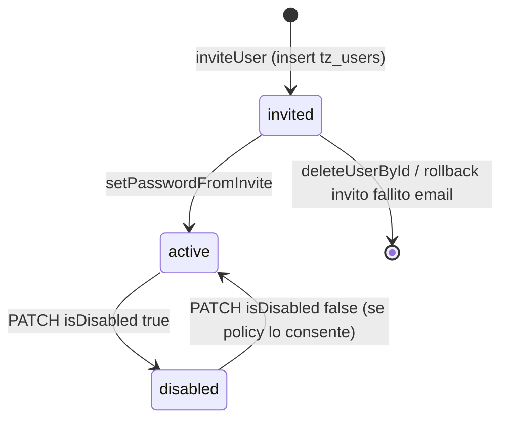
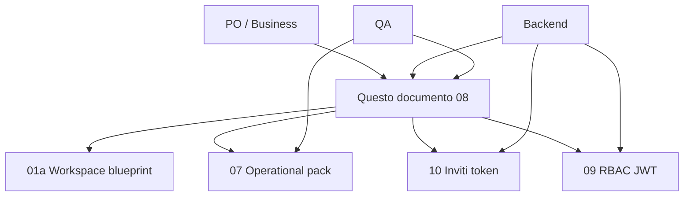

# Utenti, identità e ciclo di vita account (Followup 3.0 POC)

Documento **PO + tecnico**: cosa fa oggi il backend su account utente, dove vivono i dati, quali API toccano il dominio, e **use case / edge case** (inclusi quelli **non coperti** o **fragili** nel codice).  
Complementare a: `01a`, `07` (runbook), `09-rbac-...`, `10-invites-...`.

**Implementazione su database legacy / BSS:** questo file descrive il **POC** (`tz_users`, candidate collection). Per sapere **quali API legacy chiamare**, se le route REST devono essere solo **adapter**, e quali funzioni richiedono **spike** sul mondo BSS, leggere obbligatoriamente **`11-bss-legacy-bridge-api-and-data-matrix.md`** prima di stimare sprint backend.

---

## 1) Glossario

| Termine | Significato nel POC |
|---------|---------------------|
| **Utente applicativo** | Documento in `tz_users` (creazione invito, patch, delete) |
| **Identità login** | Può risiedere in più collection “candidate” per login legacy (`USER_COLLECTION_CANDIDATES`) |
| **Membership workspace** | `tz_user_workspaces` con `userId` = email (Fase 1), separata dall’invito |
| **Stato effettivo** | Deriva da `status`, `isDisabled`, presenza password (vedi §3) |

---

## 2) Modello dati principale (`tz_users`)

Shape usata dal service mutazioni (estratto concettuale da codice):

- `_id`, `email`, `password?`, `role?`, `system_role?`, `isTecmaAdmin?`, `isDisabled?`, `status?` (`invited` \| `active` \| `disabled`), `permissions_override?[]`, `email_verified?`, `project_ids?[]`

```27:39:tecma/business/tecma-digital-platform/followup-3.0/be-followup-v3/src/core/users/users-mutations.service.ts
export interface TzUserDoc {
  _id: ObjectId;
  email?: string;
  password?: string;
  role?: string;
  system_role?: "tecma_admin" | null;
  isTecmaAdmin?: boolean;
  isDisabled?: boolean;
  status?: UserStatus;
  permissions_override?: string[];
  email_verified?: boolean;
  project_ids?: string[];
}
```

**Fonte di verità invito (oggi):** solo `tz_users` viene creato/aggiornato da `inviteUser` / `setPasswordFromInvite`; la verifica “email già usata” scansiona **tutte** le collection candidate (§4).

---

## 3) Stati e transizioni (AS-IS)

### 3.1 Stato “effettivo”

```61:70:tecma/business/tecma-digital-platform/followup-3.0/be-followup-v3/src/core/users/users-mutations.service.ts
function effectiveStatus(doc: TzUserDoc): UserStatus {
  if (doc.isDisabled) return "disabled";
  if (doc.status === "invited") return "invited";
  return doc.status === "disabled" ? "disabled" : "active";
}

export function isInvitedWithoutPassword(doc: TzUserDoc): boolean {
  const st = effectiveStatus(doc);
  return st === "invited" || (!doc.password && st !== "disabled");
}
```

### 3.2 Diagramma transizioni (logico)



### 3.3 Use case coperti dal codice

| UC | Comportamento atteso (POC) | Dove |
|----|-----------------------------|------|
| UC-U-01 | Creare utente invitato con `project_ids` iniziale | `inviteUser` |
| UC-U-02 | Attivare utente con password da token | `setPasswordFromInvite` |
| UC-U-03 | Aggiornare ruolo, override permessi, `system_role`, disabilitazione | `updateUserById` |
| UC-U-04 | Eliminare utente da `tz_users` | `deleteUserById` |

---

## 4) Identità multi-collection (login vs inviti)

### 4.1 Collection candidate (login / collisioni email)

```121:127:tecma/business/tecma-digital-platform/followup-3.0/be-followup-v3/src/core/auth/userAccessPayload.ts
export const USER_COLLECTION_CANDIDATES = [
  "tz_users",
  "users",
  "Users",
  "user",
  "User",
  "backoffice_users"
] as const;
```

`inviteUser` rifiuta l’invito se l’email esiste in **qualsiasi** candidata:

```75:87:tecma/business/tecma-digital-platform/followup-3.0/be-followup-v3/src/core/users/users-mutations.service.ts
async function emailExistsInAnyUserCollection(email: string): Promise<boolean> {
  const e = normalizeEmail(email);
  const regex = new RegExp(`^${e.replace(/[.*+?^${}()|[\]\\]/g, "\\$&")}$`, "i");
  const db = getDb();
  for (const name of USER_COLLECTION_CANDIDATES) {
    const exists = await db.listCollections({ name }, { nameOnly: true }).hasNext();
    if (!exists) continue;
    const hit = await db.collection(name).findOne({ email: { $regex: regex } });
    if (hit) return true;
  }
  return false;
}
```

### 4.2 Edge case e gap (da chiudere in 3.1)

| ID | Scenario | AS-IS POC | Rischio | TO-BE consigliato (prodotto) |
|----|-----------|-----------|---------|------------------------------|
| E-U-01 | Utente esiste solo in `users` legacy, non in `tz_users` | Invito **409** | Impossibile invitare “BP” senza allineamento | Flusso “aggiungi a tz_users / link identity” o invito via BSS |
| E-U-02 | Stessa email con casing diverso | Regex case-insensitive | OK invito, ma confusione audit | Policy unica display + indice unique normalizzato |
| E-U-03 | `project_ids` vuoto o assente | `projectId` nel JWT può essere `null` | FE senza contesto progetto | Obbligare progetto default o picker post-login |
| E-U-04 | Membership workspace con `userId` email ma utente cambia email (futuro) | Oggi non gestito in questo file | Membership orfana | Migrazione a id stabile + `tz_identity_links` (vedi `04`, `07`) |
| E-U-05 | `workspaceId` nel body di `POST /users` | Passa a audit/security event ma **`inviteUser` non crea membership** | Admin crede di aver invitato “nel workspace” | API workspace-scoped o runbook obbligatorio (`07` §2.1) |

Riferimento route invito (nota `workspaceId` opzionale):

```17:39:tecma/business/tecma-digital-platform/followup-3.0/be-followup-v3/src/routes/v1/users.routes.ts
usersRoutes.post(
  "/users",
  requireAnyPermission(PERMISSIONS.USERS_INVITE, PERMISSIONS.USERS_CREATE),
  handleAsync(async (req) => {
    const body = z
      .object({
        email: z.string().email(),
        projectId: z.string().min(1),
        projectName: z.string().min(1).optional(),
        appPublicUrl: z.string().url().optional(),
        workspaceId: z.string().optional(),
        roleLabel: z.string().optional()
      })
      .parse(req.body);
```

---

## 5) Permessi route (invito / gestione utenti) — incrocio RBAC

| Endpoint (esempio) | Permesso richiesto | Note |
|---------------------|-------------------|------|
| `POST /v1/users` | `users.invite` **oppure** `users.create` | vedi `users.routes.ts` |
| `PATCH /v1/users/:id` | `users.update` | dettaglio in router |
| Admin parallelo `/users` | stesso pattern | `users-admin.routes.ts` |

Dettaglio completo permessi e merge JWT: **`09-rbac-permissions-enforcement-and-jwt.md`**.

---

## 6) Disabilitazione utente e sessioni (gap operativo)

**AS-IS:** `updateUserById` imposta `isDisabled` e forza `status: "disabled"` ma **non** è documentato in questo service se vengono revocati refresh token / sessioni.

| UC | Domanda PO/Security | Stato |
|----|---------------------|-------|
| UC-U-10 | Utente disabilitato può ancora refreshare? | Da verificare su `refreshSession` / login |
| UC-U-11 | Revoca immediata di access token | Tipicamente richiede denylist o versione token |

**Azione:** story dedicata in backlog Security + BE (criteri in `07` §6).

---

## 7) Backlog prodotto — Epiche, story e criteri (formato refinement-ready)

Le sezioni seguenti sono scritte per essere **copiate in Jira** (progetto TECMA, titoli con `[Area]` da adattare al backlog). Ogni story include **Who / What / Why**, **criteri di accettazione numerati**, **dipendenze** e **note tecniche** minime. Le decisioni architetturali non ancora prese sono marcate come **DECISIONE RICHIESTA**.

---

### Epic U-1 — Identità unificata: inviti e utenti legacy nello stesso modello mentale

**Obiettivo business:** un amministratore deve poter far entrare in piattaforma un collaboratore **senza** ambiguità tra “esiste nel vecchio sistema” e “esiste in Followup”, evitando doppioni e ticket al supporto.

**Perimetro:** flusso invito (`POST /users`), collisione email sulle collection candidate, allineamento con BSS/legacy in 3.1.

**Fuori perimetro (esplicito):** redesign completo del modello utente legacy lato BSS (resta decisione di dominio legacy).

**Owner epic:** PO (priorità) + BE (implementazione) + Security (collisioni identità).

---

#### Story U-1.1 — Comportamento quando l’email esiste solo in una collection legacy (gap E-U-01)

**Summary Jira (esempio):** `[Cross] Inviti — Gestione email già presente in collection legacy (non tz_users)`

**User Story (descrizione Jira):**

```markdown
## User Story:

### Who:
Amministratore che invita un nuovo indirizzo email dal pannello utenti.

### What:
Capire cosa succede se l’email è già registrata in una collection legacy (`users`, `Users`, ecc.) ma non in `tz_users`, e avere un percorso prodotto chiaro (messaggio, azione successiva).

### Why:
Oggi l’invito fallisce con 409 e l’admin non ha un flusso guidato per “collegare” o importare l’identità, con rischio di abbandono o richieste duplicate al supporto.

## Supporting Material:
- Gap E-U-01 in questo documento §4.2
- Codice: `emailExistsInAnyUserCollection` in `users-mutations.service.ts`

## Acceptance criteria:
1. Dato un utente la cui email esiste **solo** in una collection candidata diversa da `tz_users`, quando l’admin tenta `POST /v1/users` con quella email, allora la risposta è **409** (comportamento attuale) **e** il messaggio utente (FE) spiega in linguaggio naturale che l’account esiste già nel sistema (non generico “errore”).
2. **DECISIONE RICHIESTA — opzione A:** viene aggiunto un flusso “Aggiungi utente esistente al progetto/workspace” senza creare un nuovo `tz_users` duplicato; documentare endpoint e stati.
3. **DECISIONE RICHIESTA — opzione B:** resta solo 409 ma esiste articolo help / tooltip collegato con passi per l’admin (PO fornisce testo).
4. L’evento è tracciato in audit con `action` coerente e senza log della password.
5. QA: almeno 2 fixture (email in `users` mock, email in `tz_users`) con output atteso documentato.

## Technical Description:
- Nessuna modifica distruttiva alle collection legacy senza ADR; eventuale sync verso `tz_users` solo se approvato.
- Allineamento con strategia identità 3.1 (`04-data-adaptation-spec.md`).
```

**Dipendenze:** Epic identità / gateway se il flusso passa da BSS.

**Stima indicativa:** M (dipende dall’opzione A vs B).

---

#### Story U-1.2 — `workspaceId` opzionale su `POST /users` senza effetto su membership (gap E-U-05)

**Summary Jira (esempio):** `[Cross] Inviti — Allineare workspaceId su POST /users con membership o rimuovere ambiguità`

**User Story:**

```markdown
## User Story:

### Who:
Admin workspace che crea un invito pensando di aggiungere la persona “al workspace”.

### What:
O il campo `workspaceId` ha un effetto reale (creazione membership o invito workspace-scoped), oppure non è accettato / è deprecato con errore chiaro.

### Why:
Oggi il body accetta `workspaceId` e compare in audit/security, ma `inviteUser` non crea righe in `tz_user_workspaces`: rischio grave di mismatch tra intenzione admin e sistema.

## Supporting Material:
- `users.routes.ts` body zod con `workspaceId` opzionale
- Runbook `07-implementation-ready-operational-pack.md` §2.1

## Acceptance criteria:
1. **DECISIONE RICHIESTA — scegliere una sola direzione:**
   - **(1) Implementazione:** dopo invito riuscito e/o dopo `set-password-from-invite`, viene creata membership nel `workspaceId` indicato, con ruolo e audit (idempotenza definita).
   - **(2) Deprecazione:** se `workspaceId` è presente senza feature flag esplicito, rispondere **400** con codice errore stabile (`WorkspaceIdNotSupported`) **oppure** ignorare il campo solo se `ALLOW_ORPHAN_WORKSPACE_ID=true` in dev (documentato).
2. La documentazione PO (`01a`) e questo `08` sono aggiornate con la decisione presa.
3. FE: nessun campo “workspace” visibile se la direzione è (2) senza supporto.
4. QA: scenario “invito con workspaceId” ha expected status documentato (200 vs 400 vs membership creata).

## Technical Description:
- Valutare transazione o saga invito + membership (vedi `07`).
```

**Owner:** PO (decisione) + BE + FE.

**Priorità:** **P0** (ambiguità UX/processo).

---

### Epic U-2 — Stati account, disabilitazione e revoca accessi

**Obiettivo business:** quando un account è disabilitato o rimosso, l’organizzazione deve essere certa che **non** possa più accedere ai dati, in linea con aspettative Security.

**Owner epic:** Security + BE + QA.

---

#### Story U-2.1 — Matrice “stato documento utente” × “login” × “refresh” × “API protette”

**Summary Jira:** `[Cross] Utenti — Matrice stato account e revoca sessioni (disabled / invited / active)`

**User Story:**

```markdown
## User Story:

### Who:
Security officer e team operativo che gestiscono account compromessi o uscite del personale.

### What:
Una tabella approvata che definisce per ogni combinazione di campi (`status`, `isDisabled`, presenza password) se login, refresh e chiamate autenticate sono consentite o meno.

### Why:
Oggi `updateUserById` imposta `isDisabled` e `status: disabled` ma la revoca delle sessioni (`tz_authSessions`) non è descritta in questo service: rischio di accesso prolungato non percepito.

## Supporting Material:
- `updateUserById` in `users-mutations.service.ts`
- `refreshSession.service.ts` / login (analisi BE)

## Acceptance criteria:
1. Esiste un documento **versionato** (può essere appendice a questo `08` o ADR) con tabella:
   - righe: `invited`, `active`, `disabled` (incl. combinazioni `isDisabled` vs `status`);
   - colonne: “Password login”, “Refresh token”, “JWT ancora valido fino a expiry?”, “Azione raccomandata”.
2. Implementazione (se gap): alla PATCH `isDisabled: true` con policy “revoca immediata”, invalidare refresh token per `userId` / `sub` e documentare eventuale denylist access token.
3. QA: test automatici o checklist manuale per almeno 4 righe della matrice.
4. Nessun messaggio di errore che esponga differenza tra “utente inesistente” e “disabilitato” se la policy Security richiede messaggio unificato (specificare).

## Technical Description:
- Allineare con `10-invites-tokens-email-and-set-password.md` per inviti.
```

---

#### Story U-2.2 — Cancellazione utente: effetti a cascata e responsabilità dati

**Summary Jira:** `[Cross] Utenti — Policy cancellazione utente (tz_users, inviti, membership, CRM)`

**User Story:**

```markdown
## User Story:

### Who:
Admin con permesso cancellazione e team legali/operativi che definiscono retention.

### What:
Sapere cosa succede a inviti pendenti, token, membership workspace, assegnazioni entità e record CRM quando `deleteUserById` viene eseguito.

### Why:
`deleteUserById` oggi elimina solo il documento in `tz_users`; senza policy esplicita restano orfani in altre collection o dati inconsistenti.

## Acceptance criteria:
1. Documento “effetti a cascata” approvato da PO + BE: elenco collection toccate (`tz_inviteTokens`, `tz_user_workspaces`, `tz_entity_assignments`, ecc.) e per ciascuna: **cascade** / **blocca delete** / **soft delete**.
2. Se delete è bloccato (es. utente ha ownership su entità), codice e messaggio 409/422 allineati.
3. Audit obbligatorio prima e dopo (chi ha cancellato, quale `userId`).
4. QA: script o test che verificano assenza di membership zombie per email eliminata.

## Technical Description:
- Valutare soft-delete vs hard-delete per conformità.
```

---

### Epic U-3 — `project_ids` e contesto progetto nel JWT (gap E-U-03)

**Obiettivo:** evitare sessioni con `projectId: null` nel JWT quando il prodotto richiede sempre un contesto progetto per le schermate principali.

**Story U-3.1 (breve):** definire regola prodotto: primo progetto in `project_ids`, picker obbligatorio post-login, o errore se vuoto; allineare `buildAccessPayloadFromUserDoc` (usa il primo elemento dell’array).

**Acceptance criteria (sintesi):**

1. Dato `project_ids` non vuoto al login, `projectId` nel JWT corrisponde al primo elemento (comportamento attuale documentato).
2. Dato `project_ids` vuoto, **DECISIONE RICHIESTA:** o impedire attivazione account, o forzare scelta progetto nel FE prima di entrare nel CRM.
3. Documentazione FE del picker progetti collegata a `session/projects-by-email` dove applicabile.

---

## 8) Quality assurance — piano di test dettagliato (non solo bullet)

Questa sezione sostituisce i vecchi “4 bullet”: qui trovi **precondizioni**, **passi**, **esito atteso** e **priorità test** per QA e per automazione futura.

### 8.1 Ambiente e dati di test (precondizioni comuni)

| Elemento | Requisito |
|----------|------------|
| Database | Istanza con `tz_users` scrivibile; opzionalmente collection candidate `users` popolate per E-U-01 |
| Email | `EMAIL_TRANSPORT=mock` o SES valido; `INVITE_ALLOW_MOCK_EMAIL` coerente con `10` |
| Autenticazione | Utente admin con `users.invite` o `users.create` per chiamare `POST /v1/users` |

### 8.2 Casi — Invito e creazione `tz_users`

| ID test | Precondizione | Azione | Esito atteso | Priorità |
|---------|----------------|--------|--------------|----------|
| T-U-INV-01 | Email assente da tutte le candidate | `POST /v1/users` valido | `200`, body con `userId`, documento `status=invited`, `project_ids` contiene `projectId` | P0 |
| T-U-INV-02 | Stessa email già in `tz_users` | stesso POST | **409**, nessun secondo insert | P0 |
| T-U-INV-03 | Email solo in collection `users` (se presente in ambiente) | POST | **409** + messaggio comprensibile (dopo story U-1.1 anche copy FE) | P0 |
| T-U-INV-04 | SMTP fallisce dopo insert (simulare) | POST | **502**, nessun utente orfano, nessun token orfano | P1 |

### 8.3 Casi — Attivazione da invito e token

| ID test | Nota | Riferimento |
|---------|------|-------------|
| T-U-ACT-01 | Token valido + password conforme → utente `active`, `email_verified` true | `setPasswordFromInvite` |
| T-U-ACT-02 | Password non conforme **dopo** consume token | Comportamento attuale problematico: vedi **`10-invites-...` §3.1** (token bruciato); fino a fix, QA documenta come **known issue** con severità | P0 Security/UX |
| T-U-ACT-03 | Token già usato | seconda chiamata → **400** | P0 |

### 8.4 Casi — Disabilitazione e cancellazione

| ID test | Azione | Esito atteso (dopo implementazione matrice U-2.1) |
|---------|--------|-----------------------------------------------------|
| T-U-DIS-01 | `PATCH` con `isDisabled: true` | refresh successivi negati **se** policy “revoca immediata” approvata; altrimenti documentare finestra fino a expiry JWT |
| T-U-DEL-01 | `deleteUserById` su utente invitato | Policy a cascata da story U-2.2; fino a decisione, QA segnala “comportamento non definito” |

### 8.5 Tracciabilità e regressione

- Ogni bug trovato in questi flussi deve referenziare **ID gap** (E-U-xx) o **ID test** (T-U-xx) nel ticket Jira.
- Prima di ogni release candidate su workspace+utenti: eseguire almeno **T-U-INV-01/02**, **T-U-ACT-01/03**, **T-U-DIS-01** (se matrice approvata).

---

## 9) Riferimenti tecnici, grafo dipendenze e come usare questo documento

### 9.1 File sorgente nel repository (percorsi completi)

| Ruolo | Path |
|-------|------|
| Mutazioni utente (invito, set password, patch, delete) | `tecma/business/tecma-digital-platform/followup-3.0/be-followup-v3/src/core/users/users-mutations.service.ts` |
| Route API utenti standard | `.../be-followup-v3/src/routes/v1/users.routes.ts` |
| Route API utenti admin | `.../be-followup-v3/src/routes/v1/users-admin.routes.ts` |
| Candidati collection e payload JWT | `.../be-followup-v3/src/core/auth/userAccessPayload.ts` |

### 9.2 Grafo di lettura consigliato (per ruolo)



- **PO:** leggere §4.2 (gap), §7 (story), §8 (test).
- **BE:** leggere §2–§4 + codice citato + `09`/`10`.
- **QA:** partire da §8 e incrociare con `07` §9 (checklist gate).

### 9.3 Checklist “documento sufficiente per refinement”

Prima di chiudere il refinement sul dominio utenti, verificare:

- [ ] Story **U-1.2** (workspaceId) ha **decisione** registrata (implementa vs depreca).
- [ ] Story **U-2.1** ha **matrice stato** allegata o linkata.
- [ ] Story **U-2.2** ha **policy cancellazione** allegata.
- [ ] **T-U-ACT-02** è classificato (fix in sprint vs known issue con comunicazione supporto).

### 9.4 Tracciabilità QA / sicurezza (link a `07`)

| Scenario | Perché è critico | Dove vive il test minimo |
|----------|------------------|---------------------------|
| Utente disabilitato dopo emit JWT | sessione ancora valida? revoca? | `07` §9 + `09` enforcement |
| Stesso email su legacy collection diversa da `tz_users` | mismatch post-login | `07` §9b R-AUTH identity, `02` §G |
| PATCH stato account vs utente ancora invitabile | race invito/membership | `10` + `07` §9c idempotenza |
| Cancellazione vs anonymize | GDPR / audit | § story **U-2.2**, `04` reconciliation |

Per il **DoD** di release che tocca identità, applicare anche `07` §9a punti 3–4 (audit, segreti).

---

*Fine documento — sezioni 7–9 revisionate per chiarezza, completezza e uso operativo in backlog e QA.*
