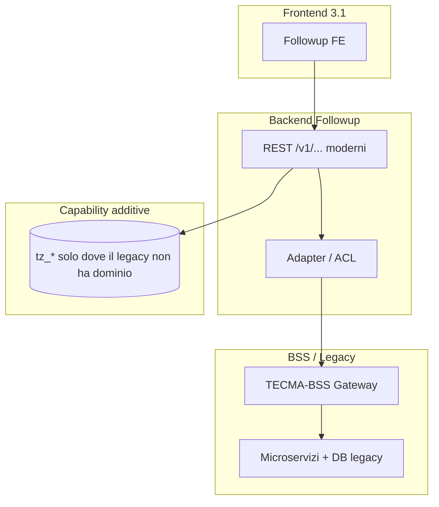
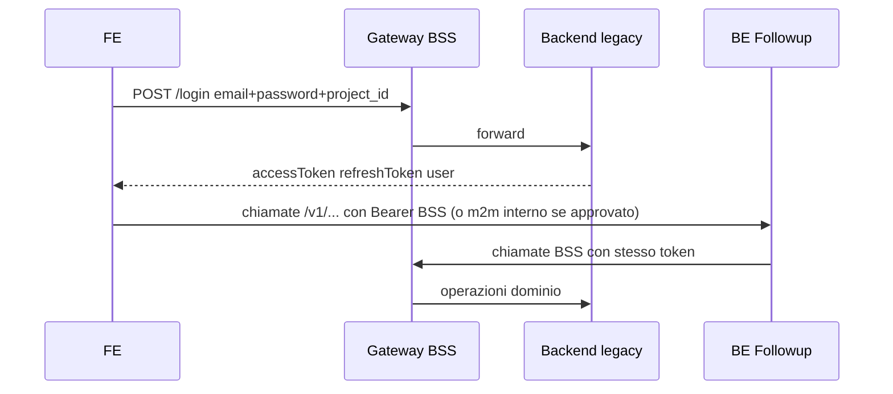

# Ponte implementativo — Followup 3.1 ↔ BSS / database legacy

Questo documento risponde esplicitamente a due paure ricorrenti:

1. **“Il pack non basta per implementare sul database legacy”** — perché molti file (`08`–`10`, `01a`) descrivono soprattutto il **comportamento del POC** (`tz_users`, `tz_inviteTokens`, JWT Followup), non il **modello persistenza e le API reali del mondo BSS** (che vanno scoperte/contrattualizzate con il team legacy).
2. **“I backend non sanno quali API nuove scrivere e come incastrarle con la vecchia BSS”** — qui trovate una **matrice lavoro**, classificazione delle API, **sequenze target**, **spike obbligatori** e una **checklist Definition of Ready** lato BE prima di aprire branch.

> Onestà metodologica: senza un **inventario API+collection legacy** firmato dal team BSS/DBA, nessun documento interno al solo repo Followup può essere completo al 100%. Questo file separa ciò che è **già noto dal POC/repo** da ciò che è **obbligatorio come output di spike** sul legacy.

---

## 1) Modello mentale: tre strati (cosa “incastra” cosa)

| Strato | Responsabilità | Cosa non deve fare |
|--------|------------------|-------------------|
| **FE** | UX, token in uso, chiamate verso un solo “mondo” per feature (idealmente gateway) | Non parlare direttamente con due auth diverse senza feature flag documentato |
| **BE Followup** | Orchestrazione, permessi workspace, mapping errori/DTO, ciò che non esiste in BSS | Non diventare “secondo CRM” con scritture duplicate su `tz_clients` / utenti paralleli non governati |
| **BSS / legacy** | Source of truth **read/write** utenti/progetti/clienti/… dove il dominio esiste già | Non essere bypassato da insert Mongo “comodi” |
| **`tz_*`** | Workspace, membership, mapping, inviti **se** non esiste equivalente legacy, audit additivo | Non sostituire silenziosamente tabelle legacy |

---

## 2) Matrice master — funzione prodotto ↔ legacy ↔ azione BE (template operativo)

**Legenda colonna “Azione 3.1”:**

- **R** — Reuse: solo proxy/adapter verso BSS, nessuna nuova semantica persistenza in Followup.
- **E** — Estensione gateway: nuovo path su API Gateway che punta a BE Followup (già pattern in `openapi-tecma-bss-additions.yaml`).
- **N** — Nuova API Followup + eventualmente nuova risorsa legacy (solo se il team legacy accetta contratto).
- **S** — **Spike** obbligatorio: oggi non abbiamo nel pack l’endpoint/collection legacy certa; il backend non può stimare lo sprint senza uscita spike.

| # | Funzione (prodotto) | Dati nel POC oggi | Presunto nel legacy BSS | API / flusso POC oggi | Azione 3.1 | Owner tipico |
|---|----------------------|-------------------|---------------------------|------------------------|------------|----------------|
| 1 | Login utente | `USER_COLLECTION_CANDIDATES`, bcrypt in BE | Utenti/progetti lato BSS | `POST /v1/auth/login` vs `POST /login` + `project_id` | **S** poi **R** o **E** a seconda di `AUTH_MODE` | Security + BE |
| 2 | Refresh sessione | `tz_authSessions` | Refresh BSS | `POST /v1/auth/refresh` vs BSS | **S** (allineare store) | Security + BE |
| 3 | “Me” / profilo | JWT + `getUserByJWT` adapter in FE | `getUserByJWT` BSS | Vari | **R** + normalizzazione | BE |
| 4 | Lista progetti per email | `tz_users`, `tz_project_access`, … | Probabile aggregazione utente-progetto legacy | `POST /v1/session/projects-by-email` | **S** → **R** (se BSS espone) o **E** (proxy) | BE + legacy |
| 5 | Invito utente | `tz_users` + `tz_inviteTokens` + email | **Sconosciuto nel pack** senza spike: creazione utente legacy? invito email legacy? | `POST /v1/users` | **S** → poi **N** o **R** | BE + legacy + PO |
| 6 | Set password da invito | consume token + update `tz_users` | Flusso legacy equivalente? | `POST /v1/auth/set-password-from-invite` | **S** | Security + BE |
| 7 | Patch utente (ruolo, disabled, override) | `tz_users` | Gestione utenti legacy | `PATCH /v1/users/:id` | **S** | BE + legacy |
| 8 | Workspace / membership | `tz_*` | Non omogeneo come “workspace” | `/v1/workspaces/...` | **E** + **TZ** (additive) finché legacy non ha primitiva | BE |
| 9 | RBAC stringhe | JWT `permissions` | Ruoli/permessi legacy | Merge membership + ruolo | **S** (tabella mapping) | PO + BE + Security |
| 10 | CRM clienti/appartamenti/… | POC nativo `tz_*` | Legacy dominio principale | `/v1/.../query` vs `/v2/.../project/{id}` | **R** (BSS) per read/write dominio | BE |

**Uso pratico:** in planning, ogni riga con **S** non diventa story di implementazione finché non esiste riga “esito spike” (endpoint legacy, payload, errori, permessi).

---

## 3) Cosa i backend devono produrre dopo lo spike (Definition of Ready legacy)

Per ogni riga **S** della §2, il team legacy/BSS consegna un mini-artefatto (anche Confluence + snippet OpenAPI):

1. **Identificativo dominio** (es. “anagrafica utenti progetto X”).
2. **Operazioni supportate**: create / read / update / disable / invite (sì/no).
3. **Endpoint HTTP** (metodo, path, versione), **request/response** (campi obbligatori), **codici errore** reali.
4. **Id stabili**: cosa è `userId`, `projectId`, tenant se esiste.
5. **Regole transazione**: cosa è atomico lato legacy (es. invito+progetto).
6. **Vincoli sicurezza**: chi può invitare, rate limit, audit obbligatori.

Fino a quel punto, il BE Followup può solo **stubbare** adapter dietro feature flag o mock contract test.

---

## 4) Classificazione delle API — “nuove” vs “adapter” vs “deprecate”

### 4.1 API che restano concettualmente “del gateway BSS” (target **R**)

Esempi tipici (nomi da confermare sullo swagger **raw** BSS, non solo public):

- `POST /login` (con `project_id`)
- `POST /v1/auth/refresh-token` (se è il contratto approvato)
- `POST /v1/users/getUserByJWT`
- Famiglia `/v2/.../project/{projectId}/...` per CRM

**Compito BE Followup:** client HTTP tipizzato, mapper errori, **non** reimplementare la semantica.

### 4.2 API POC oggi utili come **contratto FE moderno** ma implementazione deve diventare **adapter** (target **E** o **R**)

- `POST /v1/session/projects-by-email` — il FE può continuare a chiamarla se esposta via gateway verso BE Followup, ma l’implementazione interna deve leggere **legacy/BSS**, non inventare progetto.
- Eventuali `/v1/clients/query` ecc. — stesso discorso: thin adapter su `/v2/...` dove possibile.

### 4.3 API candidatamente **nuove** (target **N**) — solo dopo spike o decisione esplicita

- Invito **workspace-scoped** (`POST /v1/workspaces/{id}/invites`) se il legacy non ha equivalente.
- Replace bulk scope progetti utente nel workspace.
- Endpoint di riconciliazione identità (`tz_identity_links` o equivalente) se il legacy non espone join email↔id in un solo call.

**Regola:** ogni **N** deve avere: OpenAPI draft, owner gateway, owner microservizio legacy che persiste, piano rollback.

### 4.4 API / pattern da **non** portare in prod così com’è (candidati deprecazione o refactor)

- Doppio login parallelo senza strategia documentata.
- Scrittura CRM su `tz_clients` in parallelo al legacy senza governance.
- `workspaceId` su `POST /v1/users` senza effetto reale (vedi `08`).

---

## 5) Sequenze target (come deve “incastrarsi” dopo le decisioni)

### 5.1 Target consigliato — autenticazione **BSS-first** (semplifica incastro)

**Condizione:** il BE Followup deve poter agire per conto dell’utente con un token accettato da BSS, oppure con un pattern **m2m** approvato da Security (non usare la password utente lato server).

### 5.2 Target alternativo — **Hybrid** (massima complessità, documentare bene)

Due token convivono (BSS + JWT Followup). Richiede matrice “quale route usa quale token” + test end-to-end obbligatori. Vedi `02-poc-vs-legacy-gap-matrix.md` e `03-backend-adaptation-spec.md`.

### 5.3 Invito utente — due implementazioni possibili post-spike

**Opzione A — Invito è responsabilità legacy**

- FE/BE chiama solo BSS; Followup non crea `tz_users` per anagrafica.
- Eventuale `tz_*` solo per metadati workspace (membership) collegati a `legacyUserId`.

**Opzione B — Invito passa da BE Followup ma persiste su legacy**

- `POST /v1/users` diventa orchestratore: chiama API legacy create-user + invio email legacy; token potrebbe non essere più `tz_inviteTokens` ma quello del sistema inviti legacy.

**Opzione C** (solo transizione): invito resta come POC ma con sync job verso legacy — **sconsigliata** salvo finestra di migrazione breve; va documentata con reconciliation.

---

## 6) Mapping dati — cosa chiedere al DBA / team legacy (checklist)

| Domanda | Perché serve |
|---------|--------------|
| In quale collection/tabella vivono gli utenti “operativi” per progetto? | Sostituisce l’assunzione `tz_users` |
| Come si rappresenta disabilitazione vs cancellazione? | Allinea PATCH followup |
| Esiste già invito con token/scadenza? | Decide se tenere `tz_inviteTokens` |
| Come si aggiunge un utente a un progetto senza duplicare l’anagrafica? | Sostituisce `project_ids` array nel POC |
| Quali indici/unique su email? | Evita race con inviti |

---

## 7) Piano minimo per i backend (ordine di lavoro suggerito)

1. Leggere **`11` (questo file)** + `02` + `03`.
2. Eseguire **spike** per righe **S** della §2 con output §3.
3. Aggiornare **OpenAPI** (`05`) solo per path **E/N** approvati.
4. Implementare **adapter** `legacyBss/` prima delle nuove route “ricche”.
5. Scrivere **contract test** (Newman / integration) verso staging BSS.
6. Solo dopo: implementare feature **N** e layer `tz_*` residuo.

---

## 8) Riferimenti incrociati nel pack

| Argomento | Documento |
|-----------|-----------|
| Gap auth/session | `02-poc-vs-legacy-gap-matrix.md` |
| Moduli BE, flag | `03-backend-adaptation-spec.md` |
| Topologia DB | `04-data-adaptation-spec.md` |
| Merge gateway | `05-api-contract-alignment-spec.md` |
| Runbook operativi workspace/inviti | `07-implementation-ready-operational-pack.md` |
| Dettaglio POC utenti/RBAC/inviti | `08`, `09`, `10` |
| Progetti nel workspace, lista, permessi per progetto | `12-projects-workspace-users-and-permissions.md` |

---

## 8a) Tracciabilità spike (S) → artefatti → test

Per ogni riga **S** della §2:

1. **Output spike** (entro data concordata): elenco API legacy effettive, collection, vincoli unique, esempi payload request/response, decisione R/E/N finale.
2. **Artefatto contratto**: aggiornamento OpenAPI o nota “non esponiamo REST” con motivazione; link MR in `05`.
3. **Test**: minimo un caso API integrazione su staging che dimostra lettura/scrittura legacy conforme; ID in `07` §9b.
4. **Handoff QA**: copia-incolla della tabella errori attesi (401/403/409) per evitare interpretazioni errate durante UAT.

Se uno di questi quattro punti manca, la riga **S** non si considera chiusa: il lavoro implementativo sul codice Followup che dipende da quella riga resta **bloccato** o in feature flag spento.

---

## 9) Sintesi per CTO / EM

Il lavoro svolto su `08`–`10` e `07` è **necessario ma non sufficiente** per una implementazione legacy-first senza incontrare muri a metà sprint: manca il **contratto legacy verificato**. Questo documento `11` impone gli artefatti minimi (§3) e classifica il lavoro (§4–§7) così che backend e team BSS condividano la stessa mappa.
