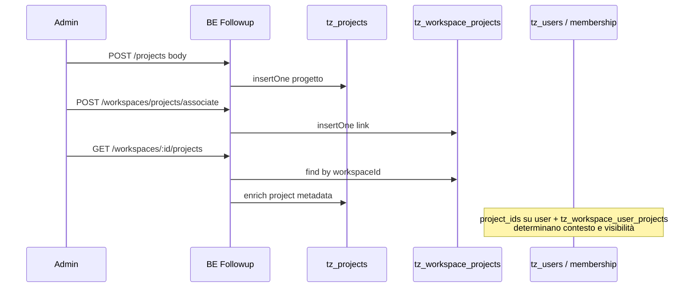

# Progetti ↔ workspace ↔ utenti e permessi (Followup 3.0 POC)

Questo documento collega tre domini che nei ticket finiscono spesso separati ma **in runtime sono intrecciati**:

1. **Creazione e anagrafica progetto** (`tz_projects`, API `/projects`).
2. **Elenco “progetti del workspace”** (join `tz_workspace_projects` + arricchimento da `tz_projects`).
3. **Utenti e permessi “a livello progetto”**: `project_ids` sul documento utente, `projectId` nel JWT, scope per utente nel workspace (`tz_workspace_user_projects`), e controlli `canAccess` / `requireCanAccessProject`.

Per il target **Followup 3.1 su legacy**, dopo la lettura di questo file passare a **`11-bss-legacy-bridge-api-and-data-matrix.md`**: oggi il POC persiste su `tz_*`; in produzione la creazione/lista potrebbe dover delegare a BSS mantenendo solo **mapping** o **projection** (decisione post-spike).

---

## 1) Tre “viste” dello stesso progetto (non confondetele)

| Concetto | Dove vive (POC) | Ruolo |
|----------|-----------------|-------|
| **Record progetto** | `tz_projects` (documento con `_id`, `name`, `mode`, opz. `workspace_id` “owner”, `legacyProjectId`, …) | Anagrafica e configurazione lato Followup |
| **Progetto collegato a un workspace** | `tz_workspace_projects` (`workspaceId`, `projectId`, `createdAt`) | Ciò che alimenta **la lista** `GET /workspaces/:id/projects` |
| **Progetto “ospitato” da altro workspace** | `tz_project_access` (`project_id`, `workspace_id`, `role`) | Accesso cross-workspace al **progetto** (vedi anche documentazione incrociata su grant/revoke in `projects.routes.ts`) |

**Errore comune in prodotto:** creare un progetto in `tz_projects` **senza** inserire una riga in `tz_workspace_projects` → il progetto **non compare** nell’elenco progetti del workspace (vedi §4).

---

## 2) Creazione progetto (AS-IS codice)

### 2.1 Endpoint e gate

- **`POST /v1/projects`** — `requireAdmin` (non basta un permesso stringa generico: è il middleware admin applicativo).

```44:44:tecma/business/tecma-digital-platform/followup-3.0/be-followup-v3/src/routes/v1/projects.routes.ts
projectsRoutes.post("/projects", requireAdmin, handleAsync((req) => createProject(req.body)));
```

### 2.2 Payload supportato (estratto schema)

Il service valida con Zod; campi principali:

- Obbligatori / default: `name`, `mode` (`rent` \| `sell`, default `sell`), vari flag booleani con default.
- Opzionale: **`workspace_id`** — se presente, viene scritto sul documento `tz_projects` come `workspace_id` (stringa trim). **Non** equivale automaticamente a creare la riga in `tz_workspace_projects`.

```15:35:tecma/business/tecma-digital-platform/followup-3.0/be-followup-v3/src/core/projects/projects.service.ts
const CreateProjectSchema = z.object({
  name: z.string().min(1).max(200),
  workspace_id: z.string().min(1).optional(),
  displayName: z.string().max(200).optional(),
  mode: z.enum(["rent", "sell"]).default("sell"),
  // ... altri campi marketing/config ...
});
```

### 2.3 Cosa viene scritto in DB

- `insertOne` su `tz_projects` con `code` / `hostKey` / `assetKey` / `feVendorKey` derivati o passati, `archived: false`, timestamp.
- Ritorno al client: `{ project: { id, name, displayName, mode } }` con `id` = `ObjectId` hex del documento creato.

### 2.4 Implicazioni PO / BE

| Domanda | Risposta nel POC |
|---------|------------------|
| Dopo `POST /projects`, il progetto è già nel workspace? | **Solo se** esiste già associazione **oppure** si chiama a parte `POST /workspaces/projects/associate` **oppure** il FE usa `workspace_id` solo come “owner hint” ma la lista workspace usa la join (§4). |
| Chi può creare? | Utenti che passano `requireAdmin` (non “chi ha SETTINGS_UPDATE”). |

**Gap documentazione precedente:** esplicitare in onboarding admin: **sempre** associare il progetto al workspace atteso se l’elenco workspace è la fonte UI.

---

## 3) Associazione e dissociazione progetto ↔ workspace

### 3.1 Associare

- **`POST /v1/workspaces/projects/associate`** (body validato da `AssociateProjectSchema` nel service) → `associateProjectToWorkspace` inserisce in `tz_workspace_projects` se non duplicato.

```303:334:tecma/business/tecma-digital-platform/followup-3.0/be-followup-v3/src/core/workspaces/workspaces.service.ts
export const associateProjectToWorkspace = async (
  rawInput: unknown
): Promise<{ workspaceId: string; projectId: string }> => {
  const input = AssociateProjectSchema.parse(rawInput);
  // ... verifica workspace esiste ...
  const existing = await wpColl.findOne({ workspaceId: wid, projectId: pid });
  if (existing) {
    return { workspaceId: wid, projectId: pid };
  }
  const now = new Date().toISOString();
  await wpColl.insertOne({
    workspaceId: wid,
    projectId: pid,
    createdAt: now,
  });
  return { workspaceId: wid, projectId: pid };
};
```

### 3.2 Dissociare

- **`DELETE /v1/workspaces/:workspaceId/projects/:projectId`** → rimuove solo la riga di join (non necessariamente cancella `tz_projects`).

---

## 4) Elenco progetti connessi a un workspace

### 4.1 Endpoint

```230:234:tecma/business/tecma-digital-platform/followup-3.0/be-followup-v3/src/routes/v1/workspaces.routes.ts
workspacesRoutes.get(
  "/workspaces/:id/projects",
  requireCanAccessWorkspace("id"),
  handleAsync((req) => listWorkspaceProjects(req.params.id).then((rows) => ({ data: rows })))
);
```

- Gate: **`requireCanAccessWorkspace`** → l’utente deve avere **membership** nel workspace (o bypass Tecma admin lato `canAccess`).

### 4.2 Logica `listWorkspaceProjects`

1. Legge **`tz_workspace_projects`** filtrando per `workspaceId`.
2. Dedup per `projectId`.
3. Arricchisce da **`tz_projects`** con `$or` su `_id` / `ObjectId` / **`legacyProjectId`** (per progetti bridge verso id BSS).
4. **Esclude** righe “orfane”: se non trova match in `tz_projects`, la riga **non** entra nel risultato (hardening commentato nel codice).

```229:299:tecma/business/tecma-digital-platform/followup-3.0/be-followup-v3/src/core/workspaces/workspaces.service.ts
/** Lista progetti associati a un workspace, arricchiti con name/displayName/mode da tz_projects. */
export const listWorkspaceProjects = async (
  rawWorkspaceId: unknown
): Promise<WorkspaceProjectEnrichedRow[]> => {
  // ... find tz_workspace_projects ...
  const matched = await projColl.find(
    {
      $or: [
        { _id: { $in: projectIds } },
        { _id: { $in: asObjectIds } },
        { legacyProjectId: { $in: projectIds } },
      ],
    },
    { projection: { _id: 1, legacyProjectId: 1, name: 1, displayName: 1, mode: 1 } }
  ).toArray();
  // ...
    if (!match) continue;
```

### 4.3 Edge case (QA / prodotto)

| ID | Scenario | Effetto |
|----|-----------|---------|
| P-WS-01 | `projectId` nella join è id legacy stringa ma `tz_projects` ha solo `legacyProjectId` | Risoluzione via `$or` — ok se dati coerenti |
| P-WS-02 | Join presente, documento `tz_projects` mancante | Progetto **sparito dalla lista** |
| P-WS-03 | Progetto creato solo in `tz_projects` con `workspace_id` ma **senza** join | **Non** in lista `GET .../projects` (comportamento attuale) |

---

## 5) Utenti e contesto progetto (JWT, `project_ids`, scope nel workspace)

### 5.1 `projectId` nel JWT

Da `buildAccessPayloadFromUserDoc`: se `user.project_ids` è array non vuoto, il JWT porta **`projectId` = primo elemento**.

Implicazione: utente con più progetti nel documento utente ha **un solo** `projectId` “primario” nel token; altri progetti vanno gestiti con picker / session / scope workspace.

### 5.2 Scope progetto per utente **dentro** un workspace

- Collection: **`tz_workspace_user_projects`**.
- API: `POST/DELETE/GET` sotto `/workspaces/:id/users/:userId/projects` (vedi `workspaces.routes.ts`).
- Regola nota: se **nessuna** riga per `(workspaceId, userId)`, l’utente vede **tutti** i progetti del workspace; se esiste almeno una riga, la visibilità è ristretta ai `projectId` elencati (dettaglio in `01-workspace-deep-dive.md`).

### 5.3 Invito utente con `projectId`

`POST /v1/users` richiede `projectId` e crea `tz_users` con `project_ids: [projectId]` — collega **utente** al progetto a livello anagrafica, **non** sostituisce la join workspace-progetto né lo scope `tz_workspace_user_projects`.

---

## 6) Permessi: tre livelli che si combinano

### 6.1 Permessi stringa (`PERMISSIONS.*`)

Esempio: molte route progetti sotto `/projects/:projectId/...` richiedono `SETTINGS_READ` / `SETTINGS_UPDATE` oltre al controllo accesso progetto.

### 6.2 Accesso al progetto (`canAccess` + `requireCanAccessProject`)

Il middleware risolve `workspaceId` da param/query/body; se mancante, `canAccess` per progetto può risalire al workspace **owner** del progetto.

```100:119:tecma/business/tecma-digital-platform/followup-3.0/be-followup-v3/src/routes/accessMiddleware.ts
/**
 * Richiede che l'utente abbia accesso al progetto (workspace owner o project_access).
 * Legge workspaceId e projectId da params (paramWorkspaceKey, paramProjectKey), query o body.
 * Se workspaceId non è fornito, viene risolto dal progetto (owner).
 */
export function requireCanAccessProject(paramWorkspaceKey = "workspaceId", paramProjectKey = "projectId") {
```

### 6.3 Verifica “progetto appartiene al workspace” per PATCH (`ensureProjectInWorkspace`)

Usata da `updateProject`: per utenti non admin, deve esistere riga in **`tz_workspace_projects`** (salvo bypass per workspace id in lista legacy hardcoded).

```11:24:tecma/business/tecma-digital-platform/followup-3.0/be-followup-v3/src/core/projects/project-access.ts
export const ensureProjectInWorkspace = async (
  projectId: string,
  workspaceId: string,
  isAdmin: boolean
): Promise<void> => {
  if (isAdmin || LEGACY_WORKSPACES.includes(workspaceId)) return;
  const db = getDb();
  const wp = await db.collection(COLLECTION_WORKSPACE_PROJECTS).findOne({
    workspaceId,
    projectId,
  });
  if (!wp) {
    throw new HttpError("Project not found or not in workspace", 404);
  }
};
```

### 6.4 `workspaceId` obbligatorio in query per alcune route progetti

`getProjectContext` usato da diverse sotto-route di `/projects/:projectId` **richiede** `?workspaceId=`; in sua assenza → **400**.

```14:21:tecma/business/tecma-digital-platform/followup-3.0/be-followup-v3/src/routes/requestContext.ts
export function getProjectContext(req: Request): ProjectContext {
  const projectId = typeof req.params.projectId === "string" ? req.params.projectId : "";
  const workspaceId = typeof req.query.workspaceId === "string" ? req.query.workspaceId.trim() : "";
  if (!workspaceId) {
    throw new HttpError("Missing workspaceId query param", 400);
  }
```

**Implicazione FE/integrazione:** documentare sempre la coppia `(projectId, workspaceId)` nelle chiamate che passano da `getProjectContext`.

---

## 7) Diagramma di flusso (creazione → visibilità → utente)



---

## 8) Backlog PO / BE (sintesi)

| ID | Story (titolo guida) | Motivo |
|----|----------------------|--------|
| PRJ-01 | Wizard “crea progetto + associa al workspace corrente” | Evita P-WS-03 |
| PRJ-02 | Documentazione FE: `workspaceId` query obbligatorio | Evita 400 silenziosi |
| PRJ-03 | Allineare `workspace_id` su `tz_projects` con join `tz_workspace_projects` | Coerenza owner vs lista |
| PRJ-04 | Spike legacy: creazione progetto BSS vs `tz_projects` | `11` |

---

## 9) Riferimenti file

- `be-followup-v3/src/core/projects/projects.service.ts` — `createProject`, `updateProject`
- `be-followup-v3/src/core/projects/project-access.ts` — `ensureProjectInWorkspace`
- `be-followup-v3/src/core/workspaces/workspaces.service.ts` — `listWorkspaceProjects`, `associateProjectToWorkspace`
- `be-followup-v3/src/routes/v1/projects.routes.ts` — route progetti e project access
- `be-followup-v3/src/routes/v1/workspaces.routes.ts` — lista progetti workspace, scope utente-progetto
- `be-followup-v3/src/routes/requestContext.ts` — `getProjectContext`
- `be-followup-v3/src/core/access/canAccess.ts` — accesso progetto
- `be-followup-v3/src/core/auth/userAccessPayload.ts` — `projectId` JWT

---

## 10) Incrocio con altri documenti del pack

| Argomento | Documento |
|-----------|-------------|
| Deep dive workspace / scope utente | `01-workspace-deep-dive.md` |
| Runbook operativi | `07-implementation-ready-operational-pack.md` |
| Utenti, inviti, `project_ids` | `08`, `10` |
| RBAC stringhe | `09` |
| Legacy BSS cosa sostituisce cosa | `11-bss-legacy-bridge-api-and-data-matrix.md` |

---

## 11) Tracciabilità test minima (allineamento a `07` §9 / §9d)

| ID | Scenario | Precondizioni | Atteso | Tipo test |
|----|-----------|----------------|--------|-----------|
| T-PRJ-CTX-01 | GET sotto-route progetto senza `?workspaceId=` | utente autenticato, progetto esistente | 400 messaggio “Missing workspaceId” | API |
| T-PRJ-WS-02 | Progetto non associato al workspace | membership OK, nessuna riga in `tz_workspace_projects` | 404 da `ensureProjectInWorkspace` | API |
| T-PRJ-LIST-03 | Lista progetti workspace | workspace con 0/N progetti | array coerente + permessi lettura | API/E2E |
| T-PRJ-ADM-04 | POST `/projects` senza admin | utente `viewer` | 403 | API |
| T-PRJ-SCOPE-05 | Utente con `tz_workspace_user_projects` limitato | overlay attivo | vede solo sottoinsieme atteso | E2E |

Aggiornare la colonna “ID test” nella matrice globale `07` §9b quando si creano suite automatizzate; per spike legacy su creazione progetto, seguire `11` §8a prima di cambiare persistenza.
