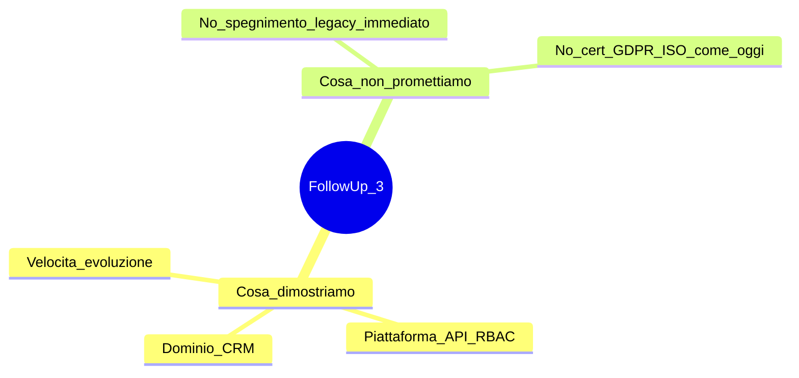
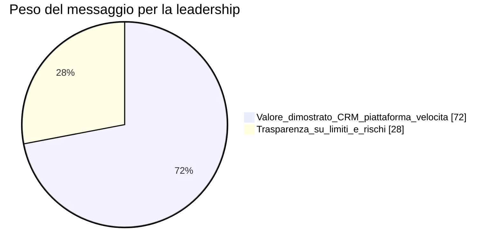

# Executive summary — FollowUp 3.0

**Ultimo aggiornamento:** 2026-04-13  
**Indice:** [README.md](README.md)

---

## In 30 secondi

FollowUp 3.0 **non** clona il legacy: è una **linea nuova** che valida architettura, sicurezza, multi-tenant, API e UX su stack moderno (React, REST, MongoDB, `tz_*` additive), con **north star** CRM multiprogetto in [FOLLOWUP_3_MASTER.md](../FOLLOWUP_3_MASTER.md). Su **perimetro definito** la baseline è **operativa in produzione controllata**, non solo prototipo slegato dal deploy.

---

## Cosa stiamo dimostrando

- **Dominio:** clienti, unità, richieste, calendario, cockpit — da esperienza 2019→oggi; legacy come *specifica implicita*.
- **Piattaforma:** OpenAPI, workspace, RBAC, connettori, traccia enterprise (audit, compliance, osservabilità).
- **Velocità:** AI-assisted su codice e documentazione; greenfield **perimetrato** vs patching continuo su stack storico per compliance e integrazioni.

## Cosa non è

- **Non** è commitment immediato a spegnere il legacy.  
- **Non** è certificazione GDPR/ISO: capability in costruzione — [stadio operativo per area](03-domain-maturity-matrix.md), [06](06-risks-open-decisions.md).

## Cosa serve dalla leadership

1. Separare **narrativa commerciale** (es. “MVP”, demo) dallo **stadio tecnico oggi**: baseline **operativa in produzione controllata** su perimetro definito, senza equivalenza al legacy completo.  
2. Decisioni su **identity / commerciale** (entitlement, BSS, Keycloak — `docs/plans/`).  
3. Trasparenza su **compliance parziale** fino a chiusura processi nel piano sicurezza.

## Approfondimenti

- [02 — Greenfield](02-why-greenfield-vs-legacy.md) · [03 — Stadio operativo](03-domain-maturity-matrix.md) · [04 — Architettura](04-architecture-at-a-glance.md)  
- [05 — Privacy](05-privacy-gdpr-and-tenant-model.md) · [06 — Rischi](06-risks-open-decisions.md)  
- Backlog: [PIANO_GLOBALE_FOLLOWUP_3.md](../PIANO_GLOBALE_FOLLOWUP_3.md)
