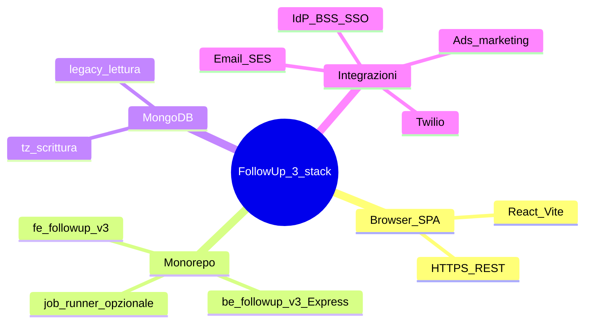
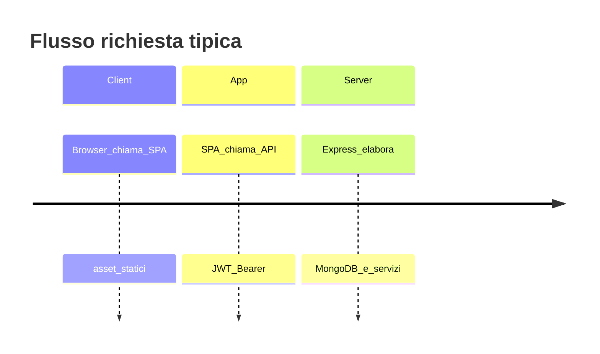

# Architettura — vista d’insieme

**Ultimo aggiornamento:** 2026-04-13  
**Indice sezione:** [README.md](README.md)

---

## In 30 secondi

FollowUp 3.0 è un **modular monolith** lato backend (Express, TypeScript) e una **SPA** React (Vite). La **verità operativa** dei dati applicativi è **MongoDB** (database configurato da `MONGO_DB_NAME`). L’autenticazione principale è **JWT** (access + refresh); SSO verso IdP aziendale dove configurato.

---

## Diagramma logico (componenti)

---

## Dati e legacy

- **Scrittura applicativa** su collection **`tz_*`** e modelli documentati nel backend; policy su legacy in [FOLLOWUP_3_MASTER.md](../FOLLOWUP_3_MASTER.md) e [LEGACY_RUNTIME_POLICY.md](../LEGACY_RUNTIME_POLICY.md).
- **Indici** e nomi collection: `be-followup-v3/src/config/ensureIndexes.ts` (riferimento tecnico).

---

## Deploy e ambienti

- Pattern documentati per **Render** e variabili: [RENDER_DEPLOY.md](../RENDER_DEPLOY.md), [RENDER_FOLLOWUP_ENV.md](../RENDER_FOLLOWUP_ENV.md).
- **Worker** separato per job schedulati (comunicazioni, automazioni, ecc.): vedi README monorepo root — non nel processo API.

---

## Contratti e integrazione esterna

- **OpenAPI** servita dal backend (`/v1/openapi.json`); allineamento gateway: [openapi-tecma-bss-additions.yaml](../openapi-tecma-bss-additions.yaml), [AUTH_AND_TECMA_BSS_API_REPORT.md](../AUTH_AND_TECMA_BSS_API_REPORT.md).

---

## Approfondimenti

- Frontend: [fe-followup-v3/ARCHITECTURE.md](../../fe-followup-v3/ARCHITECTURE.md)  
- Osservabilità: [OBSERVABILITY.md](../OBSERVABILITY.md)  
- Modello tenant e PII: [05-privacy-gdpr-and-tenant-model.md](05-privacy-gdpr-and-tenant-model.md)
