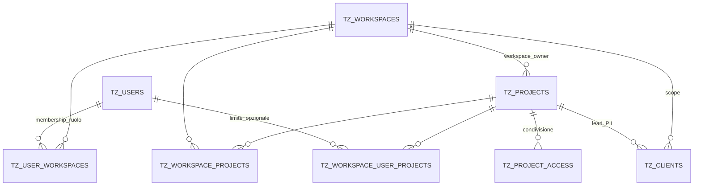
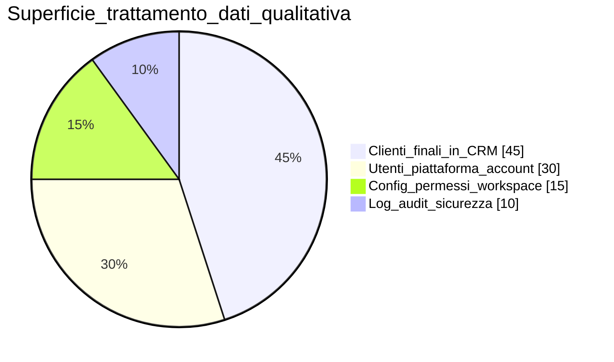
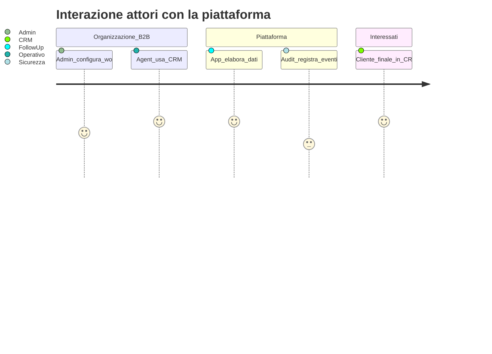

# Privacy, GDPR (alto livello) e modello multi-tenant

**Ultimo aggiornamento:** 2026-04-13  
**Indice sezione:** [README.md](README.md)

---

## In 30 secondi

I **dati dei clienti finali** del promotore/agenzia (lead CRM) convivono nel sistema con i **dati degli utenti piattaforma** (account, permessi). Il **workspace** è il contenitore organizzativo principale; il **progetto** specializza il contesto commerciale. Questa pagina serve a **delineare confini** per discussioni con DPO/legal e **non** sostituisce parere legale o DPA.

---

## Disclaimer

- Non è **parere legale**. I ruoli **titolare / responsabile / sub-responsabile** dipendono da contratti e dalla struttura del cliente finale.
- Tipicamente in SaaS B2B il **cliente organizzazione** è titolare del trattamento sui dati dei **propri** clienti finali inseriti nel CRM; il **fornitore della piattaforma** può agire come responsabile per tali trattamenti, salvo diversa qualificazione. Verificare sempre con legal.

---

## Glossario tecnico (collezioni / entità)

Riferimento: `be-followup-v3/src/types/models.ts`.

- **`tz_workspaces`** — tenant (organizzazione / ambiente dati).  
- **`tz_users`** — identità globale (email, ruoli Tecma opzionali).  
- **`tz_user_workspaces`** — membership ↔ workspace (ruolo, `access_scope`).  
- **`tz_projects`** — progetto CRM; `workspace_id` proprietario.  
- **`tz_workspace_projects`** — progetto collegato al workspace.  
- **`tz_workspace_user_projects`** — opzionale: limita progetti visibili per utente.  
- **`tz_project_access`** — accesso progetto da altro workspace.  
- **`tz_clients`** — lead/cliente CRM (PII), scoped workspace/progetto.

---

## Diagramma 1 — Modello logico dati e accessi

**Lettura:** l’utente piattaforma accede ai workspace con ruolo e scope; i progetti sono collegati al workspace; i **clienti CRM** sono nel contesto workspace/progetto; la collaborazione tra organizzazioni usa `tz_project_access`; il sottoinsieme progetti per utente è `tz_workspace_user_projects`.

---

## Diagramma 2 — Attori e categorie di dati

**Categorie dati (per documentazione interna):**

- **Utenti piattaforma:** credenziali/invito, email, ruoli, permessi, log di accesso e operazioni rilevanti.
- **Clienti finali CRM:** nominativi, contatti, trattative, documenti allegati — PII da gestire secondo policy del titolare e accordi con il fornitore.

---

## Collegamenti operativi

- Runbook sicurezza e processi: [SECURITY_RUNBOOK.md](../SECURITY_RUNBOOK.md)  
- Policy backup/DR se applicabile: [COMPLIANCE_BACKUP_DR.md](../COMPLIANCE_BACKUP_DR.md)  
- Dettaglio implementativo audit/auth: `be-followup-v3/docs/` e piano sicurezza nel repo
