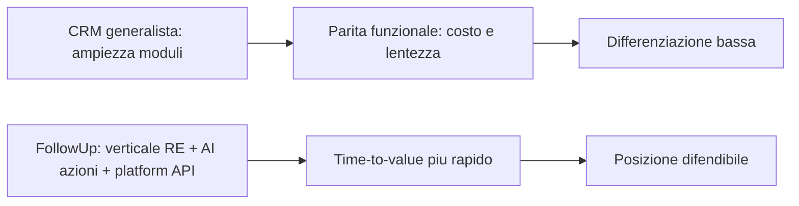

# Posizionamento AI-first (vs CRM generalisti)

**Ultimo aggiornamento:** 2026-04-13  
**Indice:** [README.md](README.md)

---

## In 30 secondi

FollowUp 3.0 non deve inseguire la parita funzionale con HubSpot o Salesforce. La strategia sostenibile e vincente e: **verticale real estate + AI operativa + piattaforma API governata + time-to-value rapido**.  
L'obiettivo non e avere piu moduli: e far eseguire al team commerciale le azioni giuste, prima, con meno attrito e maggiore tracciabilita.

---

## Cosa evitare

- **Feature catalog race:** copiare in sequenza tutto il perimetro marketing/sales/service dei player globali.
- **AI cosmetica:** chatbot o testo generato senza impatto operativo reale sui flussi quotidiani.
- **Automazioni opache:** scritture automatiche senza approvazione, senza audit, senza confini workspace/progetto.

---

## Dove competere davvero

1. **Execution cockpit:** home action-first con priorita chiare e CTA immediate.
2. **AI con responsabilita:** suggerimenti utili, human-in-the-loop, audit eventi, scope per tenant.
3. **UX per utenti non tecnici:** meno click, linguaggio chiaro, progressive disclosure.
4. **Piattaforma integrabile:** API e capability esterne governate (entitlement, rate-limit, scope).
5. **Trust e governance:** trasparenza su dati, permessi, retention, export e policy operative.

---

## Gap da chiudere prima del messaggio commerciale "AI-first"

Allineati al piano corrente:

- **Wave 7:** completare il ramo approvazioni + audit su azioni ad alto impatto (HITL pieno).
- **FASE 1 -> 3 -> 2:** consolidare dati legacy, storage, preventivo digitale (catena valore commerciale).
- **FASE 4 -> 7:** KPI/reporting, sync calendario reale, connettori, inbox affidabile.
- **FASE 8:** raffinare percezione premium e coerenza visuale.

---

## Messaggio pronto per CEO/Sales

> "FollowUp 3.0 non vuole diventare il clone di un CRM generalista.  
> Scegliamo di vincere dove conta per il real estate: meno attrito operativo, AI che aiuta ad agire (non solo a scrivere), integrazioni governate e risultati misurabili su conversione e tempi di trattativa."

---

## Metriche guida (prime 3 da rendere pubbliche internamente)

- **Tempo medio lead -> prima azione utile** (ore).
- **Conversione visita -> proposta/preventivo** (%).
- **Richieste ad alta priorita gestite entro SLA** (% entro 24h/48h).

Queste metriche devono guidare priorita prodotto, rollout AI e narrativa commerciale.

---

## Riferimenti

- [FOLLOWUP_3_MASTER.md](../FOLLOWUP_3_MASTER.md)
- [PIANO_GLOBALE_FOLLOWUP_3.md](../PIANO_GLOBALE_FOLLOWUP_3.md)
- [03-domain-maturity-matrix.md](03-domain-maturity-matrix.md)
- [06-risks-open-decisions.md](06-risks-open-decisions.md)
