# Followup 3.0 Handoff Quickstart

## Obiettivo
Questo documento permette a un team nuovo di:
- capire in 15 minuti come funziona oggi il POC su workspace + utenti + RBAC
- arrivare alla riunione di allineamento con un linguaggio comune
- partire a implementare senza settimane di discovery

## Scope di questo handoff
- Frontend: `fe-followup-v3`
- Backend: `be-followup-v3`
- Tema: autenticazione, selezione workspace/progetti, gestione utenti, enforcement permessi
- DB target operativo attuale: MongoDB dev (`MONGO_DB_NAME=test-zanetti`, variabile in `.env`)

## Cosa leggere prima (ordine consigliato)
1. `be-followup-v3/src/routes/v1.ts`
2. `be-followup-v3/src/routes/authMiddleware.ts`
3. `be-followup-v3/src/routes/permissionMiddleware.ts`
4. `be-followup-v3/src/core/access/canAccess.ts`
5. `fe-followup-v3/src/App.tsx`
6. `fe-followup-v3/src/auth/projectScope.ts`
7. `fe-followup-v3/src/core/auth/ProjectAccessPage.tsx`
8. `fe-followup-v3/src/core/users/UsersPage.tsx`
9. `fe-followup-v3/src/core/workspaces/WorkspacesPage.tsx`
10. `be-followup-v3/src/config/ensureIndexes.ts`

## Glossario minimo
- **Workspace**: tenant logico (isolamento operativo e funzionale).
- **Membership**: relazione utente-workspace (`tz_user_workspaces`).
- **Role**: ruolo workspace (`owner`, `admin`, `collaborator`, `viewer`).
- **Permission**: permesso fine-grained (`clients.read`, `users.write`, ...).
- **Project scope**: set progetti selezionati per sessione utente.
- **Entitlement**: feature commerciale abilitata per workspace.
- **Tecma admin**: ruolo globale di sistema (`system_role=tecma_admin`), con bypass forte.

## Flusso AS-IS (oggi nel POC)

```mermaid
flowchart LR
  login[LoginPage] --> token[JWTAccessRefresh]
  token --> me[AuthMe]
  me --> projectAccess[ProjectAccessPage]
  projectAccess --> scope[ProjectScopeSessionStorage]
  scope --> app[AppRoutesAndNav]
  app --> feGate[FEPermissionGating]
  feGate --> api[APIRequests]
  api --> beGate[BEAuthAndPermissionMiddleware]
  beGate --> data[MongoCollectionsTz]
```

## Architettura mentale (2 livelli)
- **FE decide UX di visibilità**: menu, route, azioni mostrate.
- **BE decide sicurezza reale**: autorizzazione finale e confini tenant.

## Stato attuale in 12 punti
1. Login supporta flussi multipli (Followup + SSO Keycloak + ramo BSS).
2. Token e refresh centralizzati nel client HTTP FE.
3. Se scope progetto manca, FE forza passaggio in `ProjectAccessPage`.
4. Scope persistito client-side in `followup3.projectScope`.
5. FE usa `hasPermission` per gating route/menu/palette.
6. BE valida JWT e applica middleware permessi su endpoint sensibili.
7. BE usa anche controllo accesso workspace/progetto (`canAccess`).
8. Membership workspace vive in `tz_user_workspaces`.
9. Assegnazione progetti per utente workspace vive in `tz_workspace_user_projects`.
10. Entitlements workspace separati da RBAC in `tz_workspace_entitlements`.
11. Indici Mongo principali vengono auto-creati in bootstrap (`ensureCoreIndexes`).
12. POC mantiene pezzi legacy e fallback permissivi in alcuni punti.

## Limiti POC da tenere in testa subito
- Scelta ambiente login hardcoded su `dev-1/demo/prod`.
- Membership spesso keyed su email (non userId canonico ObjectId).
- Bypass admin globale forte (`tecma_admin` / `*`) da trattare con cautela.
- Alcuni percorsi dipendono da fallback legacy e non da policy unificata.
- Route FE e policy BE non sempre perfettamente allineate nel naming.

## Potenzialità già pronte da riusare
- Catalogo permessi e role definitions già esistenti.
- Middleware auth/permission già separati e estendibili.
- Pattern `workspace + project + permission` già presente su molte API.
- Runbook e analisi già disponibili in `docs/analysis/followup3-legacy-adaptation`.

## Agenda riunione 2 ore (consigliata)
### 0:00 - 0:20
Allineamento lessico e scope (workspace, membership, RBAC, entitlement).

### 0:20 - 0:50
Walkthrough flusso end-to-end login -> scope -> API -> enforcement.

### 0:50 - 1:20
Limiti POC e decisioni architetturali obbligatorie per rebuild.

### 1:20 - 1:45
Nuovo DB Mongo dev: schema reale, indici, query pattern, runbook ops.

### 1:45 - 2:00
Assegnazione backlog sprint e prompt Cursor/AI per partire subito.

## Output atteso fine riunione
- Decisioni bloccanti già prese (no analisi aperta infinita).
- Backlog tecnico già diviso per FE/BE/DB/QA.
- Team operativo entro giornata con task implementativi concreti.

## Documenti successivi da leggere
- `docs/handoff/WORKSPACE_USERS_RBAC_RUNBOOK.md`
- `docs/handoff/POC_LIMITS_AND_REBUILD_BLUEPRINT.md`
- `docs/handoff/MONGODB_DEV_TECH_DEEP_DIVE.md`
- `docs/handoff/CURSOR_AI_EXECUTION_PROMPTS.md`
