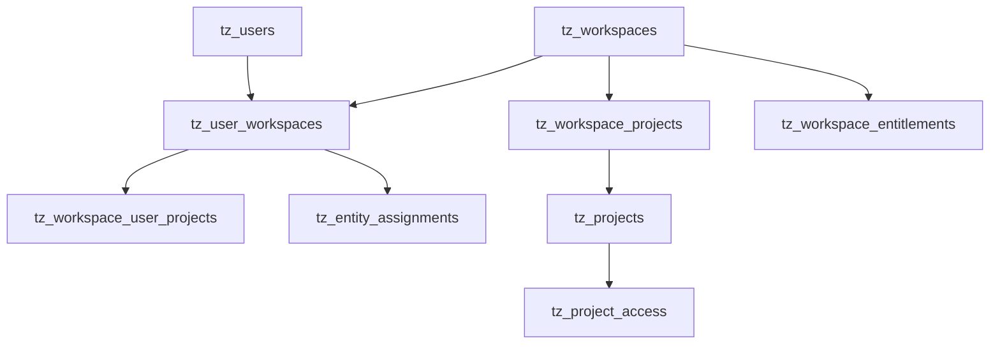

# MongoDB Dev Tech Deep Dive

## Obiettivo
Documento tecnico operativo sul nuovo DB Mongo dev usato dal POC (`MONGO_DB_NAME=test-zanetti`), per permettere al team di rifare la soluzione senza discovery lunga.

## Contesto runtime
- Backend legge connessione da:
  - `MONGO_URI`
  - `MONGO_DB_NAME`
- Default esempio in `be-followup-v3/.env.example`:
  - `MONGO_URI=mongodb://localhost:27017`
  - `MONGO_DB_NAME=test-zanetti`
- Bootstrap indici: `be-followup-v3/src/config/ensureIndexes.ts` (`ensureCoreIndexes`).

## Modello dati logico (tenant-aware)



## Collezioni core (workspace/users/RBAC)

### 1) `tz_users`
Scopo:
- identità globale utente
- metadati auth (role/system_role/override)

Campi chiave (AS-IS):
- `_id`
- `email`
- `role`
- `system_role` (es. `tecma_admin`)
- `permissions_override`
- `project_ids` (legacy)

Uso principale:
- `users-admin.service.ts`
- `users-mutations.service.ts`
- `auth` flow (`projectAccess.service.ts`, `userAccessPayload.ts`)

### 2) `tz_workspaces`
Scopo:
- tenant container

Campi chiave:
- `_id`
- `name`
- `owner_user_id`
- `mfaRequired`
- `createdAt`, `updatedAt`

Uso principale:
- `workspaces.service.ts`
- `workspaceMfaPolicy.service.ts`

### 3) `tz_user_workspaces`
Scopo:
- membership utente nel workspace (role + scope)

Campi chiave:
- `workspaceId`
- `userId` (oggi spesso email lowercase)
- `role`
- `access_scope`
- `calendarDisplayColor`

Indice chiave:
- unique `(workspaceId,userId)`

Uso principale:
- `workspace-users.service.ts`
- `canAccess.ts`
- `users-admin.service.ts`

### 4) `tz_workspace_projects`
Scopo:
- associazione progetto a workspace

Campi chiave:
- `workspaceId`
- `projectId`
- `createdAt`

Uso principale:
- `workspaces.service.ts`
- `projectAccess.service.ts`
- `canAccess.ts`

### 5) `tz_workspace_user_projects`
Scopo:
- filtro progetti visibili per utente dentro workspace

Campi chiave:
- `workspaceId`
- `userId`
- `projectId`
- `createdAt`

Indice chiave:
- unique `(workspaceId,userId,projectId)`

Regola AS-IS:
- se non ci sono righe per `(workspaceId,userId)`, in diversi flussi il comportamento è default permissivo.

### 6) `tz_project_access`
Scopo:
- collaborazione cross-workspace su progetto non owner

Campi chiave:
- `project_id`
- `workspace_id`
- `role` (`owner|collaborator|viewer`)
- `created_at`

Uso principale:
- `core/projects/project-access.service.ts`
- `core/access/canAccess.ts`

### 7) `tz_entity_assignments`
Scopo:
- assegnazioni granulari entità (client/apartment) a utente

Campi chiave:
- `workspaceId`
- `entityType`
- `entityId`
- `userId`
- `createdAt`

Indici chiave:
- unique `(workspaceId,entityType,entityId,userId)`
- `(workspaceId,userId)`

### 8) `tz_workspace_entitlements`
Scopo:
- gating capability commerciale per workspace

Campi chiave:
- `workspaceId`
- `feature`
- `status` (`inactive|pending_approval|active|suspended`)
- `billingMode`
- `notes`

Indice chiave:
- unique `(workspaceId,feature)`

Uso principale:
- `workspace-entitlements.service.ts`
- middleware entitlement routes

---

## Indici principali da conoscere

Fonte canonica:
- `be-followup-v3/src/config/ensureIndexes.ts`

Set minimo da proteggere in rebuild:
- `tz_user_workspaces`: `(workspaceId,userId)` unique
- `tz_workspace_user_projects`: `(workspaceId,userId,projectId)` unique
- `tz_entity_assignments`: `(workspaceId,entityType,entityId,userId)` unique
- `tz_workspace_entitlements`: `(workspaceId,feature)` unique
- `tz_workspace_projects`: indice su `(workspaceId,projectId)` (raccomandato anche unique lato target)
- indici list query su `(workspaceId,projectId,updatedAt)` per principali entità business

Nota:
- il bootstrap indici AS-IS è best-effort: non blocca sempre startup su conflict/duplicate legacy.
- per rebuild prod-grade, definire politica esplicita `fail-fast` per indici critici.

---

## Query pattern reali (da codice)

### Pattern A — accesso workspace utente
- lookup membership:
  - filter `{ userId: <email_lower> }`
  - projection `{ workspaceId, role }`
- usato in `canAccess` e auth payload.

### Pattern B — accesso progetto utente
- verifica owner workspace progetto da `tz_projects` / fallback `tz_workspace_projects`
- merge con `tz_project_access` per collaboration
- risultato: allow/deny su resource `project`.

### Pattern C — lista utenti workspace
- `find({workspaceId}).sort({userId:1})` su `tz_user_workspaces`
- update membership per ruolo/scope.

### Pattern D — entitlement effective
- `findOne({workspaceId,feature})` su `tz_workspace_entitlements`
- fallback su catalog default quando riga assente.

### Pattern E — assegnazioni entità
- filtro per `workspaceId,userId` e per `(entityType,entityId)` su `tz_entity_assignments`.

---

## Contratti e invarianti da preservare nel rebuild

1. Ogni record business deve essere tenant-scoped (`workspaceId` sempre presente e valido).
2. Membership workspace è prerequisito di qualunque accesso.
3. Accesso progetto deriva da:
   - owner workspace
   - oppure grant cross-workspace (`tz_project_access`)
4. Entitlement non sostituisce RBAC: è AND logico con permission.
5. Nessuna mutazione admin senza audit event.

---

## Gap POC lato DB da correggere nel rebuild

- `userId` membership basato su email: fragile; target -> FK stabile a user `_id`.
- fallback permissivo in alcuni path `workspace_user_projects`.
- naming misto (`projectId` vs `project_id`) su collezioni diverse.
- presenza campi/collection legacy nello stesso perimetro operativo.
- policy indici non sempre fail-fast (rischio startup con stato parzialmente sano).

---

## Migrazione consigliata (approccio pratico)

### Fase 0 — inventory
- dump schema e indici correnti per collezione core.
- censimento duplicati su chiavi candidate unique.

### Fase 1 — canonical identity
- introdurre `userObjectId` su membership/assignment.
- mantenere `email` solo come attributo, non chiave primaria relazionale.

### Fase 2 — policy unificata accesso
- allineare naming campi (`workspaceId`, `projectId`, `userId`) ovunque.
- rimuovere fallback ambigui.

### Fase 3 — hardening indici
- creare indici finali con migrazione offline e check duplicati.
- abilitare fail-fast su indici critici in ambienti production-like.

---

## Backup / Restore operativo (dev)

### Backup logico completo
```bash
mongodump \
  --uri="$MONGO_URI" \
  --db="$MONGO_DB_NAME" \
  --out="./backup/$(date +%Y%m%d_%H%M%S)"
```

### Restore completo su DB target
```bash
mongorestore \
  --uri="$MONGO_URI" \
  --nsFrom="${MONGO_DB_NAME}.*" \
  --nsTo="${MONGO_DB_NAME}.*" \
  "./backup/<timestamp>/${MONGO_DB_NAME}"
```

### Restore selettivo collezioni core RBAC
```bash
mongorestore \
  --uri="$MONGO_URI" \
  --nsInclude="${MONGO_DB_NAME}.tz_users" \
  --nsInclude="${MONGO_DB_NAME}.tz_workspaces" \
  --nsInclude="${MONGO_DB_NAME}.tz_user_workspaces" \
  --nsInclude="${MONGO_DB_NAME}.tz_workspace_projects" \
  --nsInclude="${MONGO_DB_NAME}.tz_workspace_user_projects" \
  --nsInclude="${MONGO_DB_NAME}.tz_project_access" \
  --nsInclude="${MONGO_DB_NAME}.tz_entity_assignments" \
  --nsInclude="${MONGO_DB_NAME}.tz_workspace_entitlements" \
  "./backup/<timestamp>"
```

### Guardrail
- fare sempre backup prima di migrazioni distruttive.
- usare marker run (`pilotRunId`) per rollback selettivo quando possibile.

---

## Checklist pronta per team

### DB engineer
- [ ] inventario indici reali collezioni core
- [ ] verifica duplicati su chiavi unique target
- [ ] script migrazione identity key (`email -> userId canonico`)
- [ ] piano rollback testato

### Backend engineer
- [ ] allineamento access policy a schema target
- [ ] rimozione fallback permissivi non voluti
- [ ] test integrazione allow/deny su casi tenant/cross-tenant

### QA
- [ ] test matrice ruoli x workspace x progetto
- [ ] test entitlement + permission combinati
- [ ] test revoke completo (membership + assignment + session)

---

## Prompt Cursor/AI per DB rebuild

### Prompt: schema hardening
```txt
Partendo dalle collezioni core workspace/users/RBAC, proponi schema target Mongo con:
1) chiavi canoniche uniformi
2) indici required/optional
3) strategia migrazione backward-compatible
4) test di regressione dati.
```

### Prompt: migration dry-run
```txt
Genera script TypeScript idempotente per migrare membership user key da email a userId canonico.
Richieste: dry-run, report JSON, rollback map, no destructive write senza flag --apply.
```

### Prompt: access-query verification
```txt
Analizza query accesso progetto/workspace e verifica che usino solo campi target.
Segnala mismatch naming e proponi patch minima con test.
```
