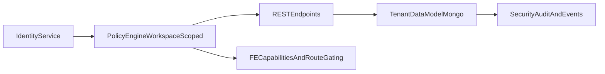

# POC Limits and Rebuild Blueprint

## Perché questo documento
Followup 3.0 ha validato concetti e flussi, ma non è base ideale per scaling governance/security. Qui c'è guida concreta per rifare meglio senza ricominciare da zero mentale.

## AS-IS: cosa funziona già bene
- pattern workspace-first già presente su molte API
- middleware auth/permission esistenti e separati
- gestione membership e assignment già modellata
- entitlements workspace separati da RBAC
- documentazione tecnica già ampia nel repo

## Limiti POC (ordinati per impatto)

## 1) Boundary sicurezza non pienamente uniforme
- alcuni endpoint e path legacy hanno policy diverse o stratificate.
- rischio: comportamento diverso per stesso ruolo in punti diversi.

## 2) Identità membership fragile
- in parti del sistema `userId` è email.
- rischio: rename email, collisioni, join deboli.

## 3) Semantica admin globale forte
- `system_role=tecma_admin` e/o wildcard `*` con bypass molto ampio.
- rischio: blast radius alto se configurazione/assegnazione errata.

## 4) Naming schema non uniforme
- coesistono `projectId` e `project_id`.
- rischio: query e policy access più complesse e bug-prone.

## 5) Fallback permissivi
- in alcune aree assignment assente = accesso ampio.
- rischio: least privilege non garantito.

## 6) Coupling legacy
- convivenza collezioni/campi legacy + nuovi.
- rischio: regressioni e manutenzione costosa.

---

## Target architecture (TO-BE)



### Principi vincolanti
1. **Deny by default** su qualunque resource scoped.
2. **Workspace membership required** prima di ogni accesso dominio.
3. **RBAC + Entitlement** sempre in AND.
4. **Identity canonical key** (ObjectId) su relazioni.
5. **Policy centralizzata** no duplicazioni controller-level.
6. **Audit obbligatorio** su mutazioni sensibili.

---

## Decisioni da chiudere in riunione (non rinviabili)
1. user key canonica definitiva (`_id` vs external immutable id).
2. semantica tecma admin (scope, eccezioni, tracciamento).
3. comportamento default quando assignment progetto assente.
4. policy standard status code deny (403 vs 404 masking).
5. compatibilità backward per endpoint legacy (sì/no, fino a quando).

---

## Piano esecutivo 2 settimane (no analisi lunga)

## Week 1 — Fondazioni robuste

### Epic A — AuthZ Core Hardening
- Task A1: matrice permission/resource formalizzata
- Task A2: middleware unificato workspace/project scope
- Task A3: test integrazione deny/allow matrix

### Epic B — Identity & Membership Refactor
- Task B1: introdurre user canonical key nelle collezioni relazionali
- Task B2: migrazione idempotente email -> userId canonico
- Task B3: rimozione fallback ambigui

### Epic C — Schema/Index Governance
- Task C1: naming policy uniforme (`workspaceId`, `projectId`, `userId`)
- Task C2: indice critici + check duplicati pre-migrazione
- Task C3: fail-fast policy per ambienti production-like

## Week 2 — Productizzazione e rollout

### Epic D — FE/BE Alignment
- Task D1: allineare route gating FE con policy backend
- Task D2: uniformare messaggi errore accesso
- Task D3: smoke test cross-workspace

### Epic E — Ops & Reliability
- Task E1: backup/restore rehearsal
- Task E2: runbook incident authz/membership
- Task E3: dashboard audit + alerting essenziale

### Epic F — Cutover and QA
- Task F1: test regressione su journey admin/collaborator/viewer
- Task F2: canary rollout su workspace pilota
- Task F3: decisione go/no-go e cleanup legacy path

---

## Cosa riusare vs cosa rifare

### Riusare come reference
- tassonomia permessi e ruolo dal backend attuale
- pattern `canAccess` come base concettuale
- modello entitlement workspace
- flow FE `ProjectAccessPage` come UX reference

### Rifare in modo strutturale
- identity key relazionale
- policy engine centralizzato con contratti espliciti
- fallback accesso troppo permissivi
- naming schema incoerente legacy/new

---

## Definition of Done (rebuild)
- ogni endpoint scoped ha auth, permission, scope check espliciti
- nessun accesso cross-workspace non autorizzato nei test
- migrazione identity completata con report e rollback plan
- FE e BE condividono stesso contratto permessi/capability
- runbook operativo validato da team non autore

---

## Prompt Cursor/AI per avvio sprint

### Prompt — breakdown automatico task
```txt
Usa questo blueprint e genera backlog eseguibile per sprint 2 settimane.
Output richiesto:
1) task BE
2) task FE
3) task DB
4) task QA
Per ogni task: effort (S/M/L), dipendenze, test minimi.
```

### Prompt — hardening PR review
```txt
Review diff con focus esclusivo su workspace isolation e RBAC enforcement.
Segnala:
1) endpoint senza scope check
2) fallback permissivi
3) mismatch FE/BE permission naming
4) test mancanti su deny path.
```

### Prompt — migration safety
```txt
Progetta migrazione Mongo idempotente con:
- dry-run
- report JSON diff
- rollback strategy
- check vincoli unique prima e dopo.
No write distruttive senza flag esplicito.
```
