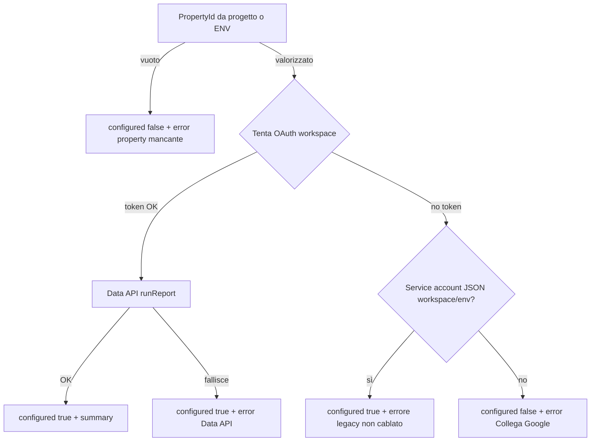

# Diagnosi: GA4 «non configurato» in Big Data

Checklist operativa per capire perché la scheda Big Data mostra GA4 non configurato o il banner «Configurazione marketing incompleta». Riferimento codice: `be-followup-v3/src/core/marketing/ga4-insights.stub.ts` (`fetchGa4TrafficSummary`), `getGoogleMarketingUserAccessToken` in `marketing-discovery.service.ts`.

## Flusso decisionale (backend)

## 1) Verificare `ga4PropertyId` salvato sul progetto

- **UI**: Progetto → **Marketing / Big Data** (o pannello inline nella pagina Big Data) → seleziona una proprietà GA4 → **Salva**.
- **API**: DevTools → Network → `GET /v1/projects/:projectId/marketing-settings?workspaceId=...` → campo `ga4PropertyId` non vuoto.
- Se manca: il backend risponde `configured: false` con messaggio che invita a impostare la property (vedi risposta JSON `marketing.ga4.error` nel payload Big Data).

## 2) Verificare OAuth Google sul workspace

- **Integrazioni** → **Big Data** → **Collega Google** completato per il **workspace** corretto (refresh token persistito).
- Senza token OAuth **e** senza JSON service account GA4 in Integrazioni / env → `configured: false` con testo che invita a collegare Google e scegliere la property.

## 3) Google Cloud (se OAuth OK ma compaiono errori Data API)

- Progetto GCP dell’OAuth marketing: API **Google Analytics Data API** abilitata.
- L’utente Google dell’OAuth deve avere accesso in lettura alla **property GA4** in Analytics Admin.
- In questo caso spesso `configured: true` ma `error` con hint sulla Data API; i dati metrici possono essere vuoti.

## 4) Service account GA4 (percorso legacy)

- Solo JSON in Integrazioni **senza** OAuth: il codice può segnare `configured: true` con messaggio che la lettura via service account non è ancora cablata per i dati; per metriche reali usare OAuth.

## 5) Cache Big Data

- Dopo modifiche a ID marketing o OAuth, nella pagina Big Data premere **Aggiorna**.
- La cache tiene conto di un fingerprint degli ID marketing (`bigdata.service.ts`).

## Banner «Configurazione marketing incompleta»

La UI considera la configurazione **globale** incompleta se **almeno uno** tra Google Ads, Meta e GA4 ha `configured: false` (`BigDataPage.tsx`, `marketingSecretsIncomplete`). Quindi il banner può restare anche se GA4 è a posto ma Ads o Meta no.

## Collegamenti

- Runbook generale marketing: [MARKETING_APIS_RUNBOOK.md](../MARKETING_APIS_RUNBOOK.md)
