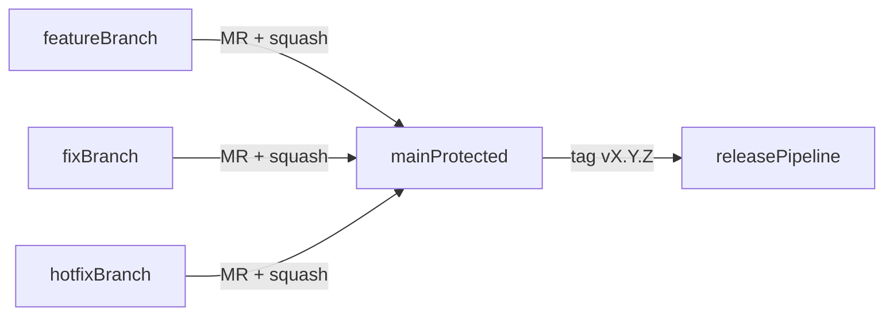

# Contributing — Followup 3.0

## Workflow

1. Crea branch da `main` con naming obbligatorio (validato in CI da `tools/ci/validate-branch-name.sh`):
   - `<type>/<TICKET>-<slug>` (es: `feat/FUP3-123-auth-refresh`)
   - `release/v<major>.<minor>.<patch>` (es: `release/v1.2.0`)
   - Tipi ammessi: `feat`, `fix`, `docs`, `refactor`, `test`, `chore`, `security`, `ci`, `build`, `hotfix`
2. Commit con [Conventional Commits](https://www.conventionalcommits.org/): `<type>(<scope>): <subject>`.
3. Apri MR verso `main`. Almeno 1 review da CODEOWNERS richiesta.
4. CI deve essere verde (build, lint, typecheck, test, security, openapi).
5. Squash merge — niente fast-forward.



## Commit format

`<type>(<scope>): <subject>`

- `type`: `feat`, `fix`, `docs`, `style`, `refactor`, `perf`, `test`, `build`, `ci`, `chore`, `revert`, `security`
- `scope` (kebab-case, obbligatorio): scelto fra l'enum di `commitlint.config.cjs`:
  - dominio applicativo: `auth`, `rbac`, `users`, `workspaces`, `projects`
  - layer: `api`, `web`, `db`
  - design system: `design-ui`, `design-tokens`, `design-themes`, `design-icons`
  - cross-cutting: `security`, `ci`, `infra`, `docs`
- `subject`: imperativo, breve, < 100 char.

Esempi:

- `feat(auth): introduce tz_users-only authentication`
- `fix(rbac): block cross-workspace fallback`
- `feat(design-ui): add PasswordInput primitive aligned to POC`
- `chore(ci): tighten branch-name validator regex`

## Merge Request standard

- Usa template MR default (`.gitlab/merge_request_templates/default.md`).
- Titolo MR obbligatorio in formato conventional:
  - `<type>(<scope>): <subject>`
  - esempio: `feat(auth): add refresh token rotation`
- CI blocca automaticamente branch naming e MR title non conformi.

## Definition of Done (per PR)

- [ ] Build verde su GitLab CI.
- [ ] Coverage non scende sotto la threshold del modulo (≥85% core).
- [ ] Spectral lint OpenAPI verde.
- [ ] Semgrep + OSV + Trivy senza issue HIGH/CRITICAL.
- [ ] ADR scritto se la PR introduce decisione strutturale.
- [ ] Test acceptance `db-isolation` passa.
- [ ] Documentazione aggiornata (README modulo + runbook se rilevante).

## Code style

- TypeScript strict mode obbligatorio.
- ESLint + Prettier auto-applicati via `lint-staged` su pre-commit.
- Niente `any`. Usa `unknown` + narrowing.
- Niente `console.log` in production code (warn/error sono ok ma sconsigliati — usa logger).

## Vincoli MongoDB

- **Mai** importare `mongodb` fuori da `packages/db/`. Bloccato da Semgrep.
- **Mai** chiamare `client.db('<other_name>')`. Bloccato da Semgrep.
- Tutte le mutation passano per il repository layer in `packages/db/`.
- Vedi [ADR 0002](docs/adr/0002-db-write-isolation.md).

## Test

- Unit: Vitest. File `*.test.ts` accanto al sorgente.
- Integration: Vitest + mongodb-memory-server. File in `services/api/tests/integration/`.
- E2E: Playwright. File in `apps/web/e2e/`.
- Security: `tests/security/`.
- Load: k6 in `tests/load/`.

## Pre-commit

Husky + lint-staged: ESLint + Prettier auto-fix. Commitlint valida il messaggio.

## Pre-push

`pnpm typecheck` su tutto il workspace.

## Local quality gate (prima di aprire MR)

Comandi consigliati prima di pushare:

```bash
pnpm -w typecheck
pnpm -w lint
pnpm -w format:check
pnpm --filter @followup/api test:integration
pnpm --filter @followup/web build
pnpm --filter @followup/design-ui build
```

## Branch protection (configurazione GitLab)

- `main` protected.
- Push diretto vietato.
- MR approval ≥1 da CODEOWNERS.
- Pipeline must succeed.
- Fast-forward merge disabilitato.
- Squash merge obbligatorio.
- Merge solo se tutti i thread MR sono risolti.
- Bloccare merge se pipeline è in stato warning/failed.
- Cancellazione source branch automatica post-merge.
- Limitare creazione branch protetti a Maintainer.

## Setup remote GitLab (one-shot, quando il progetto remoto sarà disponibile)

Eseguire dalla root del repo:

```bash
git remote add origin git@gitlab.<host>:<group>/followup-3.0.git
git push -u origin main
```

Successivamente abilitare le protezioni di cui sopra in `Settings > Repository > Protected branches` e in `Settings > Merge requests`.
Riferimento operativo: [docs/runbooks/branch-governance.md](docs/runbooks/branch-governance.md).
