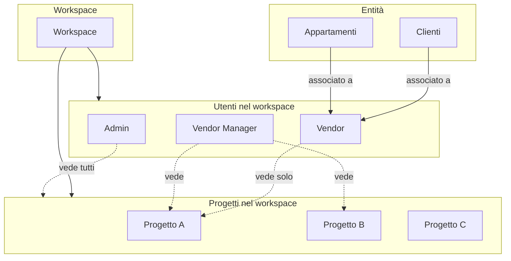

# Design: Ruoli e Visibilità

Documento di studio per l'architettura dei ruoli e della visibilità dei dati nel workspace. Da validare con il team prima dell'implementazione.

## 1. Obiettivo

Definire come gli utenti vedono e accedono a progetti, clienti e appartamenti in base al proprio ruolo nel workspace, sostituendo/estendendo il modello legacy `user.project_ids`.

## 2. Livelli di visibilità

## 3. Ruoli

| Ruolo | Descrizione | Visibilità progetti | Visibilità entità |
|-------|-------------|---------------------|-------------------|
| **admin** | Amministratore globale | Tutti i progetti del workspace | Tutti i clienti e appartamenti |
| **vendor_manager** | Responsabile vendite | Tutti i progetti (o filtro opzionale) | Tutti i clienti e appartamenti |
| **vendor** | Venditore | Solo progetti in `tz_workspace_user_projects` | Solo clienti/appartamenti in `tz_entity_assignments` |

## 4. Modello dati proposto

### 4.1 Livello 1 — Utenti nel workspace

| Collection | Scopo | Schema chiave |
|------------|-------|---------------|
| `tz_workspace_users` | Utenti per workspace con ruolo | `workspaceId`, `userId` (email o ObjectId), `role` (vendor \| vendor_manager \| admin) |

**Indici:** compound unique `(workspaceId, userId)`

### 4.2 Livello 2 — Progetti visibili per utente

| Collection | Scopo | Schema chiave |
|------------|-------|---------------|
| `tz_workspace_user_projects` | Progetti abilitati per utente nel workspace | `workspaceId`, `userId`, `projectId` (compound unique) |

**Regole:**
- Se **assente** per un utente: l'utente vede tutti i progetti del workspace (comportamento admin/vendor_manager).
- Se **presente**: l'utente vede solo i progetti elencati (comportamento vendor).

### 4.3 Livello 3 — Entità assegnate (cliente / appartamento)

| Collection | Scopo | Schema chiave |
|------------|-------|---------------|
| `tz_entity_assignments` | Assegnazione cliente/appartamento a utenti | `workspaceId`, `entityType` (client \| apartment), `entityId`, `userId` (compound unique) |

**Regole:**
- Un cliente/appartamento può essere assegnato a più utenti.
- Un vendor vede solo clienti e appartamenti a lui assegnati (oltre a quelli del suo progetto se non c'è filtro per assignment).

## 5. Regole di visibilità (da implementare)

1. **Admin:** vede tutto nel workspace.
2. **Vendor manager:** vede tutti i progetti assegnati al workspace; filtro opzionale per `tz_workspace_user_projects`.
3. **Vendor:** vede solo progetti in `tz_workspace_user_projects`; per clienti/appartamenti, solo quelli in `tz_entity_assignments` con il proprio `userId`.

## 6. Casi d'uso

### 6.1 Invito utente al workspace

- Admin/vendor_manager invita un utente (email) al workspace con ruolo (vendor, vendor_manager, admin).
- Inserimento in `tz_workspace_users`.
- Se vendor: opzionalmente associazione a progetti specifici in `tz_workspace_user_projects`.

### 6.2 Vendor accede all'app

- Sistema carica `tz_workspace_users` per workspace + email utente → ottiene `role`.
- Se vendor: carica `tz_workspace_user_projects` → ottiene `projectIds` visibili.
- Query clienti/appartamenti/requests filtrano per `projectIds` e, se vendor, per `tz_entity_assignments` con `userId`.

### 6.3 Assegnazione cliente a vendor

- Admin/vendor_manager assegna un cliente a un vendor.
- Inserimento in `tz_entity_assignments` con `entityType: "client"`, `entityId`, `userId`.

## 7. Migrazione da legacy

### 7.1 `user.project_ids` (users DB)

Il legacy usa `user.project_ids` per limitare i progetti visibili. Con il nuovo modello:

- **Opzione A:** Mantenere `user.project_ids` come fallback per utenti non ancora in `tz_workspace_users`.
- **Opzione B:** Migrare tutti gli utenti in `tz_workspace_users` e deprecare `user.project_ids`.

### 7.2 Admin globale

L'admin è attualmente determinato da `user.role === "admin"` nel users DB. Con `tz_workspace_users`:

- Un utente può essere admin in un workspace ma non in un altro.
- Per retrocompatibilità: se `user.role === "admin"` nel users DB, trattare come admin in tutti i workspace (o solo in quelli dove è presente in `tz_workspace_users`).

## 8. Fasi di implementazione

| Fase | Contenuto |
|------|-----------|
| **Fase 0 (studio)** | Questo documento. Validazione con il team. |
| **Fase 1** | `tz_workspace_users` + UI per invitare/gestire utenti nel workspace |
| **Fase 2** | `tz_workspace_user_projects` + filtri nelle query (clients, apartments, requests) per `projectIds` dell'utente |
| **Fase 3** | `tz_entity_assignments` + UI per assegnare clienti/appartamenti a utenti + filtri nelle query |

## 9. Riferimenti

- Piano: `progetto_dettaglio_ruoli_legacy_65174474.plan.md`
- Schema DB: `docs/MAIN_DB_SCHEMA.md`
