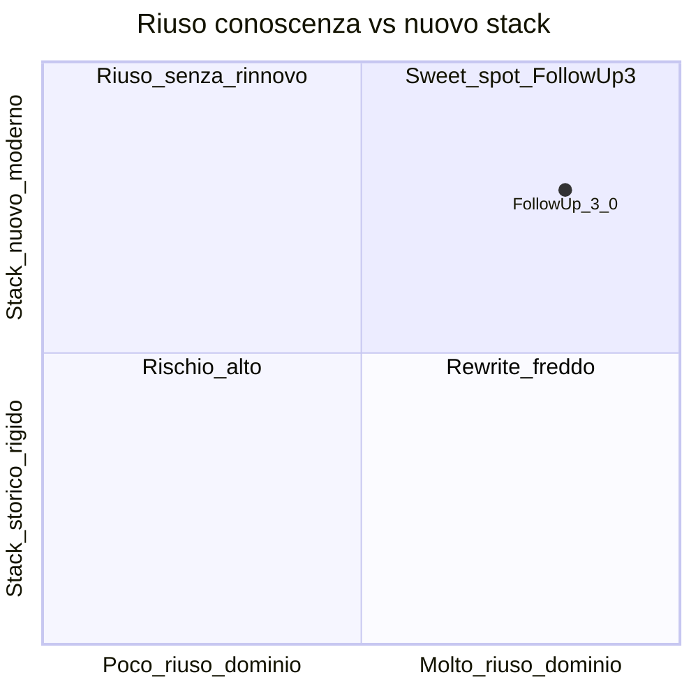
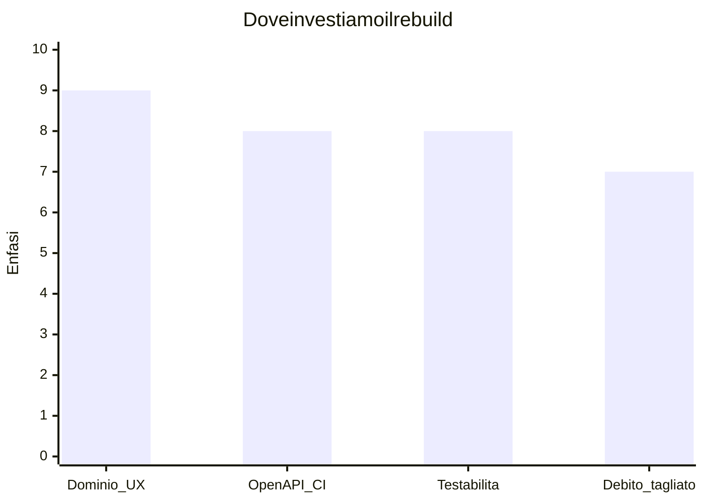

# Perché un rebuild controllato (e perché ora)

**Ultimo aggiornamento:** 2026-03-25  
**Indice:** [README.md](README.md)

---

## In 30 secondi

Il legacy è **prova di dominio**; ha **costi crescenti** su sicurezza enterprise, integrazioni e UX coerente. FollowUp 3.0 **separa** conoscenza riusabile da architettura nuova, in un **MVP** gestibile.

---

## Cosa riusiamo (2019 → oggi)

- **Dominio:** cliente, unità, richiesta, rent/sell, cockpit.  
- **UX:** utenti non tecnici, pochi click — [FOLLOWUP_3_MASTER.md](../FOLLOWUP_3_MASTER.md).  
- **Dati:** lettura legacy + scritture additive `tz_*`.

Non riusiamo: **debito strutturale** che blocca sicurezza, test o integrazioni prevedibili.

## Perché greenfield perimetrato

1. **Confini chiari:** monorepo, OpenAPI, CI/security modulare.  
2. **Costo del cambiamento:** feature enterprise sul legacy spesso pagano interesse composto.  
3. **AI-assisted:** accelera scaffolding/test/docs — non sostituisce governance.  
4. **Rischio:** MVP = **dimostrare**, poi cutover / convivenza (decisione business).

## Cosa non affermiamo

Nessun ROI quantitativo inventato; nessuna tesi “legacy da buttare” — tesi **nuova linea**, legacy come maestro di dominio.

## Collegamenti

[03 — Maturità](03-domain-maturity-matrix.md) · [06 — Rischi](06-risks-open-decisions.md) · [FOLLOWUP_3_MASTER.md](../FOLLOWUP_3_MASTER.md)
