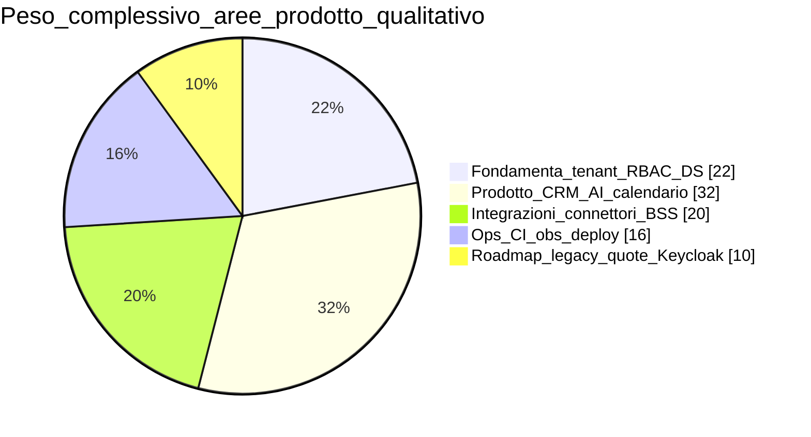
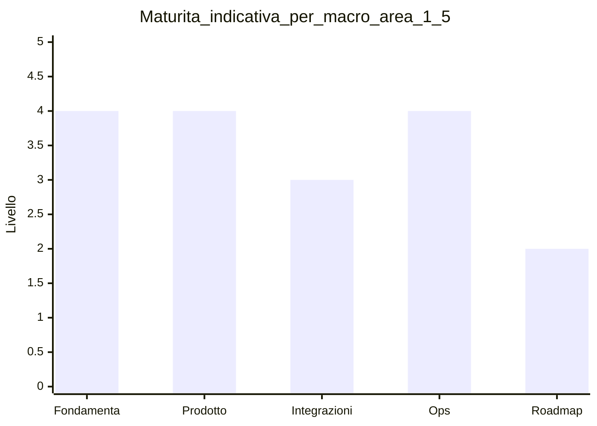

# Matrice domini — maturità e stack

**Ultimo aggiornamento:** 2026-03-25  
**Indice:** [README.md](README.md)

---

## In 30 secondi

Snapshot **FollowUp 3.0** (monorepo), non l’intero legacy Tecma. Dettaglio operativo: [PIANO_GLOBALE_FOLLOWUP_3.md](../PIANO_GLOBALE_FOLLOWUP_3.md).

**Legenda:** *Idea/Spike* → *POC* → *MVP slice* → *Beta prod* → *Roadmap* (fasi FASE / piano globale).

---

## Vista per cluster

La **Panoramica visiva** nell’app ripete mappe sintetiche; qui il riepilogo testuale compatto.

---

## Sintesi per area (indicativa)

| Area | Maturità | Riferimenti |
|------|----------|-------------|
| Workspace, progetti, accessi cross-workspace | MVP → Beta | [PIANO_GLOBALE §3.1](../PIANO_GLOBALE_FOLLOWUP_3.md) |
| RBAC, utenti, wizard | MVP | [FASE01](../deliverables/FASE01_USER_ACCESS_RBAC.md) |
| Entitlement, Platform API, console Tecma | MVP (rifiniture) | [FASE02](../deliverables/FASE02_ENTITLEMENTS_AND_TECMA.md) |
| CRM clienti / unità / richieste | Beta (scope MVP) | [REQUESTS_MODEL](../REQUESTS_MODEL.md) |
| Cockpit / AI | MVP | [WAVE_8_9](../WAVE_8_9_PRODUCT_PLATFORM.md) |
| Connettori (Twilio, marketing, OAuth) | Mistato | [FASE06](../deliverables/FASE6_CONNECTORS_UX.md) |
| Identity / SSO | MVP → Roadmap | [KEYCLOAK_RUNBOOK](../KEYCLOAK_RUNBOOK.md) |
| Security, audit, GDPR filoni | MVP | [SECURITY_RUNBOOK](../SECURITY_RUNBOOK.md) |
| DevSecOps, deploy, observability | Beta / MVP | [DOCS_CI_CD](../DOCS_CI_CD.md), [RENDER_DEPLOY](../RENDER_DEPLOY.md), [OBSERVABILITY](../OBSERVABILITY.md) |
| Dati legacy, S3, quote, report, inbox | Roadmap | FASE1–7 in piano globale |
| Design system, BSS / gateway | MVP / Roadmap | [DESIGN_SYSTEM](../DESIGN_SYSTEM.md), [BSS_INTEGRATION](../BSS_INTEGRATION.md) |

---

## Manutenzione

Aggiornare quando si chiude una voce significativa nel piano globale o si cambia stack (IdP, hosting, …).
