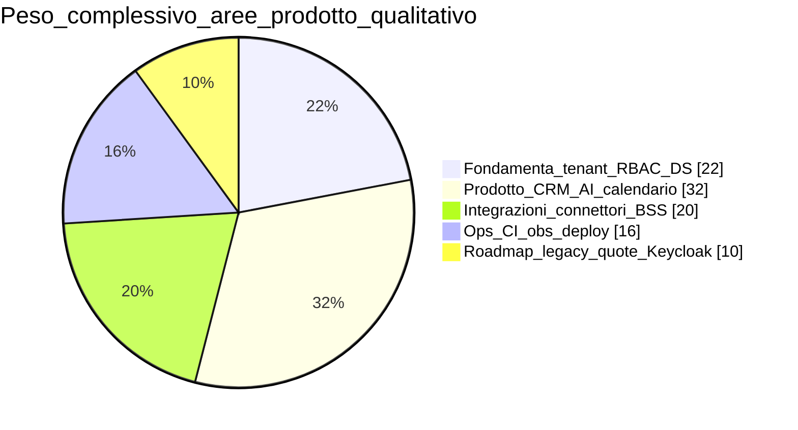
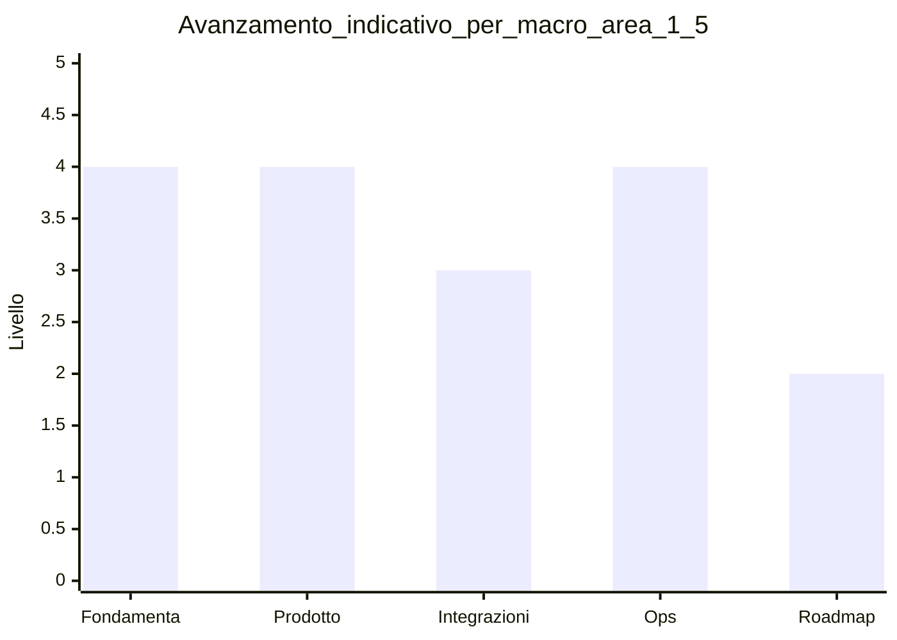

# Matrice domini — stadio operativo e stack

**Ultimo aggiornamento:** 2026-03-25  
**Indice:** [README.md](README.md)

---

## In 30 secondi

FollowUp 3.0 **non è solo un “MVP” da demo**: su un **perimetro scelto** (workspace, RBAC, CRM core, entitlement, deploy, DevSecOps) la baseline è **operativa in produzione controllata**, come da chiusure registrate nel [PIANO_GLOBALE_FOLLOWUP_3.md](../PIANO_GLOBALE_FOLLOWUP_3.md). Restano **gap rispetto al legacy completo** (FASE1–7 e oltre) e **vincoli verso cliente esterno** — vedi [RELEASE_READINESS_CHECKLIST.md](../RELEASE_READINESS_CHECKLIST.md) e [06 — Rischi](06-risks-open-decisions.md).

Questa pagina è uno **snapshot del monorepo**, non dell’intero ecosistema Tecma legacy.

**Legenda (stadio):**

| Stadio | Significato |
|--------|-------------|
| **Baseline produzione** | Funzionalità in uso o deployabile in ambiente gestito; CI e guardrail allineati al piano. |
| **Rafforzamento** | Hardening, copertura test, edge case, rifiniture senza cambiare il modello base. |
| **Controllo operativo (compliance in evoluzione)** | Strumenti e processi tecnici presenti; certificazioni / processi legali possono essere ancora aperti. |
| **Operativo (dipendenze terze)** | Dipende da fornitori esterni (API, OAuth); maturità eterogenea per connettore. |
| **Produzione / roadmap** | Oggi su stack attuale (es. JWT/BSS); evoluzione documentata (es. Keycloak). |
| **Evoluzione pianificata** | Nel piano globale / FASE, fuori dal perimetro corrente della tabella sotto. |
| **Prodotto / integrazione in corso** | Design system o integrazione gateway in uso con estensioni ancora in roadmap. |

---

## Vista per cluster

La **Panoramica visiva** nell’app ripete mappe sintetiche; qui il riepilogo testuale compatto.

---

## Sintesi per area (indicativa)

| Area | Stadio | Riferimenti |
|------|--------|-------------|
| Workspace, progetti, accessi cross-workspace | Baseline produzione (rafforzamento continuo) | [PIANO_GLOBALE §3.1](../PIANO_GLOBALE_FOLLOWUP_3.md) |
| RBAC, utenti, wizard | Baseline produzione | [FASE01](../deliverables/FASE01_USER_ACCESS_RBAC.md) |
| Entitlement, Platform API, console Tecma | Baseline produzione (estensioni commerciali) | [FASE02](../deliverables/FASE02_ENTITLEMENTS_AND_TECMA.md) |
| CRM clienti / unità / richieste | Baseline produzione (perimetro CRM) | [REQUESTS_MODEL](../REQUESTS_MODEL.md) |
| Cockpit / AI | Prodotto operativo (slice intelligenza) | [WAVE_8_9](../WAVE_8_9_PRODUCT_PLATFORM.md) |
| Connettori (Twilio, marketing, OAuth) | Operativo (dipendenze terze eterogenee) | [FASE06](../deliverables/FASE6_CONNECTORS_UX.md) |
| Identity / SSO | Produzione / roadmap IdP | [KEYCLOAK_RUNBOOK](../KEYCLOAK_RUNBOOK.md) |
| Security, audit, GDPR filoni | Controllo operativo (compliance in evoluzione) | [SECURITY_RUNBOOK](../SECURITY_RUNBOOK.md) |
| DevSecOps, deploy, observability | Baseline produzione (CI/CD, osservabilità) | [DOCS_CI_CD](../DOCS_CI_CD.md), [RENDER_DEPLOY](../RENDER_DEPLOY.md), [OBSERVABILITY](../OBSERVABILITY.md) |
| Dati legacy, S3, quote, report, inbox | Evoluzione pianificata | FASE1–7 in piano globale |
| Design system, BSS / gateway | Prodotto / integrazione in corso | [DESIGN_SYSTEM](../DESIGN_SYSTEM.md), [BSS_INTEGRATION](../BSS_INTEGRATION.md) |

---

## Manutenzione

Aggiornare quando si chiude una voce significativa nel piano globale o si cambia stack (IdP, hosting, …).
