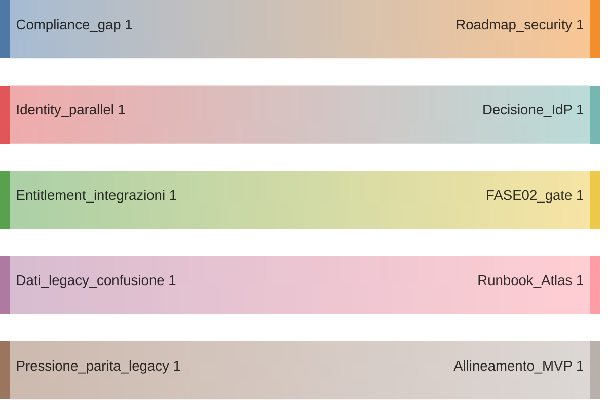
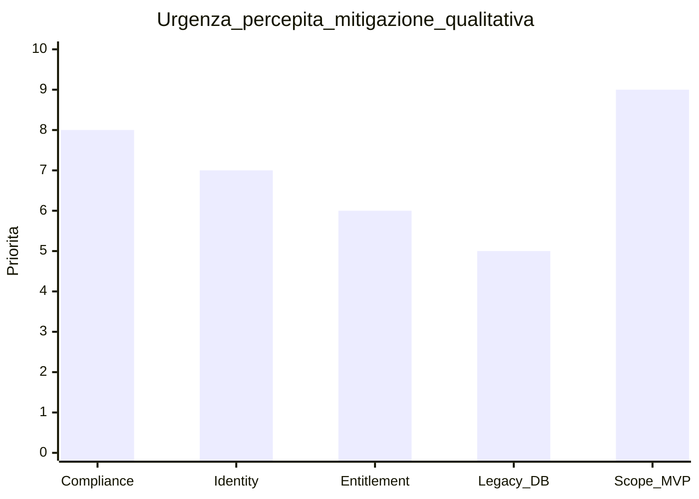

# Rischi, lacune e decisioni aperte

**Ultimo aggiornamento:** 2026-03-25  
**Indice:** [README.md](README.md)

---

## In 30 secondi

Fondamenta solide su auth, CRM, multi-tenant; **non** completezza su tutte le fasi del [PIANO_GLOBALE_FOLLOWUP_3.md](../PIANO_GLOBALE_FOLLOWUP_3.md). Priorità, budget, comunicazione esterna (clienti, audit).

---

## Rischi (qualitativi)

- **Compliance:** gap tra feature e processi certificabili — non over-vendere maturity.  
- **Identity:** parallelismo BSS / JWT / Keycloak nel tempo — decisione esplicita per ambiente.  
- **Entitlement:** integrazioni commerciali senza gate uniforme — [FASE02](../deliverables/FASE02_ENTITLEMENTS_AND_TECMA.md).  
- **Dati legacy:** confusione DB / ambienti — README monorepo + Atlas.  
- **Scope MVP:** pressione parità legacy — [01](01-executive-summary.md).

## Decisioni aperte (verificare sul piano)

1. Cutover vs convivenza col legacy.  
2. IdP unico vs graduale.  
3. Investimento FASE3–7 vs hardening sicurezza.  
4. Modello commerciale connettori (self-service vs Tecma-only).

## Documentazione correlata

[PIANO_GLOBALE_FOLLOWUP_3.md](../PIANO_GLOBALE_FOLLOWUP_3.md) · [ACCEPTANCE_GATES.md](../ACCEPTANCE_GATES.md) · [PENTEST_EXECUTION.md](../PENTEST_EXECUTION.md) · [PENTEST_VENDOR_HANDOFF.md](../PENTEST_VENDOR_HANDOFF.md)

[README.md](README.md) · [01 executive summary](01-executive-summary.md)
