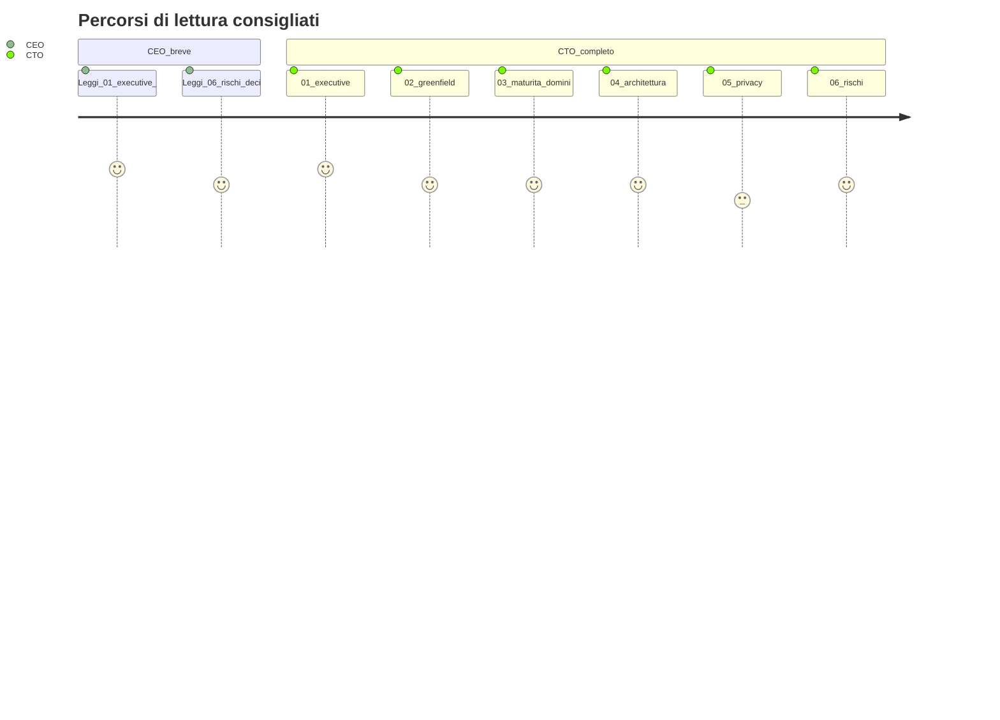

# FollowUp 3.0 — Panoramica per leadership (CTO / CEO)

**Ultimo aggiornamento:** 2026-03-25  

**Nell’app:** Admin → **Panoramica strategica**, URL `/executive`, command palette. Inizia dal tab **Panoramica visiva** (mappe di dominio).

**Backlog:** [PIANO_GLOBALE_FOLLOWUP_3.md](../PIANO_GLOBALE_FOLLOWUP_3.md) · **Visione prodotto:** [FOLLOWUP_3_MASTER.md](../FOLLOWUP_3_MASTER.md)

---

## Percorsi di lettura

- **~15 min (CEO):** [01](01-executive-summary.md) → [06](06-risks-open-decisions.md) (solo “In 30 secondi” + decisioni).  
- **Completo (CTO):** 01 → 02 → 03 → 04 → 05 → 06.

---

## Indice documenti

| Doc | Pubblico | Contenuto |
|-----|----------|-----------|
| [01](01-executive-summary.md) | CEO, board | POC/MVP: cosa dimostra / cosa non è. |
| [02](02-why-greenfield-vs-legacy.md) | CEO + CTO | Perché rebuild perimetrato oggi. |
| [03](03-domain-maturity-matrix.md) | CTO | Maturità per area + link tecnici. |
| [04](04-architecture-at-a-glance.md) | CTO | Stack, deploy, integrazioni. |
| [05](05-privacy-gdpr-and-tenant-model.md) | CTO, DPO | Tenant, PII, disclaimer. |
| [06](06-risks-open-decisions.md) | CEO + CTO | Rischi e decisioni aperte. |

---

## In 30 secondi

FollowUp 3.0 è un **CRM immobiliare** come **POC/MVP intenzionale**: base tecnica pulita, dominio da anni di operatività, legacy come **riferimento funzionale**. La leadership allinea **direzione**, **maturità** e **rischi**; il dettaglio resta nel piano globale.
