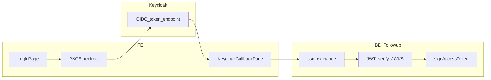

# Design: Keycloak OIDC per Followup 3.0 (enterprise)

**Data:** 2026-03-24  
**Stato:** bozza per review team / PO  
**Riferimento codice:** branch `origin/cursor/keycloak-identity-provider-b16b` (commit `799e0446` su base `main`).

## 1. Obiettivo prodotto

- **Followup enterprise:** un solo modello di identità basato su **Keycloak** (SSO, MFA e policy lato IdP).
- **Niente convivenza permanente** con login legacy/BSS nel prodotto finale; eventuali doppi percorsi solo in **dev-1** come strumento di confronto (canali / build separate), non come architettura di produzione.

## 2. Perimetro Keycloak-only (decisione aperta — PO)

| Opzione | Descrizione |
|---------|-------------|
| **A — Solo Enterprise** | Keycloak obbligatorio per tenant/offerta Enterprise; segmenti SMB restano su modello attuale fino a seconda ondata. |
| **B — Tutti i deploy** | Un solo modello auth ovunque. |
| **C — Nuovi tenant prima** | Keycloak-only per nuovi ambienti; migrazione con deadline per gli esistenti. |

**Azione:** la scelta **A/B/C** va chiusa dal PO prima del cutover produzione.

## 3. Architettura tecnica raccomandata (fase 1)

**Approccio IdP + exchange (allineato al branch cursor):**

1. **FE:** OIDC **Authorization Code + PKCE** verso Keycloak (client pubblico, nessun secret nel browser).
2. **Callback:** pagina dedicata che riceve `code`, scambia con Keycloak per ottenere **id_token** (flusso token nel branch).
3. **BE:** `POST /v1/auth/sso-exchange` con **id_token**; validazione tramite **JWKS** Keycloak (`verifySsoJwtAndGetPayload` / `exchangeSsoJwt` già presenti in be-followup-v3).
4. **Output BE:** emissione **access/refresh** Followup come oggi (`setTokens` sul FE).

**Fase 2 opzionale:** valutare resource server che accetta solo access token Keycloak sulle API (rifattor maggiore).

## 4. Variabili ambiente (FE)

Definite sul branch Keycloak (vedi `.env.example` nel diff):

- `VITE_KEYCLOAK_URL` — base URL Keycloak (senza trailing slash eccessivo).
- `VITE_KEYCLOAK_REALM`
- `VITE_KEYCLOAK_CLIENT_ID`
- Opzionali: `VITE_KEYCLOAK_SCOPE`, `VITE_KEYCLOAK_REDIRECT_PATH` (default `/login/keycloak-callback`).

**BE:** variabili SSO/JWKS già documentate in `.env.example` be-followup-v3 (issuer, audience, JWKS URI o HS256) devono puntare al realm/client Keycloak per dev-1/staging/prod.

## 5. Cutover e sostituzione BSS

- **Programma piattaforma:** sostituire del tutto l’identity provider esistente implica allineamento con **owner BSS / gateway Tecma** (timeline, realm unico vs per-prodotto, deprecazione `VITE_USE_BSS_AUTH` per Followup).
- **Finestra di migrazione:** comunicazione utenti, test e2e, rollback plan (es. ripristino deploy precedente).
- **Dopo cutover:** rimozione codice morto (adapter BSS, doppie entry login) in PR dedicate.

## 6. Dev-1: canali senza cambiare dominio

- **Stesso host**, **path prefix** per canale: es. `/app/main/`, `/app/feature-keycloak/`.
- Manifest `channels.json`: `id`, `gitBranch`, `label`, `description`, `basePath`, opzionale `apiBaseUrlOverride`.
- Tendina: `window.location.assign` verso `basePath` + path relativo corrente (reload → bundle corretto).
- Dettaglio deploy e CI: [DEV1_CHANNEL_DEPLOY.md](../../../business/tecma-digital-platform/followup-3.0/docs/DEV1_CHANNEL_DEPLOY.md).

## 7. Workflow Git

Policy branch, PR e cancellazione post-merge: [GIT_WORKFLOW_BRANCHES.md](../../../business/tecma-digital-platform/followup-3.0/docs/GIT_WORKFLOW_BRANCHES.md).

## 8. Sicurezza e test

- PKCE: `S256`, state in sessionStorage, verifica `state` al callback.
- Redirect `backTo`: solo **same-origin** (logica già presente in callback).
- Test: unit su `keycloakOidc` (branch); e2e smoke login OIDC su dev-1 quando Keycloak è raggiungibile.
- Review tecnica branch: [keycloak-identity-provider-branch-review.md](../../../business/tecma-digital-platform/followup-3.0/docs/reviews/keycloak-identity-provider-branch-review.md).
- Piano implementazione dettagliato: [2026-03-24-keycloak-implementation-plan.md](../../../business/tecma-digital-platform/followup-3.0/docs/plans/2026-03-24-keycloak-implementation-plan.md).

## 9. Criteri di accettazione (alto livello)

- [ ] PO ha scelto perimetro **A/B/C** (sez. 2).
- [ ] Login Keycloak end-to-end su dev-1 con BE `sso-exchange` e JWKS valido.
- [ ] Documentazione env e runbook aggiornati.
- [ ] Piano cutover BSS approvato dalla piattaforma.
- [ ] Dev-1 canali operativi o documentati con owner CI.
